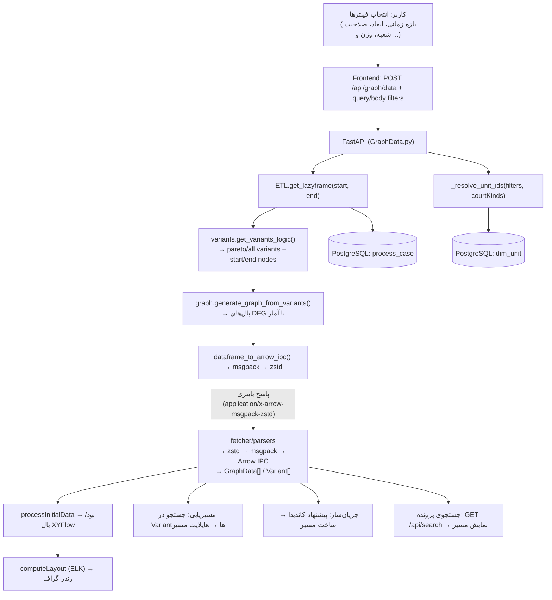

# تحلیل فنی سامانه «فکر» (Fekr)

| مشخصه | مقدار |
|---|---|
| مسیر منبع | کل پروژه (`BackEnd/`، `FrontEnd/`) |
| دسته | سند کلی (Overview) |
| مستندات مرتبط | [۰۱-معماری](01-architecture.md) · [۰۲-فهرست ماژول‌ها](02-module-inventory.md) · [راهنمای نگارش](DOCUMENTATION_RULES.md) |

## ۱. معرفی (Introduction)

سامانه «فکر» یک پلتفرم **Process Mining** است که روی داده‌های قضایی (پرونده‌های دادگستری) کار می‌کند. این سامانه از Event Log پرونده‌ها، **Variant**های مختلف طی فرآیند رسیدگی را استخراج کرده و به‌صورت **Directly Follows Graph (DFG)** نمایش می‌دهد تا مسیرهای رایج، داده‌های پرت (Outlier)، مدت‌زمان رسیدگی و انتقال‌های بین فعالیت‌ها تحلیل شوند.

پروژه از دو بخش اصلی تشکیل شده است:

- **Backend**: FastAPI (Python) + PostgreSQL + موتور محاسباتی Polars
- **Frontend**: Next.js (App Router) + React + XYFlow + Zustand + HeroUI

رابط کاربری کاملاً فارسی و RTL است و از تاریخ شمسی (Jalali) پشتیبانی می‌کند.

## ۲. مسئولیت‌ها (Responsibilities)

### Backend
- اجرای خط لوله ETL بر روی Event Log
- محاسبه Variantها، پوشش Pareto و آمارهای زمانی
- تولید یال‌های گراف DFG همراه با آمارهای پیشرفته (Min/Max/Median/Std/Branching Probability)
- جستجوی یک پرونده (Case) و مقایسه آماری آن با کل داده‌ها
- محاسبه هیستوگرام‌های آماری (Global و Edge)
- ارسال پاسخ‌های باینری فشرده (Arrow IPC + msgpack + zstd) به فرانت‌اند
- مدیریت فیلترهای ابعادی (Dimension) و صلاحیت شعبه (Court Kind) بر پایه جدول `dim_unit`
- ثبت لاگ ورود کاربران (در حال حاضر Mock)

### Frontend
- نمایش گراف تعاملی فرآیند با قابلیت انتخاب نود و یال
- محاسبه Layout گراف با موتور ELK
- فیلترگذاری سمت کاربر (بازه زمانی، سطوح ابعادی، صلاحیت شعبه، تعداد پرونده، میانگین زمان، درصد داده‌های پرت)
- مسیریابی (Pathfinding) بین دو فعالیت بر اساس Variantها (سمت کلاینت)
- جریان‌ساز هوشمند (Route Builder) با نمایش گام‌به‌گام
- تحلیل مسیرهای کم‌تکرار (Outlier)
- جستجوی پرونده با شناسه (Case ID)
- کنترل دسترسی صفحات از طریق بررسی کوکی `auth_token` (Middleware)

## ۳. ساختار پوشه‌ها (Folder Structure)

```
fekr/
├── docker-compose.yml              # سه سرویس: db, backend, frontend
├── docs/
│   └── DOCUMENTATION_RULES.md      # قوانین نوشتن مستندات
├── BackEnd/
│   ├── main.py                     # اپلیکیشن FastAPI و mount روترها
│   ├── import_data.py              # ایمپورت CSV به PostgreSQL + ساخت ایندکس + تبدیل تاریخ جلالی به میلادی
│   ├── start.sh                    # در استارت‌آپ: ایمپورت داده، سپس اجرای Uvicorn
│   ├── Dockerfile
│   ├── requirements.txt
│   ├── dim_unit.csv                # دیکشنری واحدهای سازمانی (۳۸۸ ردیف)
│   ├── process_case.csv            # Event Log پرونده‌ها (~۷۰۰ هزار ردیف)
│   ├── test_polars.py
│   ├── test_stats.py
│   └── app/
│       ├── config.py               # پیکربندی اتصال دیتابیس
│       ├── schemas.py              # تعریف اسکیمای Pydantic (تا حدی استفاده شده)
│       ├── api/
│       │   ├── deps.py             # (خالی)
│       │   └── routes/
│       │       ├── GraphData.py    # /api/graph/*
│       │       ├── SearchCase.py   # /api/search
│       │       ├── Stats.py        # /api/stats/*
│       │       └── Auth.py         # /api/auth/log-login (Mock)
│       └── services/
│           ├── ETL.py              # ساخت LazyFrame آماده (Load + Normalize + Enrich)
│           ├── variants.py         # محاسبه Variantها، پوشش Pareto و آمارهای زمانی
│           ├── graph.py            # تولید یال‌های DFG با آمار پیشرفته
│           ├── searchCase.py       # جستجوی Case و مقایسه آماری
│           ├── stats.py            # هیستوگرام‌های Global و Edge
│           └── utils.py            # توابع آماری لیستی (Polars + Fallback به NumPy)
└── FrontEnd/
    ├── next.config.ts
    ├── package.json
    ├── Dockerfile
    ├── env.example
    └── src/
        ├── proxy.ts                # Middleware بررسی کوکی auth_token
        ├── app/
        │   ├── layout.tsx          # RTL + فونت Vazir + Providers
        │   ├── Providers.tsx
        │   ├── (auth)/
        │   │   └── login/page.tsx  # صفحه ورود (شماره + OTP — Mock)
        │   └── (panel)/
        │       ├── layout.tsx      # چیدمان سه‌ستونه (آیکون‌بار + پنل + گراف)
        │       ├── page.tsx        # فرآیندنگار (فیلترها و پردازش)
        │       ├── routing/page.tsx        # جریان‌یاب (مسیریابی)
        │       ├── route-builder/page.tsx  # جریان‌ساز هوشمند
        │       ├── search-case-ids/page.tsx # پرونده‌نگار
        │       ├── outliers/page.tsx        # تحلیل مسیرهای کم‌تکرار
        │       ├── settings/page.tsx        # تنظیمات نمودار
        │       └── guide/page.tsx           # راهنمای سامانه
        ├── components/
        │   ├── Graph.tsx           # رندر گراف XYFlow
        │   ├── Navbar.tsx          # نوار بالای سامانه (فیلتر بازه زمانی و ابعاد)
        │   ├── SideBar.tsx
        │   ├── SankeyFlow.tsx      # جریان‌ساز هوشمند (DAG گام‌به‌گام)
        │   ├── ActivityTreeFilter.tsx  # فیلتر درختی فعالیت‌ها (کلاینت‌ساید)
        │   ├── Toast.tsx
        │   ├── graph/ui/           # نودها، یال‌ها و Tooltipهای سفارشی
        │   └── sideBarCards/       # کارت‌های پنل کناری (PathList و ...)
        ├── store/
        │   ├── useGraphStore.ts        # State گراف و Layout
        │   └── useRouteBuilderStore.ts # State جریان‌ساز
        ├── hooks/
        │   └── useAppStore.ts          # State اصلی اپلیکیشن و فیلترها
        ├── constants/
        │   ├── colorPalettes.ts        # پالت‌های رنگی یال‌ها
        │   └── tabThemes.ts            # تم تب‌های پنل
        ├── types/types.ts              # تایپ‌های دامنه
        └── utils/
            ├── fetcher/                # لایه ارتباط با Backend
            │   ├── core.ts             # تابع اصلی fetcher
            │   ├── parsers.ts          # Decompress + Decode + Arrow IPC
            │   └── api/                # graph, search, stats, health
            ├── formatDuration.ts
            ├── hero.ts
            └── layout-worker.ts        # (منسوخ — جایگزین: محاسبه ELK درون‌خطی)
```

## ۴. ورودی‌های داده (Input Data)

### Backend
- **Query Parameters** در اندپوینت‌ها:
  - `start_date`, `end_date` (بازه زمانی)
  - `unit_id` (شناسه واحد سازمانی)
  - `weight_metric` (`cases` | `mean_time`)
  - `time_unit` (`s` | `m` | `h` | `d` | `w`)
  - `min_cases`, `max_cases`, `min_mean_time`, `max_mean_time`
  - `target_coverage`
  - `lev1_names` تا `lev8_names` (فیلترهای ابعادی)
  - `court_kinds` (صلاحیت‌های شعبه)
- **JSON Body** در `POST /api/graph/data`:
  - `dimensionFilters` (Record از سطح به لیست مقادیر)
  - `courtKinds` (لیست صلاحیت‌ها)

### Frontend
- فیلترهای انتخاب‌شده توسط کاربر (ساختار `FilterTypes`)
- پاسخ باینری Backend (زنجیره zstd → msgpack → Arrow IPC)
- پاسخ JSON اندپوینت‌های جستجو و آمار

## ۵. منبع داده (Data Source)

- **PostgreSQL 15** (اجرا شده در Docker)
  - جدول `process_case` (~۷۰۰ هزار ردیف): Event Log پرونده‌ها با ستون‌های `case_id`, `activity`, `timestamp`, `unit_id`
  - جدول `dim_unit` (۳۸۸ ردیف): دیکشنری واحدهای سازمانی با ستون‌های `ID`, `LEV1_NAME` تا `LEV8_NAME`, `PUBLICCOURTTYPENAME`, `COURTTYPENAME`, `COURTKINDSNAME`
- فایل‌های اولیه (در زمان استارت‌آپ با `import_data.py` وارد دیتابیس می‌شوند):
  - `BackEnd/process_case.csv`
  - `BackEnd/dim_unit.csv`

## ۶. پردازش داده (Processing Steps)

### Backend

1. **ETL** (`app/services/ETL.py`)
   - خواندن داده از دیتابیس با موتور **ConnectorX** (با پارتیشن‌بندی روی `case_id` و فیلترهای زمانی مستقیم در SQL)
   - استانداردسازی نام ستون‌ها به `CaseID`, `Activity`, `Timestamp`, `UnitID`
   - تبدیل Timestamp (پشتیبانی از فرمت تاریخ شمسی)
   - حذف رکوردهای دارای Timestamp خالی
   - افزودن `Event_Rank`, `Case_Start_Time`, `Seconds_From_Start` به‌صورت Window Function

2. **Variantها** (`app/services/variants.py`)
   - گروه‌بندی رخدادها بر اساس `CaseID` و ساخت `Variant_Path` (لیست فعالیت‌ها)
   - محاسبه Frequency هر Variant (با امکان فیلتر `unit_id` یا `unit_ids`)
   - محاسبه `Percentage` و `cum_coverage` (پوشش تجمعی)
   - محاسبه آمارهای زمانی هر مرحله: `Avg_Timings`, `Total_Timings`, `Min/Max/Median/Std_Timings`
   - تفکیک `pareto_variants` (تا آستانه `target_coverage`) از کل Variantها
   - استخراج نودهای شروع و پایان به همراه تعداد تکرار (Heatmap)

3. **گراف** (`app/services/graph.py`)
   - تبدیل Variantها به یال‌های DFG (با Shift/Slice روی لیست فعالیت‌ها و Explode)
   - تجمیع یال‌ها: `Case_Count`, `Mean/Total/Min/Max/Std/Median_Duration_Seconds`, `Branching_Probability`
   - اعمال `weight_metric` و `time_unit` برای تعیین وزن و برچسب یال
   - اعمال فیلترهای `min/max_cases` و `min/max_mean_time`

4. **جستجوی پرونده** (`app/services/searchCase.py`)
   - یافتن ردیف‌های یک `case_id` و استخراج مسیر، Edge Durations و مدت کل
   - مقایسه آماری (درصدک و مقایسه با میانگین) نسبت به کل داده‌ها

5. **آمار** (`app/services/stats.py`)
   - هیستوگرام توزیع مدت‌زمان کل پرونده‌ها (Global)
   - هیستوگرام تعداد مراحل پرونده‌ها (Global)
   - هیستوگرام توزیع مدت‌زمان یک یال خاص (Edge)

6. **سریال‌سازی خروجی گراف**
   - تبدیل DataFrame به **Arrow IPC**
   - بسته‌بندی با **msgpack**
   - فشرده‌سازی با **zstd**

### Frontend

1. **دریافت داده** (`src/utils/fetcher/parsers.ts`)
   - Decompress با `fzstd` → Decode با `@msgpack/msgpack` → Parse جدول‌های Arrow با `apache-arrow`
   - تفکیک Variantها از Outlierها بر اساس `cum_coverage <= targetCoverage`

2. **ساخت گراف** (`src/store/useGraphStore.ts`)
   - تبدیل `graphData` به نود و یال XYFlow
   - افزودن نودهای مصنوعی `START_NODE` و `END_NODE` با یال‌های خط‌چین
   - محاسبه Layout با **ELK.js** (الگوریتم layered)
   - رنگ‌آمیزی یال‌ها بر اساس `Weight_Value` و پالت انتخاب‌شده

3. **مسیریابی** (صفحه `/routing`)
   - انتخاب مبدا و مقصد → جستجو در Variantها و استخراج زیرمسیرها
   - ادغام مسیرهای مشابه (بر اساس Frequency و Duration وزنی)
   - هایلایت مسیر فعال روی گراف

4. **جریان‌ساز** (صفحه `/route-builder`)
   - پیشنهاد کاندیدای بعدی هر مرحله بر اساس `computeCandidates` روی Variantها
   - ساخت گام‌به‌گام مسیر و نمایش آن به‌صورت DAG

## ۷. خروجی (Output)

### Backend
- `POST /api/graph/data`: پاسخ باینری با `Content-Type: application/x-arrow-msgpack-zstd` شامل:
  - `graphData` (جدول Arrow: یال‌ها با آمار کامل)
  - `allVariants` (جدول Arrow: تمام Variantها با آمارهای زمانی)
  - `startActivities`, `endActivities` (نودهای شروع/پایان با تعداد)
  - `targetCoverage`
- `GET /api/graph/schema`: سطوح ابعادی موجود
- `GET /api/graph/filters`: مقادیر معتبر سطوح ابعادی (با فیلتر والد)
- `GET /api/graph/court-kinds`: لیست صلاحیت‌های شعبه
- `GET /api/search`: مسیر پرونده + آمار مقایسه‌ای (JSON)
- `GET /api/stats/global`: هیستوگرام‌های مدت و مراحل
- `GET /api/stats/edge`: هیستوگرام مدت‌زمان یک یال
- `GET /health`: وضعیت سرویس‌ها (Backend و Database)
- `POST /api/auth/log-login`: ثبت لاگ ورود (در حافظه — Mock)

### Frontend
- گراف تعاملی DFG با Tooltipهای آماری روی نود و یال
- لیست مسیرهای یافت‌شده بین دو فعالیت
- مسیر ساخته‌شده در جریان‌ساز
- نتایج جستجوی پرونده و مقایسه آن با میانگین کل
- نمودارهای آماری (هیستوگرام‌ها)
- لیست Outlierها

## ۸. ارتباط با سایر بخش‌ها (Interactions)

### Backend
- **دیتابیس**: سرویس ETL و توابع مربوط به `dim_unit` مستقیماً از PostgreSQL می‌خوانند
- **Frontend**: تمام اندپوینت‌ها صرفاً برای مصرف Frontend طراحی شده‌اند
- **سرویس‌ها**: مسیر ارتباطی ثابت: Route → ETL → variants → graph → پاسخ باینری

### Frontend
- **Storeها**: `useAppStore` (داده و فیلترها)، `useGraphStore` (گراف و Layout)، `useRouteBuilderStore` (جریان‌ساز)
- **کامپوننت‌ها**: `Navbar` فیلترها را ثبت می‌کند، `page.tsx` (فرآیندنگار) با POST داده را می‌گیرد، `Graph` آن را رندر می‌کند
- **Layout پنل**: تب فعال Sidebar مشخص می‌کند کدام صفحه و کدام حالت گراف (اصلی/مسیر/خالی) نمایش داده شود

## ۹. وابستگی‌ها (Dependencies)

### Backend (`requirements.txt`)
- `fastapi`, `uvicorn[standard]`
- `polars`, `connectorx`, `pyarrow`, `numpy`
- `psycopg2-binary`, `adbc-driver-postgresql`
- `msgpack`, `zstandard`
- `pydantic-settings`

### Frontend (`package.json`)
- **فریم‌ورک**: `next` 16, `react` 19, `react-dom` 19
- **UI**: HeroUI (`@heroui/*`), `tailwindcss` v4, `framer-motion`, `lucide-react`
- **گراف**: `@xyflow/react` 12, `elkjs`, `d3-sankey` (قدیمی/استفاده‌نشده), `apexcharts`
- **State**: `zustand` 5
- **داده و باینری**: `apache-arrow` 21, `@msgpack/msgpack`, `fzstd`
- **تاریخ**: `moment-jalaali`, `@internationalized/date`

### زیرساخت
- Docker + Docker Compose (سه سرویس: `db`, `backend`, `frontend`)
- PostgreSQL 15

## ۱۰. خطاهای احتمالی (Error Scenarios)

### Backend
- **عدم اتصال به دیتابیس**: اندپوینت `/health` وضعیت Database را `unhealthy` گزارش می‌دهد
- **داده خالی**: سرویس‌ها ساختار DataFrame خالی با Schema کامل برمی‌گردانند (بدون Crash)
- **خطای Schema**: تابع `safe_calc_list_stats` در صورت خطای Type به‌صورت خودکار به Fallback به NumPy می‌رود
- **خطای عمومی اندپوینت‌ها**: در Routeها به‌صورت `HTTPException(status_code=500)` برگردانده می‌شود
- **خطای شناسایی ستون‌های سطح**: `_get_level_column_names` در صورت خطا به مقدار پیش‌فرض ۸ سطح برمی‌گردد
- **در صورت نبود فایل CSV**: تابع `import_data.py` فقط پیام خطا چاپ می‌کند و ادامه می‌دهد

### Frontend
- **خطای 404 در جستجوی پرونده**: `searchApi.byId` آن را به `{ found: false }` تبدیل می‌کند
- **خطای دریافت گراف**: پیام خطا به‌صورت Toast نمایش داده می‌شود
- **خطای دریافت Schema**: مقادیر پیش‌فرض ۸ سطح در کلاینت استفاده می‌شود
- **تایم‌اوت درخواست‌ها**: ۶۰ ثانیه (`DEFAULT_TIMEOUT`)
- **خطا در Layout**: در `computeLayout` به‌صورت `console.error` ثبت و وضعیت Loading خاموش می‌شود

## ۱۱. نمودار جریان داده (Data Flow Diagram)



> اندپوینت‌های فرعی: `/api/graph/schema`، `/api/graph/filters`، `/api/graph/court-kinds`، `/api/stats/*`، `/health`.

## ۱۲. نکات و نقاط قابل بهبود (Improvement Points)

1. **امنیت**: CORS با `allow_origins=["*"]` و `allow_credentials=True` پیکربندی شده است
2. **احراز هویت**: فقط Mock است؛ `auth_token` یک مقدار ثابت است و هیچ API واقعی برای OTP/توکن وجود ندارد
3. **پیکربندی**: اطلاعات اتصال دیتابیس به‌صورت هاردکد در `app/config.py` و `docker-compose.yml` قرار دارد
4. **ناسازگاری نام دیتابیس**: در `docker-compose.yml` دیتابیس `graphdb` ساخته می‌شود اما `config.py` به دیتابیس پیش‌فرض `postgres` متصل می‌شود
5. **Build**: در `next.config.ts` خطای TypeScript نادیده گرفته می‌شود (`ignoreBuildErrors: true`)
6. **کدهای دیباگ**: `console.log`های متعدد (مانند `[GHOST DEBUG]`) در `useGraphStore.ts` باقی مانده‌اند
7. **کدهای منسوخ**: `src/utils/layout-worker.ts` منسوخ شده (Layout به‌صورت درون‌خطی محاسبه می‌شود) و `d3-sankey` دیگر استفاده نمی‌شود
8. **فایل‌های کم‌استفاده**: `app/api/deps.py` خالی و `app/schemas.py` در عملیات اصلی استفاده نمی‌شود
