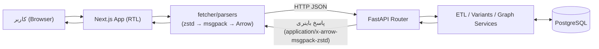
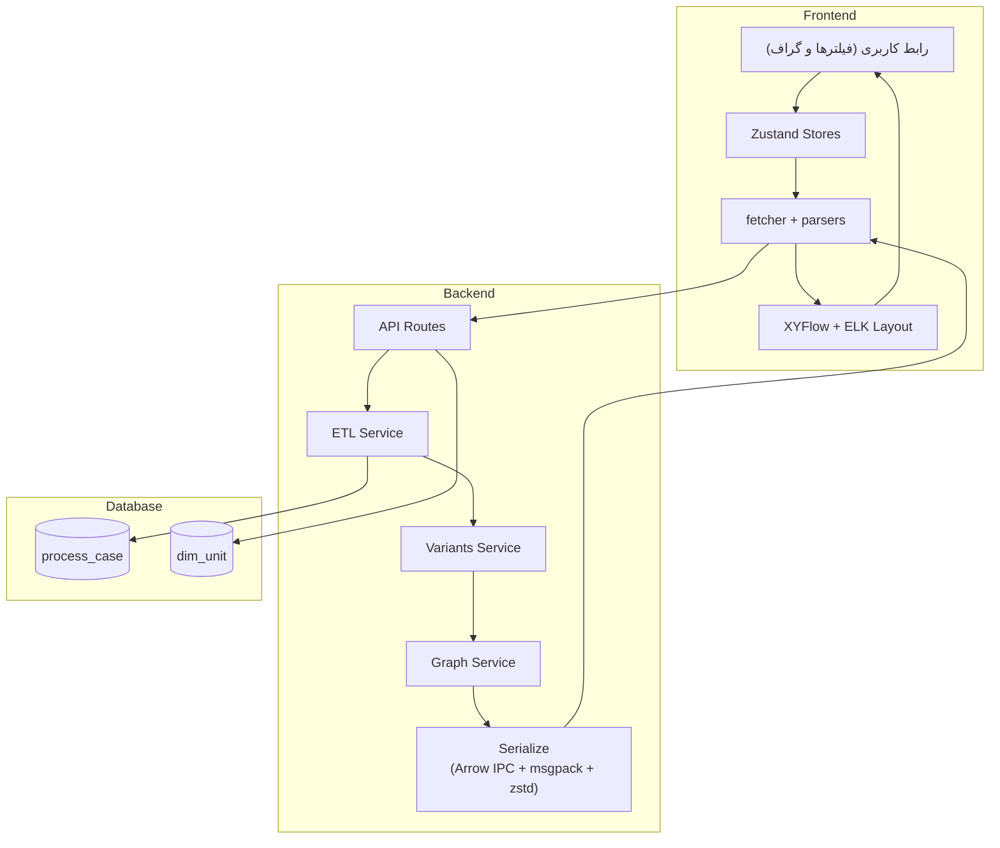
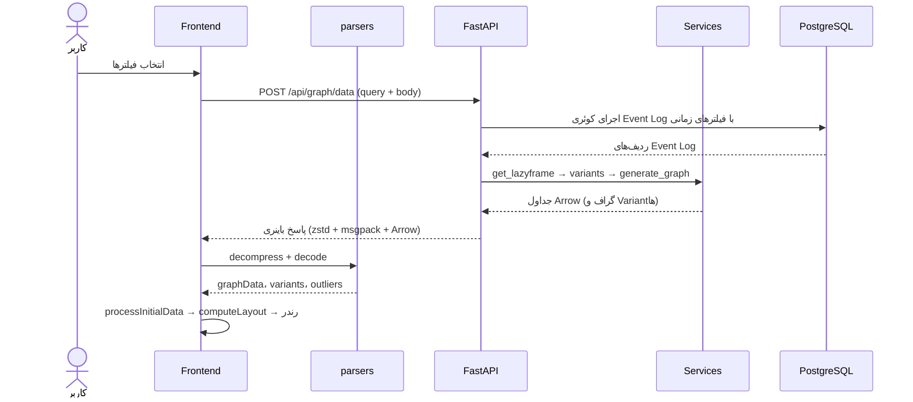
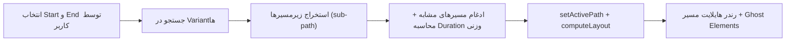
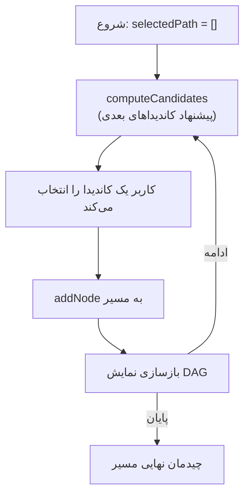
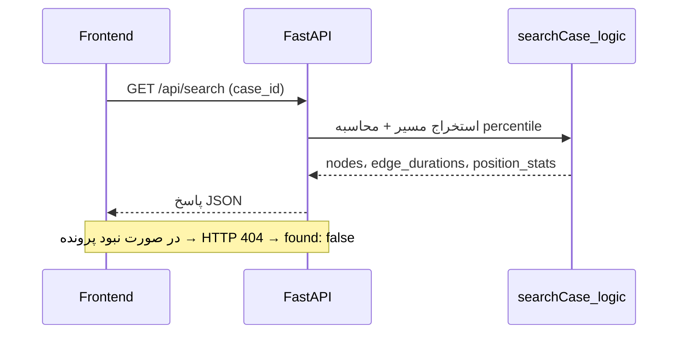

# معماری سامانه «فکر» (Fekr)

| مشخصه | مقدار |
|---|---|
| مسیر منبع | کل پروژه (`BackEnd/`، `FrontEnd/`) |
| دسته | سند کلی (Architecture) |
| مستندات مرتبط | [۰۰-تحلیل فنی](00-project-analysis.md) · [۰۲-فهرست ماژول‌ها](02-module-inventory.md) |

## ۱. معرفی کلی سیستم (System Overview)

سامانه «فکر» یک پلتفرم **Process Mining** مبتنی بر وب است. این سامانه Event Log پرونده‌های قضایی را به گراف فرایند (**Directly Follows Graph**) تبدیل می‌کند و ابزارهایی برای تحلیل مسیرها، شناسایی داده‌های پرت و جستجوی پرونده در اختیار کاربران قرار می‌دهد.

معماری سیستم از سه بخش اصلی تشکیل شده است:

1. **Frontend** — اپلیکیشن Next.js برای نمایش و تعامل با گراف فرایند
2. **Backend** — سرویس FastAPI که پردازش سنگین داده را با Polars انجام می‌دهد
3. **Database** — PostgreSQL که Event Log و دیکشنری واحدهای سازمانی را نگهداری می‌کند

نکته کلیدی معماری، تبادل داده گراف به صورت **باینری** است: Backend داده را به Arrow IPC تبدیل می‌کند و با msgpack بسته‌بندی و با zstd فشرده‌سازی می‌کند. Frontend پس از دریافت، این زنجیره را برعکس طی کرده و گراف را با XYFlow و موتور Layout مربوط به ELK.js ترسیم می‌کند.

## ۲. پشته فناوری (Technology Stack)

| لایه | فناوری | نسخه |
|---|---|---|
| Backend Framework | FastAPI + Uvicorn | 0.109+ |
| Backend Data Engine | Polars | latest |
| Backend DB Access | ConnectorX / ADBC / psycopg2 | latest |
| Backend Serialization | PyArrow / msgpack / zstandard | arrow 21.x |
| Frontend Framework | Next.js (App Router) | 16.1.1 |
| Frontend UI | React + TypeScript | 19.2.3 |
| Frontend State | Zustand | 5 |
| Frontend Graph | @xyflow/react | 12.8.6 |
| Frontend Layout | elkjs | 0.11 |
| Frontend UI Kit | HeroUI + Tailwind CSS | v4 |
| Frontend Binary Parse | apache-arrow / @msgpack/msgpack / fzstd | 21.1 |
| Frontend Date | moment-jalaali | 0.10 |
| Database | PostgreSQL | 15 |
| زیرساخت | Docker Compose | — |

## ۳. نمودار معماری سطح بالا (High-Level Architecture)





## ۴. معماری Frontend

### اصول ساختاری

- برنامه با **Next.js App Router** ساخته شده و صفحات را با Route Groups سازمان‌دهی کرده است:
  - `(auth)/login` — صفحه ورود (شماره + OTP — در حال حاضر Mock)
  - `(panel)` — فضای اصلی سامانه شامل تب‌های: فرآیندنگار، جریان‌یاب، جریان‌ساز هوشمند، پرونده‌نگار، تحلیل مسیرهای کم‌تکرار، تنظیمات و راهنما
- صفحات از نوع `'use client'` هستند.
- مدیریت State به صورت ماژولار با **Zustand** در سه Store انجام شده است.

### مدیریت State

| Store | مسئولیت |
|---|---|
| `useAppStore` | داده پردازش‌شده (graphData، variants، outliers)، فیلترهای فعلی، وضعیت انتخاب، پالت رنگ و State تب |
| `useGraphStore` | نود/یال خام و چیدمان‌شده، محاسبه ELK Layout، Tooltip و تعاملات، Pathfinding و Ghost Elements |
| `useRouteBuilderStore` | مسیر در حال ساخت در جریان‌ساز هوشمند |

### رندر گراف

- گراف با **@xyflow/react** ترسیم می‌شود (نودهای سفارشی، یال‌های استایل‌شده و Tooltip).
- چیدمان با **ELK.js** (الگوریتم Layered، جهت RIGHT، یال‌های Orthogonal) به صورت درون‌خطی در `useGraphStore.computeLayout()` محاسبه می‌شود.
- نودهای مصنوعی `START_NODE` و `END_NODE` به همراه یال‌های خط‌چین به گراف اضافه می‌شوند.
- رنگ یال‌ها بر اساس `Weight_Value` و پالت‌های `colorPalettes` تعیین می‌شود.

### لایه ارتباط با Backend

- **دو Base URL**: در مرورگر `NEXT_PUBLIC_API_URL` و در سمت سرور (Docker) `INTERNAL_API_URL`.
- Timeout پیش‌فرض ۶۰ ثانیه و کلاس خطای اختصاصی `ApiError`.
- **parsers.ts**: زنجیره `fzstd.decompress → msgpack.decode → tableFromIPC` برای تبدیل پاسخ باینری به اشیای دامنه.

## ۵. معماری Backend

### الگوی لایه‌بندی

```
FastAPI Route Handlers → Services (محض و مبتنی بر Polars) → PostgreSQL
```

- **Route Layer** (`app/api/routes/`): دریافت پارامترها، فراخوانی سرویس‌ها و سریال‌سازی پاسخ.
- **Service Layer** (`app/services/`): منطق محض و قابل تست که روی `pl.LazyFrame` کار می‌کند.
- **Config** (`app/config.py`): پیکربندی اتصال دیتابیس.

### اندپوینت‌ها

| روش | مسیر | توضیح |
|---|---|---|
| POST | `/api/graph/data` | تولید داده گراف و ارسال پاسخ باینری |
| GET | `/api/graph/schema` | سطوح ابعادی دیتابیس (LEV1 تا LEV8) |
| GET | `/api/graph/filters` | مقادیر معتبر سطوح ابعادی (با فیلتر والد) |
| GET | `/api/graph/court-kinds` | لیست صلاحیت‌های شعبه |
| GET | `/api/search` | جستجوی یک پرونده و مقایسه آماری |
| GET | `/api/stats/global` | هیستوگرام مدت و مراحل (کلی) |
| GET | `/api/stats/edge` | هیستوگرام مدت‌زمان یک یال |
| GET | `/health` | وضعیت Backend و Database |

### سرویس‌های اصلی

| سرویس | مسئولیت |
|---|---|
| `ETL.py` | خواندن داده از دیتابیس، استانداردسازی و غنی‌سازی (`get_lazyframe`) |
| `variants.py` | ساخت Variantها، پوشش Pareto و آمارهای زمانی |
| `graph.py` | تولید یال‌های DFG با آمارهای پیشرفته |
| `searchCase.py` | جستجوی یک پرونده و محاسبه percentile |
| `stats.py` | ساخت هیستوگرام با NumPy |
| `utils.py` | توابع آماری لیستی (Polars + Fallback به NumPy) |

### جریان پردازش `POST /api/graph/data`

1. خواندن Query Parameters و Body (شامل `dimensionFilters` و `courtKinds`)
2. فراخوانی `ETL.get_lazyframe(start_date, end_date)`
3. تفکیک `unit_ids` از جدول `dim_unit` بر اساس فیلترهای ابعادی
4. فراخوانی `variants.get_variants_logic(lf, target_coverage, unit_ids)`
5. فراخوانی `graph.generate_graph_from_variants(pareto_df, weight_metric, time_unit, ...)`
6. سریال‌سازی: Arrow IPC → msgpack → zstd → ارسال پاسخ

## ۶. معماری Database

| جدول | تعداد ردیف | نقش |
|---|---|---|
| `process_case` | حدود ۷۰۰ هزار | Event Log پرونده‌ها |
| `dim_unit` | ۳۸۸ | دیکشنری سلسله‌مراتبی واحدهای سازمانی |

### جدول `process_case`

| ستون | توضیح |
|---|---|
| `case_id` | شناسه پرونده |
| `activity` | نام فعالیت (نوع اقدام) |
| `timestamp` | زمان رخداد (تبدیل شده از شمسی به میلادی) |
| `unit_id` | شناسه واحد سازمانی |

### جدول `dim_unit`

| ستون | توضیح |
|---|---|
| `ID` | شناسه واحد |
| `LEV1_NAME` تا `LEV8_NAME` | سطوح سلسله‌مراتبی ابعاد (تا ۸ سطح) |
| `PUBLICCOURTTYPENAME` | نوع دادگاه عمومی |
| `COURTTYPENAME` | نوع دادگاه |
| `COURTKINDSNAME` | صلاحیت شعبه |

### ایندکس‌ها

- جدول `process_case`: ایندکس روی `case_id`، `timestamp`، `unit_id` و ترکیب `(unit_id, timestamp)`
- جدول `dim_unit`: ایندکس روی `ID`، `LEV1_NAME` و `LEV2_NAME`

> نکته: در `docker-compose.yml` دیتابیس `graphdb` ساخته می‌شود اما `app/config.py` به دیتابیس پیش‌فرض `postgres` متصل است. این ناسازگاری باید در استقرار واقعی اصلاح شود.

## ۷. نمودارهای جریان داده (Data Flow Diagrams)

### ۱. جریان فیلتر و تولید گراف



### ۲. جریان مسیریابی (Pathfinding)



### ۳. جریان جریان‌ساز (Route Builder)



### ۴. جریان جستجوی پرونده



## خلاصه

- معماری سه لایه: **PostgreSQL** (منبع داده) + **FastAPI/Polars** (پردازش) + **Next.js/XYFlow** (نمایش)
- تبادل باینری (Arrow IPC + msgpack + zstd) برای کاهش حجم و افزایش سرعت انتقال داده گراف
- تحلیل مسیر و Duration به صورت **سمت کلاینت** روی Variantهای دریافت‌شده انجام می‌شود
- احراز هویت در حال حاضر Mock است و در مستندات بعدی باید تکمیل شود
