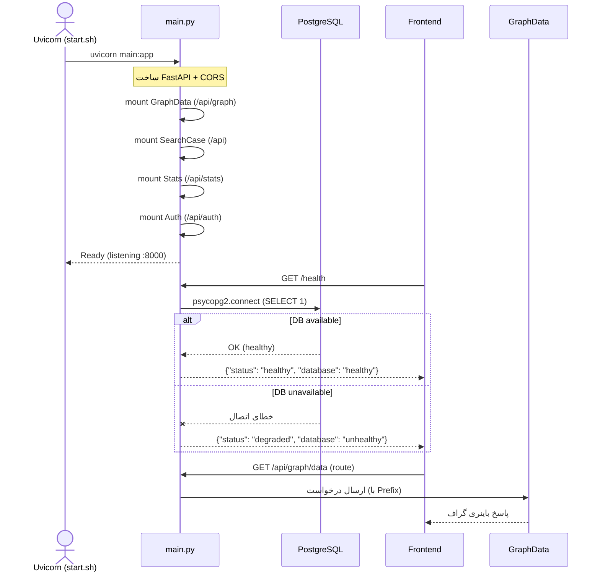

# مستندات فنی ماژول: Application Entrypoint

| مشخصه | مقدار |
|---|---|
| مسیر منبع | `BackEnd/main.py` |
| دسته | سرویس Backend (نقطه ورود) |
| مستندات مرتبط | [۰۲-Config](02-config.md) · [۰۴-Graph API Router](04-graph-api-router.md) · [۰۵-SearchCase Router](05-searchcase-router.md) · [۰۶-Stats Router](06-stats-router.md) · [۰۷-Auth Router](07-auth-router.md) |

## ۱. هدف (Purpose)

ماژول **Application Entrypoint** نقطه ورود برنامه Backend سامانه «فکر» است. این ماژول:

- اپلیکیشن **FastAPI** را ساخته و راه‌اندازی می‌کند
- تمام روترهای API (گراف، جستجو، آمار، احراز هویت) را روی مسیرهای مشخص mount می‌کند
- Middleware مربوط به CORS را تنظیم می‌کند
- اندپوینت‌های پایه (`/` و `/health`) را ارائه می‌دهد

این ماژول توسط **Uvicorn** لود می‌شود و در واقع دروازه ورود تمام درخواست‌های HTTP به سرویس Backend است.

## ۲. مسئولیت‌ها (Responsibilities)

| مسئولیت | توضیح |
|---|---|
| ساخت اپلیکیشن | ایجاد Instance از کلاس `FastAPI` با متادیتای سرویس (Title: "Process Mining Graph API") |
| تنظیم CORS | افزودن Middleware برای مجاز کردن همه Origins، Methods و Headers |
| Mount روترها | اتصال روترهای ۴گانه به Prefix مشخص |
| تعریف اندپوینت‌های پایه | ریشه `/` و سرویس HealthCheck `/health` |
| بررسی سلامت دیتابیس | اتصال تستی مستقیم به PostgreSQL جهت گزارش وضعیت DB |

## ۳. فایل‌های مرتبط (Related Files)

| نقش | مسیر |
|---|---|
| **Main**: این فایل | `BackEnd/main.py` |
| پیکربندی دیتابیس | `BackEnd/app/config.py` (منبع: `DATABASE_URL`) |
| روتر گراف | `BackEnd/app/api/routes/GraphData.py` |
| روتر جستجو | `BackEnd/app/api/routes/SearchCase.py` |
| روتر آمار | `BackEnd/app/api/routes/Stats.py` |
| روتر احراز هویت | `BackEnd/app/api/routes/Auth.py` |
| Package روترها | `BackEnd/app/api/routes/__init__.py` |
| اسکریپت استارت‌آپ | `BackEnd/start.sh` — ابتدا `import_data.py` (بازنویسی جداول از CSV + ساخت ایندکس) و سپس اجرای Uvicorn با ماژول `main:app` |
| Dockerfile | `BackEnd/Dockerfile` (Command: `uvicorn main:app`) |

## ۴. داده ورودی (Input Data)

این ماژول به صورت مستقیم داده کاربری دریافت نمی‌کند؛ بلکه **دروازه همه درخواست‌های HTTP** است:

| نوع ورودی | جزئیات |
|---|---|
| درخواست HTTP | روت‌های `/api/graph/*`, `/api/search`, `/api/stats/*`, `/api/auth/*` |
| درخواست Health | `GET /health` |
| درخواست ریشه | `GET /` |
| تنظیمات محیط | `DATABASE_URL` (از `app/config.py`) |
| Initialization | بارگذاری روترها هنگام ساخت اپلیکیشن (Startup) |

## ۵. منبع داده (Data Source)

- **دیتابیس**: PostgreSQL — این ماژول مستقیماً در اندپوینت `/health` با `psycopg2` به دیتابیس متصل شده و با `SELECT 1` سلامت آن را بررسی می‌کند.
- **روترها**: منبع اصلی داده، روترهای Imported هستند که در هنگام ساخت اپلیکیشن به آن تزریق می‌شوند.

## ۶. مراحل پردازش (Processing Steps)

| مرحله | شرح |
|---|---|
| **۱. ساخت اپلیکیشن** | `app = FastAPI(...)` با Metadata سرویس |
| **۲. افزودن CORS** | `app.add_middleware(CORSMiddleware, allow_origins=["*"], ...)` |
| **۳. Mount روترها** | الحاق روترها با Prefix و Tags مجزا |
| **۴. تعریف اندپوینت‌ها** | تعریف تابع `read_root` و `health_check` |
| **۵. HealthCheck** | تلاش برای اتصال به DB با `connect_timeout=2`؛ در صورت موفقیت `db_status = "healthy"` در غیر این صورت `"unhealthy"` |
| **۶. پاسخ Health** | ساخت JSON حاوی `status`, `frontend`, `backend`, `database` |

> نکته: مراحل پردازش در این ماژول بیشتر **Orchestration** هستند و پردازش محاسباتی در سرویس‌های دیگر انجام می‌شود؛ این ماژول فقط مسیر (Routing) و وضعیت (Health) را تعیین می‌کند.

## ۷. داده خروجی (Output Data)

| اندپوینت | خروجی |
|---|---|
| `GET /` | `{"Hello": "FastAPI is Working!"}` |
| `GET /health` | `{ status, frontend, backend, database }` |
| پاسخ روترها | با توجه به Prefix به روتر مربوطه منتقل می‌شود (بخشی از خروجی این ماژول نیست) |

### نمونه پاسخ `/health`

```json
{
  "status": "healthy",
  "frontend": "healthy",
  "backend": "healthy",
  "database": "healthy"
}
```

و در صورت خطای دیتابیس:

```json
{
  "status": "degraded",
  "frontend": "healthy",
  "backend": "healthy",
  "database": "unhealthy"
}
```

## ۸. مصرف‌کنندگان خروجی (Where Outputs Are Consumed)

- **`/health`**: صفحه‌ی ورود در Frontend (`src/app/(auth)/login/page.tsx`) از این اندپوینت برای نمایش وضعیت سرویس‌ها (Backend و Database) استفاده می‌کند. همچنین کامپوننت Health در فرانت‌اند (`api.health`) آن را فراخوانی می‌کند.
- **اندپوینت‌های API**: مصرف‌کننده دیگری در این ماژول وجود ندارد؛ مصرف پاسخ روترها توسط ماژول‌های گراف، جستجو و آمار در Backend انجام می‌شود.
- **Orchestration**: داکر Compose و `/health` برای HealthCheck سرویس Backend استفاده می‌شود.
- **بوت کانتینر (`start.sh`)**: در هر استارت ابتدا `import_data.py` اجرا می‌شود که با `if_table_exists="replace"` جداول `process_case`/`dim_unit` را از CSV **بازنویسی** و ایندکس‌ها را از نو می‌سازد — هر تغییری که پس از بوت روی دیتابیس اعمال شده باشد با ری‌استارت بعدی از بین می‌رود.

## ۹. وابستگی‌ها (Dependencies)

| وابستگی | نوع |
|---|---|
| FastAPI | Framework اصلی |
| CORSMiddleware | از `fastapi.middleware` |
| psycopg2-binary | اتصال DB در HealthCheck |
| `app.config.DATABASE_URL` | مسیر اتصال دیتابیس |
| روترهای `GraphData`, `SearchCase`, `Stats`, `Auth` | ماژول‌های Route |
| Uvicorn | سرویس اجرایی (از `start.sh` / Dockerfile) |

## ۱۰. خطاهای احتمالی (Error Scenarios)

| سناریو | رفتار فعلی |
|---|---|
| **عدم دسترسی به دیتابیس** | `except` در `health_check` -> مقدار `db_status = "unhealthy"` و پاسخ `status: "degraded"` |
| **خطای غیرمنتظره در HealthCheck** | در Console چاپ می‌شود (`print(f"Database health check failed: {e}")`) و در عین حال degraded پاسخ داده می‌شود |
| **درخواست به روتر ناموجود** | خطای 404 استاندارد FastAPI |
| **درخواست بدون ورود** | هیچ مرحله ورودی وجود ندارد؛ درخواست مستقیم از طریق CORS/Health پذیرفته می‌شود |
| **مشکل در CORS** | هیچ مدیریت خطای اختصاصی ندارد؛ خطا توسط FastAPI به‌صورت پیش‌فرض برگردانده می‌شود |
| **نبود Database URL** | `psycopg2.connect` با `DATABASE_URL` ناقص خطا خواهد داد و HealthCheck به حالت `degraded` می‌شود |

## ۱۱. نمودار جریان داده (Data Flow Diagram)



## خلاصه

ماژول **Application Entrypoint** ساده اما حیاتی است: تمام Traffic ورودی سرویس را از طریق **روترهای** خود به ماژول‌های تخصصی (گراف، جستجو، آمار، Auth) هدایت می‌کند و با اندپوینت `/health` وضعیت سیستم را برای Frontend و Orchestration گزارش می‌دهد. داده محاسباتی در این ماژول تولید نمی‌شود؛ همه آن‌ها به سرویس‌های زیردستی واگذار (Delegate) می‌شود.