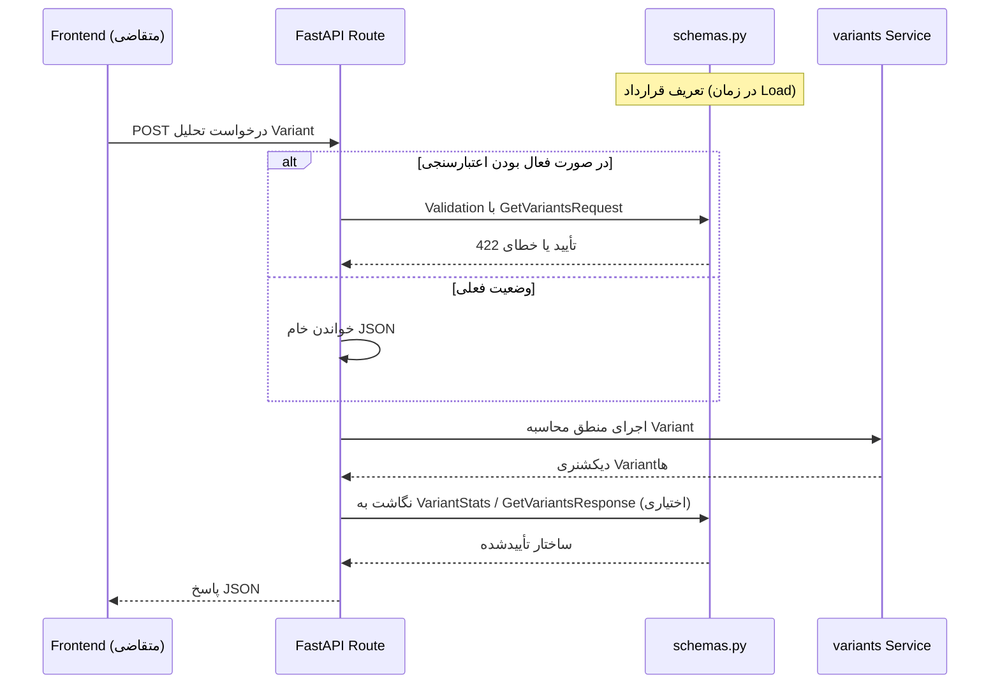

# مستندات فنی ماژول: Pydantic (Schemas)

| مشخصه | مقدار |
|---|---|
| مسیر منبع | `BackEnd/app/schemas.py` |
| دسته | سرویس Backend (قرارداد داده) |
| مستندات مرتبط | [۰۴-Graph API Router](04-graph-api-router.md) · [۰۹-Variants](09-variants.md) |

## ۱. هدف (Purpose)

ماژول **Schemas** وظیفه تعریف **قرارداد داده‌ای (Data Contract)** برای تحلیل Variant را بر عهده دارد. این ماژول با استفاده از Pydantic سه مدل تعریف می‌کند:

- **GetVariantsRequest**: ساختار درخواست تحلیل Variant
- **VariantStats**: ساختار هر Variant در خروجی
- **GetVariantsResponse**: ساختار پاسخ کامل تحلیل

هدف این ماژول، اعتبارسنجی خودکار ورودی و تضمین شکل صحیح خروجی است تا مرزهای API به صورت تایپ‌شده و قابل مستندسازی تعریف شوند.

## ۲. مسئولیت‌ها (Responsibilities)

| مسئولیت | توضیح |
|---|---|
| تعریف قرارداد ورودی | مدل `GetVariantsRequest` با فیلدهای `input_source` و `target_coverage` |
| تعریف قرارداد خروجی | مدل‌های `VariantStats` و `GetVariantsResponse` با ساختار دقیق Variantها |
| اعتبارسنجی داده | استفاده از `Field` با محدودیت‌ها (`ge`, `le`, `example`) |
| مستندسازی خودکار | تولید اسکیمای OpenAPI برای قراردادها |
| نگاشت نام‌ها | فعال کردن `populate_by_name` برای سازگاری با خروجی دیکشنری Polars |

## ۳. فایل‌های مرتبط (Related Files)

| نقش | مسیر |
|---|---|
| **Main**: این فایل | `BackEnd/app/schemas.py` |
| سرویس محاسباتی مرتبط | `BackEnd/app/services/variants.py` (ساختار خروجی Variantها) |
| روتر گراف (کاربر احتمالی) | `BackEnd/app/api/routes/GraphData.py` |
| اسکیمای OpenAPI | تولید خودکار توسط FastAPI از روی این مدل‌ها |

## ۴. داده ورودی (Input Data)

| مدل | فیلدها | جزئیات |
|---|---|---|
| `GetVariantsRequest` | `input_source` | نام جدول یا فایل منبع (الزامی) |
| | `min_cases` | حداقل فرکانس برای نگه‌داشتن یک Variant (اختیاری) |
| | `target_coverage` | آستانه پوشش Pareto بین ۰ تا ۱ (پیش‌فرض 0.95) |
| `VariantStats` | `Variant_Path` | لیست فعالیت‌های مسیر Variant |
| | `Frequency` | تعداد تکرار |
| | `Percentage` | درصد از کل |
| | `cum_coverage` | پوشش تجمعی |
| | `True_Start_Count`, `True_End_Count` | شمارش شروع/پایان صحیح |
| | `Avg_Timings`, `Total_Timings` | لیست زمان‌های میانگین و مجموع هر مرحله |

## ۵. منبع داده (Data Source)

- **منبع داده مستقیم ندارد**: این ماژول صرفاً ساختار Type را تعریف می‌کند و به دیتابیس یا فایل متصل نمی‌شود.
- منبع مقادیر، سرویس `variants.py` و یا درخواست کاربر است که باید با این ساختارها تطبیق داده شود.

## ۶. مراحل پردازش داده (Data Processing Steps)

| مرحله | شرح |
|---|---|
| **۱. تعریف مدل‌ها** | تعریف سه کلاس Pydantic با فیلدها و اعتبارسنجی‌ها |
| **۲. اعتبارسنجی ورودی** | در صورت استفاده، Pydantic ورودی JSON را با `GetVariantsRequest` تطبیق داده و اعتبارسنجی می‌کند |
| **۳. تبدیل خروجی** | در صورت استفاده، خروجی دیکشنری Polars به ساختار `VariantStats` نگاشت می‌شود |
| **۴. سرویس OpenAPI** | FastAPI از این مدل‌ها اسکیمای مستندات خودکار می‌سازد |

> نکته مهم: در وضعیت فعلی، **روتر فعالی از این مدل‌ها استفاده نمی‌کند**. اندپوینت `POST /api/graph/data` بدنه JSON را به صورت خام (Raw) می‌خواند و این مدل‌ها به عنوان قراردادهای تعریف‌شده اما غیرفعال (Unused) نگهداری می‌شوند.

## ۷. داده خروجی (Output Data)

| مدل | خروجی |
|---|---|
| `GetVariantsResponse` | لیست `pareto_variants`، لیست `all_variants`، نودهای شروع/پایان (`final_start_nodes`, `final_end_nodes`) و پیام وضعیت |
| `VariantStats` | ساختار استاندارد هر Variant برای مصرف در پاسخ |

### نمونه ساختار پاسخ (Contractual)

```json
{
  "pareto_variants": [
    {
      "Variant_Path": ["فعالیت A", "فعالیت B"],
      "Frequency": 120,
      "Percentage": 24.5,
      "cum_coverage": 0.245,
      "True_Start_Count": 120,
      "True_End_Count": 118,
      "Avg_Timings": [0.0, 3600.5],
      "Total_Timings": [0.0, 432060.0]
    }
  ],
  "all_variants": [],
  "final_start_nodes": ["فعالیت A"],
  "final_end_nodes": ["فعالیت B"],
  "message": "Analysis completed successfully"
}
```

## ۸. مصرف‌کنندگان خروجی (Where Outputs Are Consumed)

| مصرف‌کننده | نحوه استفاده |
|---|---|
| **Frontend (در صورت استفاده)** | ساختار Variantها و آمارهای زمانی را مطابق این قرارداد Parse می‌کند |
| **سرویس variants** | خروجی‌های آن (`Variant_Path`, `Frequency`, `cum_coverage` و تایمینگ‌ها) باید با `VariantStats` سازگار باشند |
| **مستندات OpenAPI** | توضیحات و مثال‌های این مدل‌ها در مستندات خودکار API نمایش داده می‌شود |

> وضعیت فعلی: از آنجا که روتر فعالی از این مدل‌ها استفاده نمی‌کند، جریان داده واقعی از این ماژول عبور نمی‌کند و قرارداد به صورت غیرفعال نگهداری می‌شود.

## ۹. وابستگی‌ها (Dependencies)

| وابستگی | نوع |
|---|---|
| Pydantic | پایه تعریف مدل‌ها و اعتبارسنجی |
| FastAPI (به صورت ضمنی) | استفاده در OpenAPI و Validation Pipeline |
| Python typing | تعریف List و Optional |

## ۱۰. خطاهای احتمالی (Error Scenarios)

| سناریو | رفتار فعلی |
|---|---|
| **ورودی نامعتبر** | در صورت استفاده، Pydantic خطای 422 با جزئیات Validation برمی‌گرداند |
| **بیش از محدوده `target_coverage`** | فیلد با `ge=0.0` و `le=1.0` محدود شده و مقدار خارج از بازه رد می‌شود |
| **نبود `input_source`** | فیلد الزامی (`...`)؛ ارسال بدون آن خطای اعتبارسنجی می‌دهد |
| **عدم تطابق خروجی Polars** | در صورت برخورد خطای نگاشت، مقادیر خارج از ساختار رد می‌شوند (به `populate_by_name` نیاز است) |
| **استفاده‌نشدگی** | مدل‌ها در روتر فعال استفاده نمی‌شوند؛ بنابراین خطاهای اعتبارسنجی در جریان فعلی فعال نیستند |

## ۱۱. نمودار جریان داده (Data Flow Diagram)



## خلاصه

ماژول **Schemas** قرارداد داده‌ای تحلیل Variant را با Pydantic تعریف می‌کند: یک مدل درخواست (`GetVariantsRequest`)، یک مدل ساختار Variant (`VariantStats`) و یک مدل پاسخ کامل (`GetVariantsResponse`). این ماژول به دیتابیس متصل نیست و پردازشی انجام نمی‌دهد؛ بلکه نقش اعتبارسنجی و مستندسازی مرز API را دارد. در وضعیت فعلی، این مدل‌ها توسط روترهای فعال استفاده نمی‌شوند و به عنوان قرارداد تعریف‌شده (Contractual) نگهداری می‌شوند؛ در صورت راه‌اندازی اندپوینت اختصاصی تحلیل Variant، این قراردادها جریان داده را اعتبارسنجی می‌کنند.