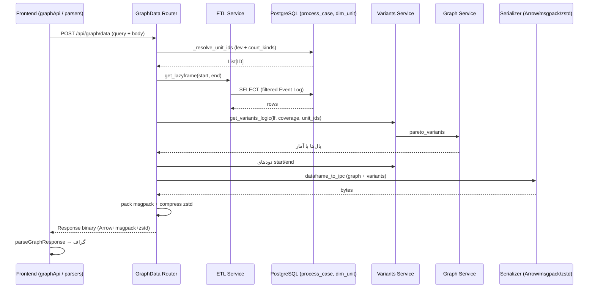

# مستندات فنی ماژول: Graph API Router

| مشخصه | مقدار |
|---|---|
| مسیر منبع | `BackEnd/app/api/routes/GraphData.py` |
| دسته | روتر Backend |
| مستندات مرتبط | [۰۱-Application Entrypoint](01-application-entrypoint.md) · [۰۳-Pydantic Schemas](03-schemas.md) · [۰۸-ETL](08-etl.md) · [۰۹-Variants](09-variants.md) · [۱۰-Graph](10-graph.md) |

## ۱. هدف (Purpose)

ماژول **Graph API Router** اصلی‌ترین روتر Backend سامانه «فکر» است. این ماژول تمام عملکردهای گراف را ارائه می‌دهد:

- تولید داده گراف فرایند از Event Log (اندپوینت اصلی `POST /api/graph/data`)
- ارائه متادیتای سطوح ابعادی (`GET /api/graph/schema`)
- ارائه مقادیر معتبر ابعاد برای فیلتر (`GET /api/graph/filters`)
- ارائه لیست صلاحیت‌های شعبه (`GET /api/graph/court-kinds`)

این ماژول جریان داده را از درخواست کاربر تا پاسخ باینری فشرده (Arrow IPC + msgpack + zstd) Orchestration می‌کند.

## ۲. مسئولیت‌ها (Responsibilities)

| مسئولیت | توضیح |
|---|---|
| تولید داده گراف | فراخوانی ETL، Variants و Graph برای ساخت یال‌های DFG |
| تفکیک Unit از ابعاد | ترجمه فیلترهای ابعادی به شناسه واحدها (`_resolve_unit_ids`) |
| سریال‌سازی باینری | تبدیل DataFrame به Arrow IPC و بسته‌بندی msgpack + فشرده‌سازی zstd |
| ارائه Schema | کش کردن و برگرداندن ستون‌های سطح `LEV1..LEV8` |
| ارائه مقادیر ابعاد | محاسبه مقادیر معتبر هر سطح بر اساس فیلتر والد |
| ارائه صلاحیت شعبه | خواندن `COURTKINDSNAME` های یکتا |
| تحمل خطا | Fallback مقادیر پیش‌فرض در صورت خطای نمی‌داند |

## ۳. فایل‌های مرتبط (Related Files)

| نقش | مسیر |
|---|---|
| **Main**: این فایل | `BackEnd/app/api/routes/GraphData.py` |
| سرویس ETL | `BackEnd/app/services/ETL.py` |
| سرویس Variants | `BackEnd/app/services/variants.py` |
| سرویس Graph | `BackEnd/app/services/graph.py` |
| پیکربندی دیتابیس | `BackEnd/app/config.py` |
| مصرف‌کننده فرانت‌اند | `FrontEnd/src/utils/fetcher/api/graph.ts` |
| Parse پاسخ باینری | `FrontEnd/src/utils/fetcher/parsers.ts` |
| Mount در اپلیکیشن | `BackEnd/main.py` (prefix: `/api/graph`) |

## ۴. داده ورودی (Input Data)

### اندپوینت اصلی `POST /api/graph/data`

| منابع | جزئیات |
|---|---|
| **Query Parameters** | `start_date`, `end_date`, `unit_id`, `weight_metric` (`cases`/`mean_time`), `time_unit` (`s/m/h/d/w`), `min_cases`, `max_cases`, `min_mean_time`, `max_mean_time`, `target_coverage`, فیلترهای `lev1..lev8`, `court_kinds` |
| **JSON Body** | `dimensionFilters` (سطح → مقادیر انتخابی)، `courtKinds` (لیست صلاحیت‌ها) |
| **Cache** | `_SCHEMA_CACHE` (در سطح ماژول) برای schema |

> نکته: پارامترهای فیلتر از Query String خوانده می‌شوند و فیلترهای ابعادی/صلاحیت هم از Query هم از Body مجاز هستند؛ Body اولویت دارد.

## ۵. منبع داده (Data Source)

- **Primary**: PostgreSQL از طریق `DATABASE_URL` (منبع: ETL و کوئری‌های مستقیم)
  - جدول `process_case` — Event Log (برای محاسبه گراف)
  - جدول `dim_unit` — ابعاد، صلاحیت شعبه و سطوح (`LEV1_NAME..LEV8_NAME`)
- **موتور**: ConnectorX برای خواندن موازی/سریع از دیتابیس
- **Cache داخلی**: `_SCHEMA_CACHE` برای سطوح (یک بار محاسبه، استفاده مکرر)

## ۶. مراحل پردازش داده (Data Processing Steps)

### اندپوینت `POST /api/graph/data`

| مرحله | شرح |
|---|---|
| **۱. جمع‌آوری فیلتر** | خواندن query params (lev...، court_kinds) و body (`dimensionFilters`, `courtKinds`) |
| **۲. ETL** | `ETL.get_lazyframe(start_date, end_date)` — خواندن Event Log با فیلتر زمانی SQL |
| **۳. Unit Resolution** | `_resolve_unit_ids(level_filters, court_kinds)` — تبدیل فیلترهای ابعادی به لیست `ID` از `dim_unit`؛ سپس **ادغام با `unit_id`**: اگر فیلتر ابعادی لیست تولید کرد و `unit_id` هم ارسال شده باشد، لیست به همان `unit_id` محدود می‌شود؛ اگر فیلتر ابعادی وجود نداشت، `unit_id` تکی جایگزین می‌شود |
| **۴. Variants** | `variants.get_variants_logic(lf, target_coverage, unit_id, unit_ids)` — برگشت pareto_variants و start/end nodes |
| **۵. Graph** | `graph.generate_graph_from_variants(pareto_df, weight_metric, time_unit, ...)` — یال‌های DFG با آمار |
| **۶. افزودن سطح شعبه** | استخراج `Source_CourtType`/`Target_CourtType` با برش آخرین بخش نام فعالیت بعد از `" در "` (`str.split(" در ").list.get(-1)`). کوئری `units_meta_df` (SELECT `ID`/`PUBLICCOURTTYPENAME`/`COURTTYPENAME`) اجرا می‌شود اما نتیجه‌اش **استفاده نمی‌شود** (dead query) |
| **۷. تبدیل Arrow** | `dataframe_to_arrow_ipc(graph_df)` و برای all_variants |
| **۸. بسته‌بندی** | ساخت payload با `msgpack.packb` (شامل Arrow bytes) |
| **۹. فشرده‌سازی** | `zstd` با سطح 3 |
| **۱۰. پاسخ** | `Response(content_type="application/x-arrow-msgpack-zstd")` |

### اندپوینت‌های متادیتا

| اندپوینت | پردازش |
|---|---|
| `GET /schema` | خواندن ستون‌های `LEV{x}_NAME` از dim_unit + cache |
| `GET /filters` | برای هر سطح، مقادیر یکتا؛ با فیلتر سطوح والد در SQL |
| `GET /court-kinds` | `SELECT DISTINCT COURTKINDSNAME` و حذف مقادیر خالی |

## ۷. داده خروجی (Output Data)

### پاسخ `POST /api/graph/data` (باینری)

| فیلد (در داخل msgpack) | نوع | توضیح |
|---|---|---|
| `graphData` | `Uint8Array` | Arrow IPC جدول یال‌های گراف |
| `allVariants` | `Uint8Array` | Arrow IPC جدول تمام Variantها |
| `startActivities`, `endActivities` | `ActivityCountItem[]` | نودهای شروع/پایان با `{node, count}` |
| `targetCoverage` | number | آستانه پوشش اعمال‌شده |

### پاسخ‌های متادیتا (JSON)

| اندپوینت | خروجی |
|---|---|
| `GET /schema` | `{ levels: [{ key, label }] }` |
| `GET /filters` | `{ lev1_names: [...], lev2_names: [...] }` |
| `GET /court-kinds` | `string[]` |

## ۸. مصرف‌کنندگان خروجی (Where Outputs Are Consumed)

| مصرف‌کننده | نحوه مصرف |
|---|---|
| **Frontend (parsers.ts)** | Decompress زنجیره (zstd → msgpack → Arrow IPC) و ساخت `graphData`, `variants`, `outliers` |
| **Frontend (page.tsx)** | ورودی `ProcessMiningData` را در `useAppStore` ثبت و سپس برای `computeLayout` استفاده می‌کند |
| **Frontend (Navbar)** | `getSchema` برای درخت ابعاد و `getCourtKinds` برای فیلتر صلاحیت |
| **Frontend (ActivityTreeFilter)** | `filters` برای مقادیر معتبر درختی |

## ۹. وابستگی‌ها (Dependencies)

| وابستگی | نوع |
|---|---|
| FastAPI (APIRouter, Query, Response) | Framework اصلی |
| ETL, variants, graph (سرویس‌ها) | محاسبات |
| polars, pyarrow, connectorx | پردازش و IPC |
| msgpack, zstandard | سریال‌سازی و فشرده‌سازی |
| `app.config.DATABASE_URL` | اتصال دیتابیس |
| io, collections | ابزار داخلی |

## ۱۰. خطاهای احتمالی (Error Scenarios)

| سناریو | رفتار فعلی |
|---|---|
| **خالی بودن داده** | سرویس‌ها DataFrame خالی با Schema کامل برمی‌گردانند؛ پاسخ Arrow خالی ارسال می‌شود |
| **خطای دیتابیس/پردازش** | خطا به‌صورت Exception بیرون نموده و در نهایت توسط FastAPI به 500 تبدیل می‌شود |
| **شناسایی نشدن ستون‌های سطح** | `return fallback` به ۸ سطح پیش‌فرض |
| **فیلتر انتخابی بدون والد** | در schema وجود ندارد؛ آرایه خالی برمی‌گردد |
| **Body نامعتبر JSON** | `except: pass` و ادامه با فیلتر خالی |
| **کنسروسی دیتابیس** | اندپوینت‌های متادیتا به `end []` یا `[]` برمی‌گردند و log می‌شوند |
| **تغییر اسکیمای ابعاد بعد از اولین درخواست** | `_SCHEMA_CACHE` هرگز invalidate نمی‌شود؛ `GET /schema` تا ری‌استارت پروسه همیشه پاسخ کش‌شده را برمی‌گرداند |

## ۱۱. نمودار جریان داده (Data Flow Diagram)

## خلاصه

ماژول **Graph API Router** مغز ورودی API گراف است: فیلترها (زمانی، ابعادی، صلاحیت) → ETL → Variantها → DFG → سریال‌سازی باینری Arrow که با zstd فشرده می‌شود و به Frontend ارسال می‌گردد. اندپوینت‌های فرعی متادیتا نیز از جدول `dim_unit` مقادیر فیلتر را تامین می‌کنند. خروجی این ماژول به صورت ****باینری**** است و Frontend با `parsers.ts` آن را به اشیای گراف تبدیل می‌کند.