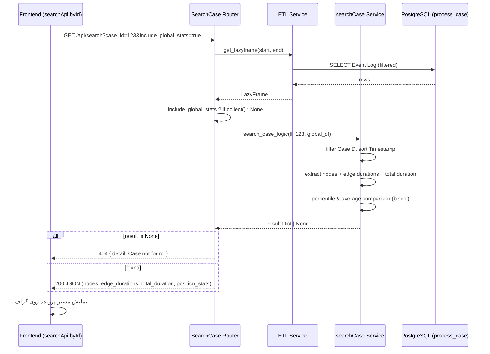

# مستندات فنی ماژول: SearchCase Router

| مشخصه | مقدار |
|---|---|
| مسیر منبع | `BackEnd/app/api/routes/SearchCase.py` |
| دسته | روتر Backend |
| مستندات مرتبط | [۰۱-Application Entrypoint](01-application-entrypoint.md) · [۰۸-ETL](08-etl.md) · [۱۱-SearchCase Service](11-searchcase-service.md) |

## ۱. هدف (Purpose)

ماژول **SearchCase Router** قابلیت **جستجوی یک پرونده (Case)** را در Event Log فراهم می‌کند. کاربر با ارسال `case_id`، مسیر طی‌شده (فعالیت‌ها)، مدت‌زمان هر مرحله و مدت کل پرونده را دریافت می‌کند؛ به‌صورت اختیاری نیز پرونده با آمار کل داده‌ها مقایسه می‌شود (Percentile و مقایسه با میانگین).

اندپوینت این ماژول: `GET /api/search` (روتر با prefix `api/` در main.py ثبت شده است)

## ۲. مسئولیت‌ها (Responsibilities)

| مسئولیت | توضیح |
|---|---|
| جستجوی پرونده | یافتن ردیف‌های یک `case_id` در Event Log |
| استخراج مسیر | ساخت لیست مرتب فعالیت‌های طی‌شده پرونده |
| محاسبه Edge Durations | اختلاف زمانی بین فعالیت‌های متوالی (به ثانیه) |
| محاسبه Total Duration | مدت کل پرونده (آخرین منهای اولین Timestamp) |
| مقایسه آماری | محاسبه `duration_percentile` و `is_slower_than_average` (اختیاری) |
| مدیریت خطا | 404 در نبود پرونده، 500 برای سایر خطاها |

## ۳. فایل‌های مرتبط (Related Files)

| نقش | مسیر |
|---|---|
| **Main**: این فایل | `BackEnd/app/api/routes/SearchCase.py` |
| سرویس جستجو | `BackEnd/app/services/searchCase.py` (`search_case_logic`) |
| سرویس ETL | `BackEnd/app/services/ETL.py` (`get_lazyframe`) |
| Mount در اپلیکیشن | `BackEnd/main.py` (prefix: `api/`) |
| مصرف‌کننده فرانت‌اند | `FrontEnd/src/utils/fetcher/api/search.ts` |
| صفحه جستجو | `FrontEnd/src/app/(panel)/search-case-ids/page.tsx` |

## ۴. داده ورودی (Input Data)

اندپوینت `GET /api/search`:

| پارامتر | نوع | الزامی | توضیح |
|---|---|---|---|
| `case_id` | integer | بله | شناسه پرونده مورد جستجو |
| `start_date` | string | خیر | شروع بازه زمانی فیلتر |
| `end_date` | string | خیر | پایان بازه زمانی فیلتر |
| `include_global_stats` | boolean | خیر (پیش‌فرض `true`) | آیا مقایسه با آمار کلی انجام شود؟ |

## ۵. منبع داده (Data Source)

- **Primary**: جدول `process_case` در PostgreSQL (از طریق `DATABASE_URL` و موتور ConnectorX)
- **مسیر دسترسی**: `ETL.get_lazyframe(start_date, end_date)` — Event Log را با فیلتر زمانی احتمالی به صورت LazyFrame برمی‌گرداند
- **Context آماری**: همان LazyFrame پس از `collect()` به عنوان زمینه جهانی مقایسه استفاده می‌شود

## ۶. مراحل پردازش داده (Data Processing Steps)

### لایه Router (SearchCase.py)

| مرحله | شرح |
|---|---|
| **۱. ETL** | اجرای `ETL.get_lazyframe(start, end)` برای دریافت Event Log فیلترشده |
| **۲. زمینه آماری** | اگر `include_global_stats=true`، اجرای `lf.collect()` روی کل داده |
| **۳. جستجو** | فراخوانی `searchCase.search_case_logic(lf, case_id, df_global_context)` |
| **۴. پاسخ** | برگرداندن result به صورت JSON؛ اگر `None` بود → HTTP 404 |

### لایه Service (search_case_logic)

| مرحله | شرح |
|---|---|
| **۱. فیلتر پرونده** | `lf.filter(CaseID == case_id).collect()` |
| **۲. تشخیص نبود** | اگر DataFrame خالی بود → `None` (منجر به 404) |
| **۳. مرتب‌سازی** | مرتب کردن بر اساس `Timestamp` |
| **۴. مسیر** | استخراج ستون `Activity` به لیست فعالیت‌ها |
| **۵. Edge Durations** | `Timestamp.shift(-1) - Timestamp` به ثانیه؛ حذف آخرین مقدار ساختگی |
| **۶. Total Duration** | اختلاف آخرین و اولین Timestamp (فقط اگر بیش از یک ردیف) |
| **۷. مقایسه آماری** | گروه‌بندی همه پرونده‌ها (`group_by CaseID`)، محاسبه Duration هر پرونده، سپس `bisect_left` روی لیست مرتب برای درصدک + مقایسه با میانگین |
| **۸. خروجی** | ساخت Dict با `nodes`, `edge_durations`, `total_duration`, `case_id`, `position_stats` |

## ۷. داده خروجی (Output Data)

پاسخ موفق (HTTP 200) — JSON:

| فیلد | نوع | توضیح |
|---|---|---|
| `nodes` | string[] | فعالیت‌های طی‌شده به ترتیب |
| `edge_durations` | number[] | مدت‌زمان هر یال به ثانیه |
| `total_duration` | number | مدت کل پرونده به ثانیه |
| `case_id` | number | شناسه پرونده |
| `position_stats` | object | `{ duration_percentile, is_slower_than_average }` — تنها با `include_global_stats=true` |

پاسخ خطا (HTTP 404):

```json
{ "detail": "Case with ID 123 not found" }
```

## ۸. مصرف‌کنندگان خروجی (Where Outputs Are Consumed)

| مصرف‌کننده | نحوه مصرف |
|---|---|
| **Frontend `searchApi.byId`** | فراخوانی اندپوینت با `fetcher`؛ خطای 404 به `{ found: false }` تبدیل می‌شود |
| **صفحه `search-case-ids`** | نمایش مسیر پرونده، Edge Durations و مقایسه آماری روی گراف |
| **Toast اعلان** | نمایش پیام موفقیت یا خطا به کاربر |

## ۹. وابستگی‌ها (Dependencies)

| وابستگی | نوع |
|---|---|
| FastAPI (`APIRouter`, `Query`, `HTTPException`) | Framework اصلی |
| سرویس `searchCase` | منطق جستجو و مقایسه آماری |
| سرویس `ETL` | تهیه LazyFrame |
| Polars | عملیات DataFrame |
| `bisect` | محاسبه percentile روی لیست مرتب |

## ۱۰. خطاهای احتمالی (Error Scenarios)

| سناریو | رفتار فعلی |
|---|---|
| **نبود پرونده** | `search_case_logic` مقدار `None` برمی‌گرداند → HTTP 404 با پیام انگلیسی |
| **خطای پیش‌بینی‌نشده** | در `except` عمومی → HTTP 500 با `str(e)` به عنوان detail |
| **تکرار خطای HTTP** | `except HTTPException: raise` — 404 دست‌نخورده بالا می‌آید |
| **پرونده تک‌ردیفی** | `total_duration = 0` (در مقایسه با میانگین وارد می‌شود اما `Case_Length > 1` فیلتر شده) |
| **داده خالی در زمینه آماری** | `get_case_position_stats` → `(0, False)` |

## ۱۱. نمودار جریان داده (Data Flow Diagram)



## خلاصه

ماژول **SearchCase Router** یک جستجوی تک‌پرونده‌ای است: ETL → فیلتر `CaseID` → استخراج مسیر و زمان‌ها → مقایسه آماری اختیاری با کل داده‌ها (درصدک). خروجی یک Dict ساده JSON است که فرانت‌اند برای نمایش مسیر پرونده در گراف و مقایسه سرعت آن با میانگین استفاده می‌کند.
