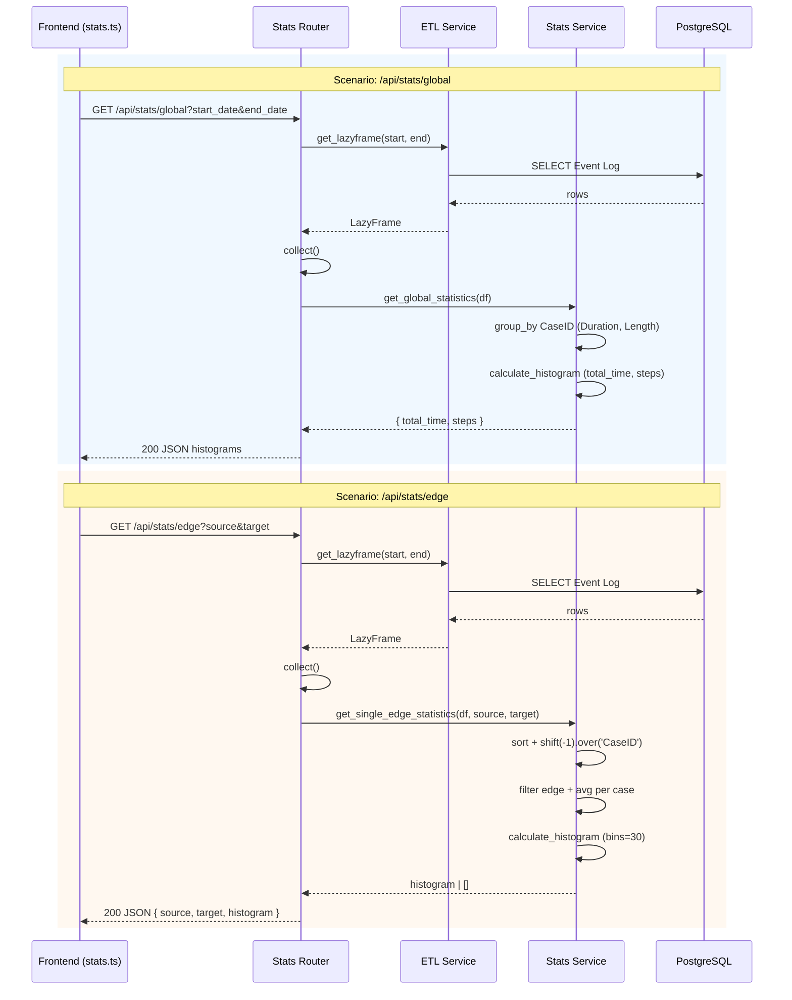

# مستندات فنی ماژول: Stats Router

| مشخصه | مقدار |
|---|---|
| مسیر منبع | `BackEnd/app/api/routes/Stats.py` |
| دسته | روتر Backend |
| مستندات مرتبط | [۰۱-Application Entrypoint](01-application-entrypoint.md) · [۰۸-ETL](08-etl.md) · [۱۲-Stats Service](12-stats-service.md) |

## ۱. هدف (Purpose)

ماژول **Stats Router** آمار توصیفی فرایند را به صورت **هیستوگرام** ارائه می‌دهد. این ماژول دو نوع آمار تولید می‌کند:

- **آمار کلی (Global)**: توزیع مدت‌زمان کل پرونده‌ها و توزیع تعداد فعالیت‌ها (Case Length)
- **آمار یال (Edge)**: توزیع مدت‌زمان گذار بین دو فعالیت مشخص (`source → target`)

اندپوینت‌های این ماژول: `GET /api/stats/global` و `GET /api/stats/edge` (prefix `api/stats` در main.py)

## ۲. مسئولیت‌ها (Responsibilities)

| مسئولیت | توضیح |
|---|---|
| آمار کلی فرایند | ساخت دو هیستوگرام: `total_time` (مدت کل) و `steps` (تعداد ردیف/گام) |
| آمار تک‌یال | توزیع مدت‌زمان گذار `source → target` (میانگین هر پرونده) |
| ساختن Histogram | خوشه‌بندی مقادیر (Binning) امن با فیلتر خلأ |
| آماده‌سازی داده | ETL → `collect()` → ورودی DataFrame برای محاسبات |
| مدیریت خطا | HTTP 500 برای خطاهای پیش‌بینی‌نشده |

## ۳. فایل‌های مرتبط (Related Files)

| نقش | مسیر |
|---|---|
| **Main**: این فایل | `BackEnd/app/api/routes/Stats.py` |
| سرویس آمار | `BackEnd/app/services/stats.py` (`get_global_statistics`, `get_single_edge_statistics`, `calculate_histogram`) |
| سرویس ETL | `BackEnd/app/services/ETL.py` (`get_lazyframe`) |
| Mount در اپلیکیشن | `BackEnd/main.py` (prefix: `api/stats`) |
| مصرف‌کننده فرانت‌اند | `FrontEnd/src/utils/fetcher/api/stats.ts` |
| نمودارها | `FrontEnd/src/components/graph/ui/CaseDistributionCharts.tsx`, `EdgeDurationChart.tsx` |

## ۴. داده ورودی (Input Data)

### `GET /api/stats/global`

| پارامتر | نوع | الزامی | توضیح |
|---|---|---|---|
| `start_date` | string | خیر | شروع بازه زمانی |
| `end_date` | string | خیر | پایان بازه زمانی |

### `GET /api/stats/edge`

| پارامتر | نوع | الزامی | توضیح |
|---|---|---|---|
| `source` | string | بله | نام فعالیت مبدا |
| `target` | string | بله | نام فعالیت مقصد |
| `start_date` | string | خیر | شروع بازه زمانی |
| `end_date` | string | خیر | پایان بازه زمانی |

## ۵. منبع داده (Data Source)

- **Primary**: جدول `process_case` در PostgreSQL (از طریق `DATABASE_URL` و ConnectorX)
- **مسیر دسترسی**: `ETL.get_lazyframe(start, end)` → فیلتر زمانی → `collect()`
- **Cluster آماری**: DataFrame کامل در حافظه برای محاسبات histogram

## ۶. مراحل پردازش داده (Data Processing Steps)

### جریان مشترک Router

| مرحله | شرح |
|---|---|
| **۱. ETL** | `ETL.get_lazyframe(start, end)` — Event Log فیلترشده |
| **۲. جمع‌آوری** | `lf.collect()` → DataFrame در حافظه |

### `GET /api/stats/global` — سرویس `get_global_statistics`

| مرحله | شرح |
|---|---|
| **۱. گروه‌بندی** | `group_by CaseID` → `Total_Duration` (max-min) و `Case_Length` (تعداد) |
| **۲. فیلتر** | حذف پرونده‌های تک‌ردیفی (`Case_Length > 1`) |
| **۳. هیستوگرام مدت** | `calculate_histogram(Total_Duration, bins=40, is_integer=False)` → `total_time` |
| **۴. هیستوگرام گام** | `calculate_histogram(Case_Length, bins=40, is_integer=True)` → `steps` |

### `GET /api/stats/edge` — سرویس `get_single_edge_statistics`

| مرحله | شرح |
|---|---|
| **۱. مرتب‌سازی** | sort بر اساس `CaseID, Timestamp` |
| **۲. فعالیت بعدی** | `Activity.shift(-1).over('CaseID')` → `Target_Activity` و Timestamp بعدی |
| **۳. فیلتر یال** | اگر `Activity == source` و `Target_Activity == target` |
| **۴. مدت هر یال** | `Target_Timestamp - Timestamp` به ثانیه → `Raw_Duration` |
| **۵. نرمال‌سازی** | `group_by CaseID` → میانگین `Raw_Duration` در هر پرونده |
| **۶. هیستوگرام** | `calculate_histogram(avg_durations, bins=30)` — سرویس `get_single_edge_statistics` |

## ۷. داده خروجی (Output Data)

### پاسخ `GET /api/stats/global` (HTTP 200)

| فیلد | نوع | توضیح |
|---|---|---|
| `total_time` | HistogramData | هیستوگرام مدت کل پرونده‌ها (`{bins, counts}`) |
| `steps` | HistogramData | هیستوگرام تعداد گام‌ها (`{bins, counts}`) |

### پاسخ `GET /api/stats/edge` (HTTP 200)

| فیلد | نوع | توضیح |
|---|---|---|
| `source` | string | مبدا |
| `target` | string | مقصد |
| `histogram` | HistogramData | توزیع مدت یال (`{bins, counts}`) — در نبود داده خالی |

## ۸. مصرف‌کنندگان خروجی (Where Outputs Are Consumed)

| مصرف‌کننده | نحوه مصرف |
|---|---|
| **`statsApi.getGlobalStats`** | فرانت‌اند `CaseDistributionCharts` نمایش توزیع مدت و گام پرونده‌ها |
| **`statsApi.getEdgeStats`** | فرانت‌اند `EdgeDurationChart` نمایش بازه زمانی گذر انتخاب‌شده |
| **Toast خطا** | در صورت خطای فرانت، Toast Persian نمایش داده می‌شود |

## ۹. وابستگی‌ها (Dependencies)

| وابستگی | نوع |
|---|---|
| FastAPI (`APIRouter`, `Query`, `HTTPException`) | Framework اصلی |
| سرویس `stats` | محاسبه آمار و هیستوگرام |
| سرویس `ETL` | تهیه DataFrame |
| Polars | گروه‌بندی، shift window, دیتا فقط |
| NumPy | **np.histogram** و Binning |

## ۱۰. خطاهای احتمالی (Error Scenarios)

| سناریو | رفتار فعلی |
|---|---|
| **خالی بودن داده** | هیستوگرام خالی `{bins: [], counts: []}` — بدون error |
| **یال ناموجود** | `bins` خالی؛ پیام ⚠️ در log ولی پاسخ 200 ساده |
| **مقدار تکتا** | ثابت صفر → `linspace(-1, 1, bins+1)`؛ غیرصفر → بازه `val*0.9..1.1` (پیشگیری از تقسیم بر صفر در طول bin) |
| **خطای غیرمنتظره** | `except Exception` → HTTP 500 با `str(e)` به عنوان detail |

## ۱۱. نمودار جریان داده (Data Flow Diagram)

## خلاصه

ماژول **Stats Router** با تکیه بر Polars تجمیع per-case و NumPy هیستوگرام‌بندی را انجام می‌دهد. خروجی JSON سبک برای نمودارهای فرانت‌اند (توزیع زمانی/گامی و توزیع مدت یک یال مشخص) ارسال می‌شود و سناریوی داده خالی/یال ناموجود را بدون خطا مدیریت می‌کند. یک نکته: هر دو اندپوینت کل **DataFrame** را در حافظه جمع می‌کنند که با حجم داده ممکن است سنگین باشد.