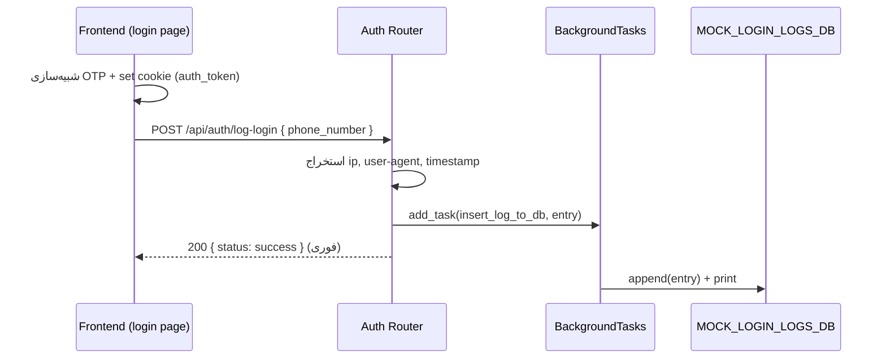

# مستندات فنی ماژول: Auth Router

| مشخصه | مقدار |
|---|---|
| مسیر منبع | `BackEnd/app/api/routes/Auth.py` |
| دسته | روتر Backend |
| مستندات مرتبط | [۰۱-Application Entrypoint](01-application-entrypoint.md) |

## ۱. هدف (Purpose)

ماژول **Auth Router** در سامانه «فکر» صرفاً **ثبت لاگ ورود موفق کاربر** را انجام می‌دهد (`POST /api/auth/log-login`). در نسخه فعلی، فرآیند احراز هویت (OTP و صدور توکن) **Mock** است و این ماژول فقط اطلاعات ورود را جمع‌آوری و ذخیره می‌کند.

> ⚠️ نکته: این ماژول **Verify / Authentication** انجام نمی‌دهد؛ توکن واقعی صادر نمی‌کند و امنیت‌سنجی ندارد. فقط Logging است و ذخیره‌سازی آن نیز در یک لیست موقتی در حافظه (به جای دیتابیس واقعی) صورت می‌گیرد.

## ۲. مسئولیت‌ها (Responsibilities)

| مسئولیت | توضیح |
|---|---|
| ثبت لاگ ورود | ذخیره اطلاعات ورود موفق (شماره تلفن، IP، User-Agent، زمان) |
| جمع‌آوری متادیتای درخواست | استخراج IP و User-Agent از Request |
| پردازش آسنکرون | ذخیره‌سازی در **BackgroundTasks** تا پاسخ فوری برگردد |
| شبیه‌سازی دیتابیس | نوشتن لاگ در لیست `MOCK_LOGIN_LOGS_DB` در حافظه (قابل جایگزینی با ORM) |

## ۳. فایل‌های مرتبط (Related Files)

| نقش | مسیر |
|---|---|
| **Main**: این فایل | `BackEnd/app/api/routes/Auth.py` |
| Mount در اپلیکیشن | `BackEnd/main.py` (prefix: `api/auth`, tags: Authentication & Logging) |
| مصرف‌کننده فرانت‌اند | `FrontEnd/src/app/(auth)/login/page.tsx` (فراخوانی پس از OTP مقدماتی) |
| واسط توکن در فرانت | `FrontEnd/src/proxy.ts` (خواندن کوکی `auth_token`) |

## ۴. داده ورودی (Input Data)

اندپوینت `POST /api/auth/log-login` — **JSON Body** (مدل `LoginLogRequest`):

| فیلد | نوع | الزامی | توضیح |
|---|---|---|---|
| `phone_number` | string | بله | شماره تلفن کاربری که وارد شده |
| `user_id` | string | خیر | شناسه خارجی کاربر در صورت وجود |

داده‌های ضمنی که از Request استخراج می‌شوند:

| فیلد | منبع |
|---|---|
| `ip_address` | `request.client.host` (در نبود Client: `"Unknown"`) |
| `user_agent` | هدر `User-Agent` (در نبود: `"Unknown"`) |
| `login_timestamp` | `datetime.utcnow().isoformat()` |

## ۵. منبع داده (Data Source)

- **منبع لاگ**: درخواست HTTP از فرانت‌اند (بدنه JSON + متادیتای Request)
- **ذخیره‌سازی**: `MOCK_LOGIN_LOGS_DB` — لیست **درون‌حافظه‌ای** در سطح ماژول
- **وضعیت فعلی**: دیتابیس واقعی وجود ندارد؛ کد شامل TODO برای جایگزینی با SQLAlchemy/ORM است

## ۶. مراحل پردازش داده (Data Processing Steps)

| مرحله | شرح |
|---|---|
| **۱. دریافت بدنه** | Pydantic اعتبارسنجی `LoginLogRequest` (خطا → 422 خودکار FastAPI) |
| **۲. استخراج متادیتا** | IP از `request.client`، User-Agent از هدرها، Timestamp از `utcnow` |
| **۳. ساخت log_entry** | ترکیب فیلدها در یک Dict با کلیدهای `phone_number`, `user_id`, `ip_address`, `user_agent`, `login_timestamp` |
| **۴. Background Task** | `background_tasks.add_task(insert_log_to_db, log_entry)` — اجرا **پس از** ارسال Response |
| **۵. ذخیره Mock** | `insert_log_to_db` → `MOCK_LOGIN_LOGS_DB.append(log_entry)` + چاپ در کنسول |
| **۶. پاسخ فوری** | `{status: "success", message: "Login activity logged successfully."}` |

## ۷. داده خروجی (Output Data)

پاسخ موفق (HTTP 200):

```json
{
  "status": "success",
  "message": "Login activity logged successfully."
}
```

خروجی جانبی: افزودن entry به `MOCK_LOGIN_LOGS_DB` (فقط در حافظه پروسه) و چاپ آن در لاگ سرور.

## ۸. مصرف‌کنندگان خروجی (Where Outputs Are Consumed)

| مصرف‌کننده | نحوه مصرف |
|---|---|
| **صفحه login (فرانت‌اند)** | پس از شبیه‌سازی تأیید OTP، `fetch` به این اندپوینت می‌زند (بدنه: `phone_number`) سپس به `/` هدایت می‌شود |
| **کنسول سرور** | هر ورود جدید در log سرور چاپ می‌شود (برای تست) |
| **(آینده) دیتابیس لاگ** | در نسخه نهایی قرار است از طریق ORM در دیتابیس واقعی ذخیره شود |

## ۹. وابستگی‌ها (Dependencies)

| وابستگی | نوع |
|---|---|
| FastAPI (`APIRouter`, `Request`, `BackgroundTasks`) | Framework اصلی |
| Pydantic (`BaseModel`, `Field`) | اعتبارسنجی بدنه |
| `datetime` | Timestamp لاگ |

## ۱۰. خطاهای احتمالی (Error Scenarios)

| سناریو | رفتار فعلی |
|---|---|
| **بدنه نامعتبر** (نبود `phone_number`) | Pydantic → HTTP 422 خودکار |
| **نبود Client در Request** | `ip_address = "Unknown"` (محافظت از None) |
| **نبود هدر User-Agent** | `user_agent = "Unknown"` |
| **خطا در Background Task** | نامحسوس (آسنکرون) — پاسخ موفق ارسال شده و خطا فقط در لاگ دیده می‌شود |
| **خاموشی سرور قبل از Task** | لاگ از دست می‌رود (لیست درون‌حافظه‌ای) |

## ۱۱. نمودار جریان داده (Data Flow Diagram)



## خلاصه

ماژول **Auth Router** یک endpoint لاگینگ ساده و Mock است: بدنه `{phone_number}` + متادیتای Request را به یک entry تبدیل می‌کند و به صورت آسنکرون (BackgroundTasks) در یک لیست درون‌حافظه‌ای ذخیره می‌کند. هیچ تأیید هویتی انجام نمی‌دهد و ذخیره‌سازی واقعی دیتابیس در TODO باقی مانده است. فرانت‌اند آن را پس از تأیید OTP شبیه‌سازی‌شده، صرفاً برای ثبت ورود فراخوانی می‌کند.
