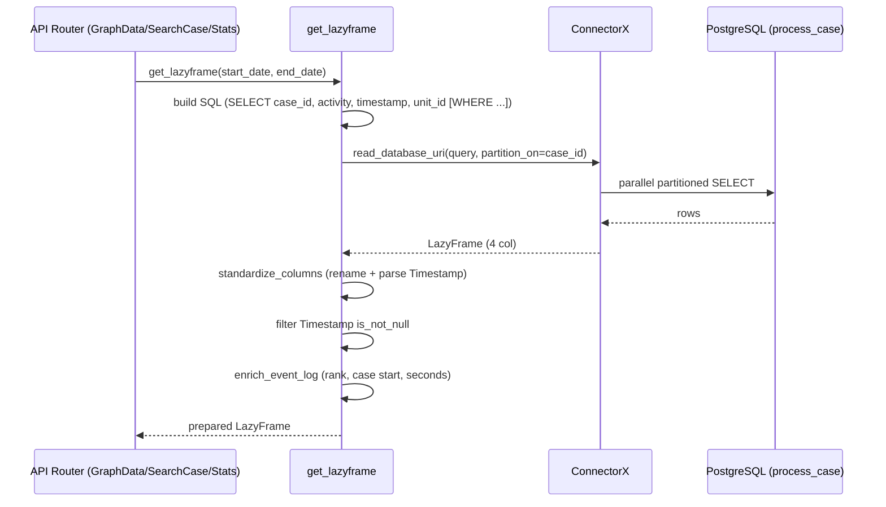

# مستندات فنی ماژول: ETL Service

| مشخصه | مقدار |
|---|---|
| مسیر منبع | `BackEnd/app/services/ETL.py` |
| دسته | سرویس Backend |
| مستندات مرتبط | [۰۱-Application Entrypoint](01-application-entrypoint.md) · [۰۴-Graph API Router](04-graph-api-router.md) · [۰۵-SearchCase Router](05-searchcase-router.md) · [۰۶-Stats Router](06-stats-router.md) · [۱۴-Import Data](14-import-data.md) |

## ۱. هدف (Purpose)

سرویس **ETL** (Extract-Transform-Load) قلب تهیه Event Log در سامانه «فکر» است. این سرویس داده خام جدول `process_case` را از PostgreSQL با موتور فوق‌سریع ConnectorX می‌خواند، فیلترهای زمانی را مستقیم در سطح دیتابیس اعمال می‌کند، ستون‌ها را استاندارد می‌کند (لازم‌ترین کار) و ستون‌های محاسباتی مانند Ranking و Duration را به آن می‌افزاید و در نهایت یک `LazyFrame` آماده تحویل می‌دهد.

این سرویس پایه تمام روترهای API است (GraphData، SearchCase و Stats همگی از `get_lazyframe` استفاده می‌کنند).

## ۲. مسئولیت‌ها (Responsibilities)

| مسئولیت | توضیح |
|---|---|
| خواندن سریع داده | استفاده از ConnectorX با پارتیشن‌بندی (`partition_on="case_id"`) |
| اعمال فیلتر زمانی در SQL | جلوگیری از انتقال داده‌ی اضافه (push-down) |
| استانداردسازی ستون‌ها | تبدیل `case_id/activity/timestamp/unit_id` → `CaseID/Activity/Timestamp/UnitID` |
| نرمال‌سازی تاریخ | تبدیل ستون Timestamp به نوع `Datetime`؛ **تبدیل تقویم جلالی→میلادی در زمان ایمپورت (`import_data.py`) انجام شده** و اینجا فقط پارس/cast صورت می‌گیرد |
| پاکسازی null | حذف رکوردهای دارای Timestamp نال |
| محاسبات غنی‌سازی | `Event_Rank`, `Case_Start_Time`, `Max_Rank`, `Seconds_From_Start` |
| آماده‌سازی LazyFrame | تحویل LazyFrame برای پردازش بهینه (اجرای دیرهنگام) |

## ۳. فایل‌های مرتبط (Related Files)

| نقش | مسیر |
|---|---|
| **Main**: این فایل | `BackEnd/app/services/ETL.py` |
| پیکربندی دیتابیس | `BackEnd/app/config.py` (`DATABASE_URL`) |
| مصرف‌کننده ۱ | `BackEnd/app/api/routes/GraphData.py` — مراحل ETL |
| مصرف‌کننده ۲ | `BackEnd/app/api/routes/SearchCase.py` — جستجو |
| مصرف‌کننده ۳ | `BackEnd/app/api/routes/Stats.py` — آمار |

## ۴. داده ورودی (Input Data)

| آیتم | جزئیات |
|---|---|
| `start_date` | string (اختیاری) — شروع بازه |
| `end_date` | string (اختیاری) — پایان بازه |
| `DATABASE_URL` | اتصال به PostgreSQL (تبدیل به فیلتر SQL) |
| جدول `process_case` | ستون‌های: `case_id`, `activity`, `timestamp`, `unit_id` |

## ۵. منبع داده (Data Source)

- **Primary**: PostgreSQL — جدول `process_case` (Event Log خام؛ حدود ~700K ردیف)
- **موتور**: `polars.read_database_uri(..., engine="connectorx")` — خواندن موازی سریع
- **پارتیشن‌بندی**: `partition_on="case_id"` و `partition_num = min(cpu_count, 8)`
- **نکته**: فیلتر زمانی به صورت رشته در کادر SQL درج می‌شود (درج مستقیم — ریسک SQL Injection برای درخواست‌های عمومی)

## ۶. مراحل پردازش داده (Data Processing Steps)

### Pipeline اصلی `get_lazyframe`

| مرحله | شرح |
|---|---|
| **۱. Load** | `load_data_from_db(start, end)` — ساخت کوئری داینامیک با فیلتر `timestamp >= start AND timestamp <= end` و خواندن با ConnectorX؛ خروجی LazyFrame |
| **۲. Standardize** | `standardize_columns` — rename چهار ستون اول + تبدیل Timestamp: اگر `Utf8` بود با `str.strptime(..., format="%Y/%m/%d-%H:%M", strict=False)`؛ وگرنه cast به `Datetime`. **نکته:** دیتای واقعی بعد از ایمپورت از قبل میلادی است (تبدیل جلالی→میلادی در `import_data.py`)، بنابراین شاخه‌ی Utf8 در مسیر عادی اجرا نمی‌شود |
| **۳. Filter Null** | `filter(Timestamp.is_not_null())` — حذف ردیف‌های فاقد زمان |
| **۴. Enrich** | `enrich_event_log` — sort بر `CaseID, Timestamp` + افزودن ستون‌های Rank و زمان |
| **۵. خروجی** | بازگشت LazyFrame آماده (هنوز اجرا نشده) |

### `load_data_from_db` — جزئیات

| مرحله | شرح |
|---|---|
| ساخت Query | `SELECT "case_id", "activity", "timestamp", "unit_id" FROM process_case` + فیلترهای شرطی |
| خواندن | `pl.read_database_uri(query, uri=DATABASE_URL, engine="connectorx", partition_on="case_id", partition_num=...)` |
| خروجی | `df.lazy()` |

### `enrich_event_log` — ستون‌های محاسباتی

| ستون | نحوه محاسبه |
|---|---|
| `Event_Rank` | `Timestamp.rank('ordinal').over('CaseID')` — ترتیب رخداد در هر پرونده |
| `Case_Start_Time` | `Timestamp.min().over('CaseID')` — شروع پرونده |
| `Max_Rank` | `Event_Rank.max().over('CaseID')` — شاخص بیشترین رتبه (تعداد رکوردهای پرونده) |
| `Seconds_From_Start` | `(Timestamp - Case_Start_Time).dt.total_seconds()` — فاصله زمانی از شروع |

## ۷. داده خروجی (Output Data)

- **نوع**: `polars.LazyFrame`
- **ستون‌ها**: `CaseID`, `Activity`, `Timestamp` (Datetime), `UnitID`, `Event_Rank`, `Case_Start_Time`, `Max_Rank`, `Seconds_From_Start`
- **منطق**: تا زمان `collect()` توسط مصرف‌کننده اجرا نمی‌شود (مناسب برای دیتای حجیم)

## ۸. مصرف‌کنندگان خروجی (Where Outputs Are Consumed)

| مصرف‌کننده | نحوه استفاده |
|---|---|
| **GraphData Router** | `get_lazyframe` می‌سپارد → همراه خدمات `variants` و `graph` برای ساخت DFG |
| **SearchCase Router** | فیلتر `case_id` و مقایسه آماری روی همان LazyFrame |
| **Stats Router** | `collect()` و محاسبه هیستوگرام‌ها (global/edge) |
| **Import Script** | (در صورت استفاده) داده را پس از load برای تحویل به Data Warehouse شارژ می‌کند |

## ۹. وابستگی‌ها (Dependencies)

| وابستگی | نوع |
|---|---|
| Polars | LazyFrame/DataFrame و عملیات |
| ConnectorX | موتور خواندن SQL (partition) |
| `config.DATABASE_URL` | اتصال دیتابیس |
| `os.cpu_count()` | تعیین تعداد پارتیشن |

## ۱۰. خطاهای احتمالی (Error Scenarios)

| سناریو | رفتار فعلی |
|---|---|
| **نبود DATABASE_URL** | خطای اتصال به سمت بالا propagate می‌شود؛ بدون Error Handling صریح |
| **فرمت تاریخ نامعتبر در پارس** | `strict=False` → Null قرار گرفته و در مرحله ۳ فیلتر می‌شود |
| **داده خالی در بازه** | LazyFrame خالی با Schema درست؛ مصرف‌کننده باید مقابله کند |
| **عدم match ستون‌ها** | `standardize_columns` فقط اگر `len(cols) >= 4`؛ در غیر این صورت skip + احتمال خطا در مصرف |
| **داده‌ی جلالی Legacy در شاخه‌ی Utf8** | `strptime` یک رشته‌ی جلالی را میلادی می‌پندارد (خطای ~۶۲۱ سال). چون تبدیل واقعی در `import_data.py` هنگام نوشتن در DB انجام می‌شود، این شاخه در مسیر عادی اجرا نمی‌شود اما در صورت ورود دیتای جلالی خام، **باگ پنهان** است |
| **SQL Injection** | مقادیر مستقیم در Query درج می‌شوند (risk بالا برای API عمومی) |

## ۱۱. نمودار جریان داده (Data Flow Diagram)

## خلاصه

سرویس **ETL** دیتای خام را در سه لایه آماده می‌کند: **Load** (ConnectorX + پارتیشن‌بندی روی `case_id`)، **Transform** (استانداردسازی نام ستون‌ها و تاریخ‌ها)، **Enrich** (Rank و زمان محاسبه‌شده). فیلتر زمانی در همان SQL اعمال می‌شود تا از انتقال دیتای اضافه جلوگیری شود. خروجی یک LazyFrame است که همه روترهای اصلی API از آن تغذیه می‌شوند. نکات بهداشت امنیتی: درج مستقیم مقادیر در SQL و عدم مدیریت خطای صریح اتصال دیتابیس در نسخه فعلی وجود دارد.