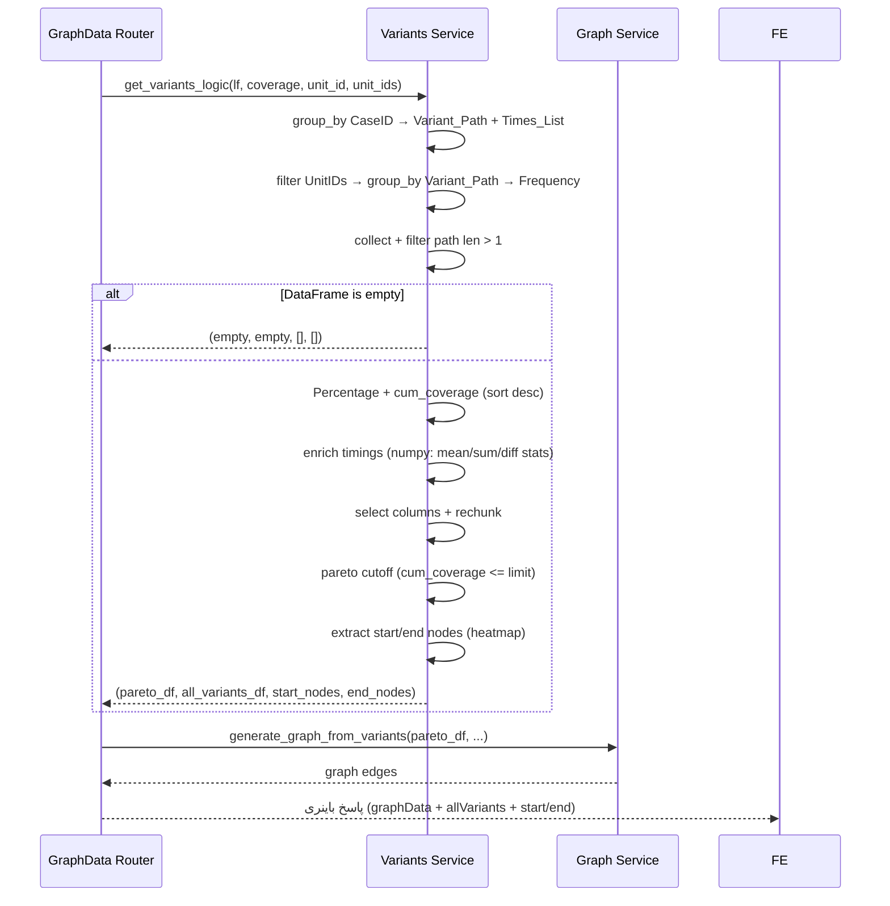

# مستندات فنی ماژول: Variants Service

| مشخصه | مقدار |
|---|---|
| مسیر منبع | `BackEnd/app/services/variants.py` |
| دسته | سرویس Backend |
| مستندات مرتبط | [۰۴-Graph API Router](04-graph-api-router.md) · [۰۸-ETL](08-etl.md) · [۱۰-Graph](10-graph.md) · [۱۳-Utils](13-utils.md) |

## ۱. هدف (Purpose)

سرویس **Variants** مسیرهای فرایندی (Process Variants) را از Event Log استخراج می‌کند: هر پرونده (Case) به یک مسیر از فعالیت‌ها تبدیل می‌شود، پرونده‌های هم‌مسیر تجمیع و با فرکانس شمارش می‌شوند. سپس آمار زمانی (میانگین، کل، حداقل، حداکثر، میانه، انحراف معیار) هر مسیر و نودهای شروع/پایان پرتکرار محاسبه و **Pareto Coverage** اعمال می‌شود.

این سرویس ورودی اصلی سرویس Graph است (تولید DFG).

## ۲. مسئولیت‌ها (Responsibilities)

| مسئولیت | توضیح |
|---|---|
| تجمیع پرونده‌ها | تبدیل رخدادها به مسیر (`Variant_Path`) و لیست زمان‌ها (`Times_List`) |
| فیلتر واحد | اعمال فیلتر `unit_id` تکی یا لیست `unit_ids` ابعادی |
| شمارش فرکانس | `group_by Variant_Path` → `Frequency`، `True_Start_Count`، `True_End_Count` |
| محاسبه Coverage | `Percentage` و `cum_coverage` به ترتیب نزولی فرکانس |
| آمار زمانی | `Avg/Total/Min/Max/Median/Std` بر اساس Durationهای داخلی |
| انتخاب نودها | استخراج نودهای شروع/پایان پرتکرار با Heatmap و Coverage |
| پاکسازی حافظه | `rechunk()` برای آزادسازی فیزیکی حافظه (ریزش `Times_List`) |
| قطع Pareto | انتخاب زیرمجموعه مسیرهایی که `target_coverage` را پوشش می‌دهند |

## ۳. فایل‌های مرتبط (Related Files)

| نقش | مسیر |
|---|---|
| **Main**: این فایل | `BackEnd/app/services/variants.py` |
| تابع کمکی | `BackEnd/app/services/utils.py` (`safe_calc_list_stats`) |
| مصرف‌کننده | `BackEnd/app/api/routes/GraphData.py` (`get_variants_logic`) |
| دریافت‌کننده بعدی | `BackEnd/app/services/graph.py` (خروجی `pareto_variants_df`) |
| ورودی | خروجی ETL: `BackEnd/app/services/ETL.py` (`get_lazyframe`) |
| فیلترهای ابعادی | `BackEnd/app/api/routes/GraphData.py` (`_resolve_unit_ids`) |

## ۴. داده ورودی (Input Data)

| آیتم | نوع | توضیح |
|---|---|---|
| `df_lazy` | `pl.LazyFrame` | Event Log استاندارد شده (خروجی ETL: `CaseID`, `Activity`, `Timestamp`, `UnitID`, `Event_Rank`, `Seconds_From_Start`, `Max_Rank`) |
| `target_coverage` | float (پیش‌فرض `0.95`) | آستانه پوشش برای قطع Pareto |
| `unit_id` | int (اختیاری) | فیلتر تک‌واحدی |
| `unit_ids` | list[int] (اختیاری) | فیلتر لیست واحدها (ارشد از `unit_id`) |

## ۵. منبع داده (Data Source)

- **منبع**: LazyFrame تولیدشده توسط **ETL Service** (از جدول `process_case` در PostgreSQL)
- **مسیر**: GraphData Router ← `get_variants_logic(lf, target_coverage, unit_id, unit_ids)`
- **نکته**: هیچ تماس مستقیمی با دیتابیس ندارد؛ فقط داده ورودی را پردازش می‌کند

## ۶. مراحل پردازش داده (Data Processing Steps)

### Orchestration اصلی `get_variants_logic`

| مرحله | شرح |
|---|---|
| **۱. تجمیع پرونده‌ها** | `calculate_case_aggregations` — `group_by CaseID`: ساخت `Variant_Path` (لیست Activity)، `Times_List` (لیست `Seconds_From_Start`)، `UnitID` (اولین)، پرچم‌های `Is_True_Start/Is_True_End` |
| **۲. شمارش مسیرها** | `calculate_variant_frequencies` — فیلتر UnitID/UnitIDs → `group_by Variant_Path` → `Frequency`, `True_Start_Count`, `True_End_Count` + **collect** + حذف مسیرهای تک‌مرحله‌ای (`path len > 1`) |
| **۳. داده خالی؟** | اگر DataFrame خالی بود → بازگشت `(DataFrame خالی, DataFrame خالی, [], [])` |
| **۴. Coverage** | `compute_coverage_and_sort` — `Percentage = Frequency/total*100`، sort نزولی، `cum_coverage` |
| **۵. آمار زمانی** | `enrich_variants_with_timings` — `Avg/Total` روی `Times_List`؛ محاسبه Durationهای یال با `np.diff` برای `Min/Max/Median/Std` |
| **۶. تمیزکاری** | انتخاب ستون‌های موردنیاز + `rechunk()` برای آزادسازی حافظه |
| **۷. قطع Pareto** | یافتن اولین ردیف با `cum_coverage >= target_coverage` → `pareto_variants_df` = مسیرهای `cum_coverage <= limit` |
| **۸. نودهای شروع/پایان** | `extract_nodes_heatmap` روی پارتو با شمارنده‌های True Start/End و `Running_Coverage < 0.95` |
| **۹. خروجی** | `(pareto_variants_df, variants_df_clean, start_nodes, end_nodes)` |

### `extract_nodes_heatmap` — جزئیات

| مرحله | شرح |
|---|---|
| فیلتر | حذف ردیف‌های `count_col = 0` |
| استخراج نود | `Variant_Path.list.get(0)` برای start یا `list.get(-1)` برای end |
| تجمیع | `group_by Node` → مجموع `Total_Count` → sort نزولی |
| Coverage تجمعی | `Running_Coverage = cum_sum / total` |
| انتخاب | نودهایی که `Running_Coverage` قبلی `< coverage` (پیش‌فرض ۰.۹۵) |
| خروجی | لیست `{node, count}` |

## ۷. داده خروجی (Output Data)

### `pareto_variants_df` — ستون‌ها

| ستون | توضیح |
|---|---|
| `Variant_Path` | list[Activity] |
| `Frequency` | تعداد پرونده‌های این مسیر |
| `UnitID` | واحد اولین پرونده |
| `True_Start_Count` / `True_End_Count` | شمارش شروع/پایان معتبر |
| `Percentage` | سهم درصدی |
| `cum_coverage` | پوشش تجمعی |
| `Avg/Total/Min/Max/Median/Std_Timings` | آمار زمانی list-wise |

### سایر خروجی‌ها

| خروجی | توضیح |
|---|---|
| `variants_df_clean` | کل مسیرها (قبل از قطع Pareto) |
| `start_nodes` / `end_nodes` | `[{node, count}]` برای نودهای شروع/پایان |
| حالت خالی | `(DataFrame خالی, DataFrame خالی, [], [])` |

## ۸. مصرف‌کنندگان خروجی (Where Outputs Are Consumed)

| مصرف‌کننده | نحوه مصرف |
|---|---|
| **Graph Service** | `generate_graph_from_variants(pareto_df, ...)` — ساخت یال‌های DFG |
| **GraphData Router** | `start_nodes/end_nodes` → بخش `startActivities/endActivities` پاسخ باینری |
| **Frontend** | `variants` پس از پارس Arrow → نمایش لیست مسیرها و آمار |

## ۹. وابستگی‌ها (Dependencies)

| وابستگی | نوع |
|---|---|
| Polars | `group_by`, list ops, window |
| NumPy | `np.diff`, `np.mean/sum/min/max/median/std` |
| `app.services.utils.safe_calc_list_stats` | محاسبه امن آمار روی لیست‌های متغیر |

## ۱۰. خطاهای احتمالی (Error Scenarios)

| سناریو | رفتار فعلی |
|---|---|
| **داده خالی** | بازگشت زودهنگام ۴ خروجی خالی (بدون خطا) |
| **مسیرهای تک‌مرحله‌ای** | حذف با فیلتر `list.len() > 1` |
| **لیست زمان خالی/کوچک** | `_calc_edge_diffs` → `[]` و آمار به صورت امن از `safe_calc_list_stats` |
| **`target_coverage` بالاتر از حداکثر** | `cutoff_row` خالی → `pareto = تمام مسیرها` (بدون قطع) |
| **سینک لیست‌ها** | احتمال عدم تطابق طول لیست‌ها در ستون‌های Timings (بستگی به هم‌اندازه بودن Durationهای هر مسیر دارد) |

## ۱۱. نمودار جریان داده (Data Flow Diagram)

## خلاصه

سرویس **Variants** از Event Log استاندارد، مسیرهای یکتای فرایند را با فرکانس و آمار زمانی استخراج می‌کند. الگوریتم آن کاملاً Lazy تا مرحله جمع‌آوری، سپس روی DataFrame با Polars list-ops و NumPy اجرا می‌شود. قطع **Pareto** با `target_coverage` (پیش‌فرض ۹۵٪) انجام و نودهای شروع/پایان به صورت Heatmap انتخاب می‌شوند. خروجی آن هم به Graph Service (برای یال‌ها) و هم مستقیم به پاسخ API (نودها و مسیرها) می‌رود.
