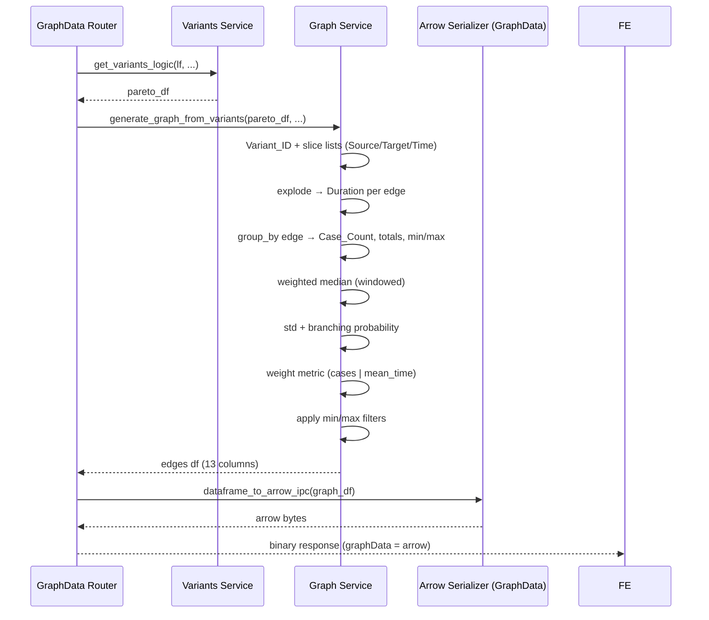

# مستندات فنی ماژول: Graph Service

| مشخصه | مقدار |
|---|---|
| مسیر منبع | `BackEnd/app/services/graph.py` |
| دسته | سرویس Backend |
| مستندات مرتبط | [۰۴-Graph API Router](04-graph-api-router.md) · [۰۹-Variants](09-variants.md) · [۱۳-Utils](13-utils.md) |

## ۱. هدف (Purpose)

سرویس **Graph** داده‌ی `pareto_variants_df` (خروجی Variants Service) را به **گراف کاربرد مستقیم (DFG)** تبدیل می‌کند. هر یال در خروجی یک گذار `Source → Target` را با آمار پیشرفته‌ی Process Mining توصیف می‌کند:

- آمار زمانی: میانگین، میانه‌ی وزنی، حداقل، حداکثر، انحراف معیار
- وزن‌دهی: بر اساس `weight_metric` (تعداد پرونده یا میانگین زمان)
- احتمال انشعاب: `Branching_Probability`
- Tooltip متنی قابل‌خواندن برای فرانت‌اند

خروجی این سرویس، ورودی اصلی ارسال به کلاینت است (تبدیل به Arrow IPC).

## ۲. مسئولیت‌ها (Responsibilities)

| مسئولیت | توضیح |
|---|---|
| ساخت یال‌های DFG | تبدیل `Variant_Path` هر مسیر به جفت‌های `Source → Target` |
| تجمیع یال‌ها | محاسبه `Case_Count`, مجموع/مجذور مدت‌زمان، Min/Max |
| میانه‌ی وزنی | محاسبه `Median_Duration_Seconds` با وزن تعداد پرونده‌ها |
| آمار انحراف | `Std_Duration_Seconds` فرمولی (clip به صفر) |
| احتمال انشعاب | `Branching_Probability` نسبت به مجموع یال‌های هر نود |
| وزن/Label گراف | اعمال `weight_metric` + تبدیل واحد زمانی (s/m/h/d/w) |
| فیلترهای کلاینت | `min/max_cases` و `min/max_mean_time` |
| خروجی Empty-Safe | اسکیمای کامل خالی در صورت نبود داده |

## ۳. فایل‌های مرتبط (Related Files)

| نقش | مسیر |
|---|---|
| **Main**: این فایل | `BackEnd/app/services/graph.py` |
| تابع کمکی | `BackEnd/app/services/utils.py` (`format_seconds_to_days_expr`) |
| ورودی | خروجی Variants Service — `BackEnd/app/services/variants.py` |
| مصرف‌کننده | `BackEnd/app/api/routes/GraphData.py` (پس از آن → Arrow IPC) |
| ورودی پارامترها | `BackEnd/app/api/routes/GraphData.py` (query params) |

## ۴. داده ورودی (Input Data)

| آیتم | نوع | توضیح |
|---|---|---|
| `variants_df` | `pl.DataFrame` | جدول `pareto_variants_df` (ستون‌های `Variant_Path`, `Frequency`, `Avg_Timings`) |
| `weight_metric` | str (`cases`/`mean_time`) | معیار وزن یال |
| `time_unit` | str (`s/m/h/d/w`) | واحد نمایش برای `mean_time` |
| `min_cases`, `max_cases` | int | فیلتر تعداد پرونده‌های یال |
| `min_mean_time`, `max_mean_time` | int | فیلتر میانگین مدت یال |

## ۵. منبع داده (Data Source)

- **منبع**: DataFrame تولیدشده توسط **Variants Service** (که خود از LazyFrame ETL تغذیه می‌شود)
- **مسیر**: GraphData Router ← `generate_graph_from_variants(pareto_df, weight_metric, time_unit, min/max...)`
- **نکته**: بدون تماس مستقیم با دیتابیس؛ پردازش خالص روی DataFrame

## ۶. مراحل پردازش داده (Data Processing Steps)

| مرحله | شرح |
|---|---|
| **۱. بررسی Empty** | اگر `variants_df.is_empty()` → بازگشت DataFrame خالی با ۱۳ ستون دقیق |
| **۲. Variant_ID** | `pl.lit(1).cum_sum() -> Variant_ID` برای ردیابی حلقه‌ها قبل از Explode |
| **۳. ساخت انتقال‌ها** | `Variant_Path.list.slice(0, len-1)` → Source و `list.slice(1, len-1)` → Target (همین‌طور `Avg_Times`) |
| **۴. Explode** | `explode([Source, Target, Source_Time, Target_Time])` → هر رکورد یک یال پایه؛ `Duration = Target_Time - Source_Time`؛ `collect()` |
| **۵. تجمع یال‌ها** | `group_by [Source, Target]` → `Case_Count` (sum Frequency)، `Total_Duration_Seconds` (sum `Duration*Frequency`)، `Total_Duration_Squared`، `Min/Max` |
| **۶. میانه وزنی** | sort بر اساس Duration، `cum_freq` و `total_freq` در window، فیلتر `cum_freq >= total_freq/2`، `first()` به ازای هر یال |
| **۷. میانگین و منبع** | `Mean_Duration_Seconds = Total/Case_Count`؛ `Source_Total_Count = sum Case_Count` روی `Source` |
| **۸. انحراف و احتمال** | `Std = sqrt(clip(Total²/Count - Mean², 0, ...))`؛ `Branching = Case_Count/Source_Total×100` |
| **۹. ابزار محاوره** | `Tooltip_Total_Time`/`Tooltip_Mean_Time` با `format_seconds_to_days_expr` |
| **۱۰. وزن گراف** | اگر `mean_time`: `Weight = Mean/divisor` و `Edge_Label = "<num> <unit>"`؛ در غیر این‌صورت `Weight = Case_Count` و Label همان عدد |
| **۱۱. تغییر نام** | `Source/Target → Source_Activity/Target_Activity` و انتخاب ۱۳ ستون نهایی |
| **۱۲. فیلتر کلاینت** | اعمال `min/max_cases` و `min/max_mean_time` |

## ۷. داده خروجی (Output Data)

### ساختار ۱۳ ستونه هر یال

| ستون | توضیح |
|---|---|
| `Source_Activity` / `Target_Activity` | جفت فعالیت مبدا/مقصد |
| `Case_Count` | تعداد پرونده‌های عبور از این یال |
| `Total_Duration_Seconds` | مجموع مدت‌زمان وزنی |
| `Mean_Duration_Seconds` | میانگین |
| `Min/Max/Std/Median_Duration_Seconds` | پروفایل آماری |
| `Tooltip_Total_Time` / `Tooltip_Mean_Time` | رشته‌ی متنی فرمتشده (روز/ساعت/دقیقه) |
| `Weight_Value` | وزن نهایی (`cases` یا `mean_time`) |
| `Edge_Label` | برچسب روی یال |
| `Branching_Probability` | درصد انشعاب نسبت به یال‌های خروجی منبع (دقیق ۲ رقم اعشار — `round(2)`) |

### حالت خالی

داده‌Frame خالی اما با اسکیمای کامل **۱۳ ستون** (Type-Preserved) برای پردازش ایمن‌تر در Arrow.

## ۸. مصرف‌کنندگان خروجی (Where Outputs Are Consumed)

| مصرف‌کننده | نحوه مصرف |
|---|---|
| **GraphData Router** | `generate_graph_from_variants` → `dataframe_to_arrow_ipc(graph_df)` → فیلد `graphData` |
| **Frontend parsers.ts** | پارس Arrow → `graphData` برای `useAppStore` و Layout |
| **فرانت‌اند** | نمایش `Edge_Label`, `Weight_Value`, `Branching_Probability` و آمار یال |

## ۹. وابستگی‌ها (Dependencies)

| وابستگی | نوع |
|---|---|
| Polars | list slicing، explode، group_by، join، window |
| `app.services.utils.format_seconds_to_days_expr` | رشته‌سازی ابزار |

## ۱۰. خطاهای احتمالی (Error Scenarios)

| سناریو | رفتار فعلی |
|---|---|
| **ورودی خالی** | اسکیمای کامل خالی (بدون crash) |
| **`time_unit` نامعلوم** | `divisor_map.get(..., 1)` و برچسب `'s'` |
| **تقسیم بر صفر در احتمال** | `Case_Count=0` غیر ممکن است (فرکانس‌ها > 0)؛ تنها در داده خالی اسکیمای خالی |
| **نوسانات Duration منفی** | `clip(lower_bound=0).sqrt()` برای امنیت StdDev |
| **فیلترهای تناقض‌دار** | فیلترهای چهارگانه به ترتیب اعمال؛ خروجی می‌تواند خالی شود |

## ۱۱. نمودار جریان داده (Data Flow Diagram)

## خلاصه

سرویس **Graph** اوج زنجیره پردازش بک‌اند است: با Slicing‌های list در Polars و `Explode`، جفت‌های یال از مسیرها استخراج، سپس با aggregation های پیشرفته (از جمله میانگین وزنی، انحراف معیار فرمولی و احتمال انشعاب) غنی می‌شود. معیار وزن گراف (بر حسب کیس یا زمان) انتخاب و فیلترهای کلاینت اعمال می‌شود. خروجی ۱۳ ستونی مستقیم به Serializer Arrow میرود و پایهٔ `graphData` فرانت‌اند را می‌سازد.