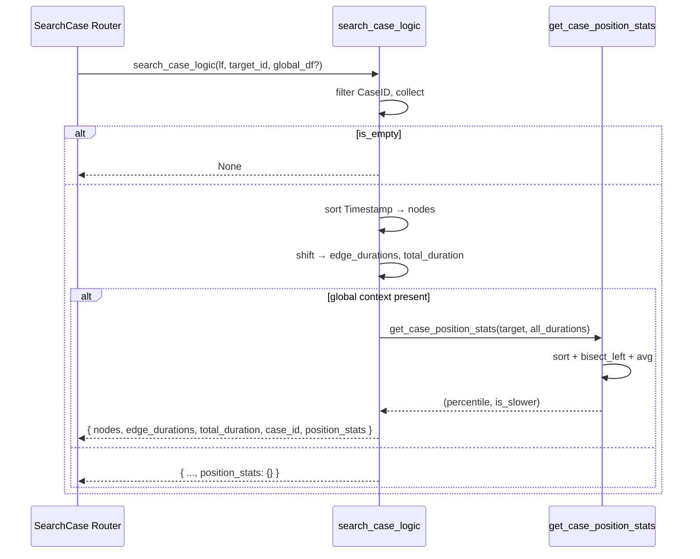

# مستندات فنی ماژول: SearchCase Service

| مشخصه | مقدار |
|---|---|
| مسیر منبع | `BackEnd/app/services/searchCase.py` |
| دسته | سرویس Backend |
| مستندات مرتبط | [۰۵-SearchCase Router](05-searchcase-router.md) · [۰۸-ETL](08-etl.md) |

## ۱. هدف (Purpose)

سرویس **SearchCase** منطق خالص جستجوی یک پرونده در Event Log را پیاده‌سازی می‌کند. این سرویس یک `LazyFrame` استاندارد (خروجی ETL) را می‌گیرد و با فیلتر بر روی `CaseID`، مسیر فعالیت‌ها، مدت هر یال و مدت کل پرونده را محاسبه می‌کند. به‌صورت اختیاری نیز پرونده را با آمار کل داده‌ها (مجموع همه پرونده‌ها) مقایسه نموده و موقعیت آماری آن (درصدک و کندتر از میانگین) را برمی‌گرداند.

این سرویس در واقع همان درونیات ماژول **SearchCase Router** است؛ Router فقط پارامترها را از HTTP دریافت، این سرویس را صدا می‌زند و جزئیات 404 را اداره می‌کند.

## ۲. مسئولیت‌ها (Responsibilities)

| مسئولیت | توضیح |
|---|---|
| فیلتر پرونده | `lf.filter(CaseID == target_case_id)` و جمع‌آوری ردیف‌ها |
| تشخیص نبود | بازگرداندن `None` در صورت خالی بودن DataFrame |
| مسیر فعالیت‌ها | استخراج `nodes` (فعالیت‌ها به ترتیب زمانی) |
| مدت یال‌ها | محاسبه `edge_durations` (ثانیه بین رخدادهای متوالی) |
| مدت کل | `total_duration` (آخرین − اولین Timestamp) |
| مقایسه آماری | `duration_percentile` و `is_slower_than_average` نسبت به کل |
| مدیریت لیست خالی | رفتار امن در `get_case_position_stats` |

## ۳. فایل‌های مرتبط (Related Files)

| نقش | مسیر |
|---|---|
| **Main**: این فایل | `BackEnd/app/services/searchCase.py` |
| فراخواننده | `BackEnd/app/api/routes/SearchCase.py` |
| ورودی | خروجی ETL — `BackEnd/app/services/ETL.py` (`get_lazyframe`) |
| مصرف‌کننده فرانت‌اند | `FrontEnd/src/utils/fetcher/api/search.ts`, صفحه `search-case-ids` |

## ۴. داده ورودی (Input Data)

### `search_case_logic`

| آرگومان | نوع | توضیح |
|---|---|---|
| `lf` | `pl.LazyFrame` | Event Log استاندارد (خروجی ETL) |
| `target_case_id` | int | شناسه پرونده مورد جستجو |
| `df_global_context` | `pl.DataFrame` (اختیاری) | کل داده برای مقایسه آماری؛ اگر `None` باشد فقط مسیر برمی‌گردد |

## ۵. منبع داده (Data Source)

- **منبع**: LazyFrame استاندارد از **ETL Service** (خود از جدول `process_case` در PostgreSQL)
- **مسیر**: SearchCase Router ← `search_case_logic(lf, case_id, df_global_context)`
- **Context آماری**: توسط Router (از همان LazyFrame به صورت `lf.collect()`) ساخته می‌شود
- **نکته**: بدون دسترسی مستقیم به دیتابیس؛ همه پردازش بر داده ورودی

## ۶. مراحل پردازش داده (Data Processing Steps)

### `search_case_logic`

| مرحله | شرح |
|---|---|
| **۱. filter + collect** | `lf.filter(CaseID == target).collect()` → `case_df` |
| **۲. خالی؟** | `case_df.is_empty()` → return `None` |
| **۳. مرتب‌سازی** | `sort('Timestamp')` — فعالیت‌ها به ترتیب زمانی |
| **۴. مسیر** | `Activity.to_list()` → `nodes` |
| **۵. زمان یال** | `Timestamp.shift(-1) - Timestamp` (ثانیه) `fill_null(0)`؛ حذف آخرین مقدار ساختگی |
| **۶. مدت کل** | `last - first` به ثانیه (فقط اگر > ۱ ردیف) |
| **۷. مقایسه آماری** | اگر context: `group_by CaseID` → `Total_Duration` + `Case_Length`؛ فیلتر `Case_Length > 1`؛ ساخت لیست Durationها |
| **۸. درصدک** | `get_case_position_stats` — بازگشت `percentile` و `is_slower` |
| **۹. خروجی** | ساخت Dict نهایی |

### `get_case_position_stats` (helper)

| قدم | شرح |
|---|---|
| لیست خالی | return `(0, False)` |
| مرتب‌سازی | `all_durations.sort()` |
| Percentile | `bisect_left(target)` → `(idx / n) * 100` |
| میانگین | `sum / len` → مقایسه `target > avg` |

## ۷. داده خروجی (Output Data)

### Dict موفق (یا `None`)

| فیلد | نوع | توضیح |
|---|---|---|
| `nodes` | string[] | فعالیت‌ها به ترتیب |
| `edge_durations` | number[] | ثانیه بین هر جفت فعالیت |
| `total_duration` | number | مدت کل (ثانیه) |
| `case_id` | int | شناسه پرونده |
| `position_stats` | object | `{ duration_percentile, is_slower_than_average }` — خالی در نبود context؛ درصدک با `round(2)` گرد می‌شود |

### حالت‌های خاص

| حالت | خروجی |
|---|---|
| پرونده یافت نشد | `None` (Router → 404) |
| بدون مقایسه (بدون context) | `position_stats = {}` |
| لیست زمانی خالی | `(0, False)` برای آماری |

## ۸. مصرف‌کنندگان خروجی (Where Outputs Are Consumed)

| مصرف‌کننده | نحوه مصرف |
|---|---|
| **SearchCase Router** | بررسی `None` → 404؛ وگرنه بازگشت به JSON |
| **searchApi.byId (فرانت)** | فراخوانی اندپوینت و نمایش مسیر/مدت |
| **نمایشگر پرونده** | رسم خط زمانی Edge Durations و درصدک مقایسه |

## ۹. وابستگی‌ها (Dependencies)

| وابستگی | نوع |
|---|---|
| Polars | فیلتر، sort، shift، `total_seconds`، `group_by` |
| `bisect` | محاسبه percentile (بر روی لیست مرتب) |
| `typing.Optional/Tuple` | نوع‌دهی |

## ۱۰. خطاهای احتمالی (Error Scenarios)

| سناریو | رفتار فعلی |
|---|---|
| **پرونده یافت نشد** | `None` → Router به 404 تبدیل می‌کند |
| **لیست خالی context** | `(0, False)` — بدون تقسیم بر صفر |
| **پرونده تک‌ردیفی** | `total_duration = 0`؛ `Case_Length > 1` در context حذف |
| **شکست در shift** | منبع: آخرین مقدار `fill_null(0)` استخراج می‌شود |
| **نوع زمان نامناسب** | فرض می‌شود Timestamp استاندارد شده از ETL است |
| **سری بزرگ** | sort در Percentile هر بار انجام می‌شود (ممکن است آرام) — کامنت در سورس |

## ۱۱. نمودار جریان داده (Data Flow Diagram)

## خلاصه

سرویس **SearchCase** هستهٔ منطقی جستجوی تک‌پرونده است: `filter → sort → shift → stats`. خروجی یک Dict ساده با مسیر، مدت‌ها و (به صورت اختیاری) مقایسه درصدکی نسبت به میانگین. تمام خطاهای احتمالی به‌صورت `None` یا مقادیر پیش‌فرض مدیریت می‌شوند و Router مسئول نگاشت به HTTP است.