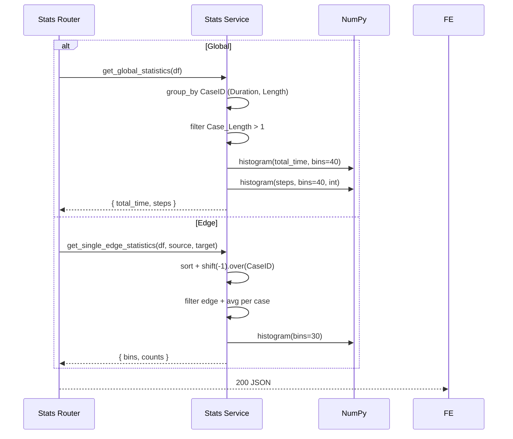

# مستندات فنی ماژول: Stats Service

| مشخصه | مقدار |
|---|---|
| مسیر منبع | `BackEnd/app/services/stats.py` |
| دسته | سرویس Backend |
| مستندات مرتبط | [۰۶-Stats Router](06-stats-router.md) · [۰۸-ETL](08-etl.md) |

## ۱. هدف (Purpose)

سرویس **Stats** محاسبات آماری توصیفی فرایند را به صورت **هیستوگرام** انجام می‌دهد. این سرویس سه تابع اصلی دارد:

- `get_global_statistics` — آمار کلی: توزیع مدت کل پرونده‌ها و توزیع تعداد گام‌ها
- `get_single_edge_statistics` — توزیع مدت‌زمان گذار بین دو فعالیت مشخص
- `calculate_histogram` — موتور مشترک و ایمن ساخت هیستوگرام (NumPy)

این سرویس درونیات ماژول **Stats Router** است؛ Router فقط داده را از ETL آماده و پارامترها را از HTTP می‌گیرد و این سرویس محاسبات خالص را انجام می‌دهد.

## ۲. مسئولیت‌ها (Responsibilities)

| مسئولیت | توضیح |
|---|---|
| آمار کل پرونده‌ها | `group_by CaseID` → `Total_Duration` و `Case_Length` |
| فیلتر پرونده‌های معتبر | حذف `Case_Length <= 1` |
| هیستوگرام امن | مدیریت داده خالی، مقدار ثابت و مقادیر صحیح (Bins یکتا) |
| آمار تک‌یال | یافتن گذار `source → target` با shift window بر روی هر CaseID |
| نرمال‌سازی per-case | میانگین Duration هر پرونده (پیش از هیستوگرام) |
| تحویل Dict | خروجی `{bins, counts}` آماده برای JSON |

## ۳. فایل‌های مرتبط (Related Files)

| نقش | مسیر |
|---|---|
| **Main**: این فایل | `BackEnd/app/services/stats.py` |
| فراخواننده | `BackEnd/app/api/routes/Stats.py` (global/edge) |
| ورودی | خروجی ETL — `BackEnd/app/services/ETL.py` (`get_lazyframe` → `collect`) |
| مصرف‌کننده فرانت‌اند | `FrontEnd/src/utils/fetcher/api/stats.ts` + نمودارهای `CaseDistributionCharts`, `EdgeDurationChart` |

## ۴. داده ورودی (Input Data)

### `get_global_statistics`

| آرگومان | نوع | توضیح |
|---|---|---|
| `df` | `pl.DataFrame` | Event Log کامل (خروجی ETL پس از collect) |

### `get_single_edge_statistics`

| آرگومان | نوع | توضیح |
|---|---|---|
| `df` | `pl.DataFrame` | Event Log کامل |
| `source` | str | فعالیت مبدا |
| `target` | str | فعالیت مقصد |

### `calculate_histogram` (internal)

| آرگومان | نوع | توضیح |
|---|---|---|
| `values` | List[float] | مقادیر نمونه |
| `bins` | int (پیش‌فرض ۳۰) | تعداد خوشه‌ها |
| `is_integer` | bool | آیا مقادیر صحیحاند؟ (Bins یکتا با `arange`) |

## ۵. منبع داده (Data Source)

- **منبع**: DataFrame استاندارد از **ETL Service** (جدول `process_case` در PostgreSQL)
- **مسیر**: Stats Router ← `get_global_statistics(df)` / `get_single_edge_statistics(df, source, target)`
- **نکته**: بدون دسترسی مستقیم به دیتابیس؛ پردازش خالص در حافظه

## ۶. مراحل پردازش داده (Data Processing Steps)

### `get_global_statistics`

| مرحله | شرح |
|---|---|
| **۱. گروه‌بندی** | `group_by CaseID` → `Total_Duration` (max−min به ثانیه) و `Case_Length` (تعداد) |
| **۲. فیلتر** | `Case_Length > 1` — حذف پرونده‌های تک‌رخدادی |
| **۳. آماده‌سازی** | `drop_nulls` روی Durationها؛ لیست کردن طول‌ها |
| **۴. هیستوگرام** | `total_time` با `bins=40, is_integer=False` و `steps` با `bins=40, is_integer=True` |

### `get_single_edge_statistics`

| مرحله | شرح |
|---|---|
| **۱. مرتب‌سازی** | `sort([CaseID, Timestamp])` در حالت Lazy |
| **۲. یال‌ها** | `Activity.shift(-1).over('CaseID')` → `Target_Activity` و همین‌طور `Target_Timestamp` |
| **۳. فیلتر** | `Activity == source` و `Target_Activity == target` |
| **۴. مدت** | `Target_Timestamp - Timestamp` → `Raw_Duration` (ثانیه) |
| **۵. نرمال‌سازی** | `group_by CaseID` → میانگین `Raw_Duration` هر پرونده |
| **۶. هیستوگرام** | `calculate_histogram(avg_durations, bins=30)` |

### `calculate_histogram` — منطق ایمن

| حالت | رفتار |
|---|---|
| لیست خالی | `{bins: [], counts: []}` |
| مقادیر صحیح (`is_integer`) | `unique_count < bins` → `np.arange(min, max+2)`؛ وگرنه bin edges صحیح از `histogram_bin_edges` |
| مقادیر اعشاری یکسان | مقدار صفر → `linspace(-1, 1)`؛ غیرصفر → بازه `val*0.9..val*1.1` |
| مقادیر عادی | `np.histogram(values, bins=bins)` |

## ۷. داده خروجی (Output Data)

### `get_global_statistics`

| فیلد | نوع | توضیح |
|---|---|---|
| `total_time` | `{bins: number[], counts: number[]}` | توزیع مدت کل |
| `steps` | `{bins: number[], counts: number[]}` | توزیع تعداد گام |

### `get_single_edge_statistics`

| فیلد | نوع | توضیح |
|---|---|---|
| `{bins, counts}` | HistogramData | توزیع مدت یال (خالی در نبود داده) |

## ۸. مصرف‌کنندگان خروجی (Where Outputs Are Consumed)

| مصرف‌کننده | نحوه مصرف |
|---|---|
| **Stats Router** | wrapper کردن به `{total_time, steps}` یا `{source, target, histogram}` |
| **Frontend `getGlobalStats`** | نمودار `CaseDistributionCharts` |
| **Frontend `getEdgeStats`** | نمودار `EdgeDurationChart` (انتخاب یال) |

## ۹. وابستگی‌ها (Dependencies)

| وابستگی | نوع |
|---|---|
| Polars | `group_by`, `shift().over()`, `total_seconds` |
| NumPy | `np.histogram`, `histogram_bin_edges`, `arange`, `linspace` |
| `typing` | نوع‌دهی خروجی |

## ۱۰. خطاهای احتمالی (Error Scenarios)

| سناریو | رفتار فعلی |
|---|---|
| **داده خالی** | `{bins: [], counts: []}` — بدون crash |
| **مقدار تکتا (ثابت)** | بازه مصنوعی ساخته می‌شود (پیشگیری از تقسیم بر صفر در عرض bin) |
| **تعداد مقادیر صحیح کم** | `arange` با گام ۱ (هر عدد یک bin) |
| **یال ناموجود** | لیست خالی → هیستوگرام خالی (نه خطا) |
| **Null در Duration** | `drop_nulls` قبل از هیستوگرام |
| **ورودی نامرتب** | sort صریح در تابع edge انجام می‌شود |

## ۱۱. نمودار جریان داده (Data Flow Diagram)

## خلاصه

سرویس **Stats** با ترکیب `group_by` پلارز و `np.histogram`، آمار توزیع را به فرم `{bins, counts}` تولید می‌کند. نکته‌های کلیدی: فیلتر `Case_Length > 1` (اعتبارسنجی پرونده‌ها)، نرمال‌سازی میانگین per-case برای یال‌ها، و رفتار امن در برابر داده خالی/ثابت. همه حالت‌های مرزی بدون خطا و با ساختار کامل بازگردانده می‌شوند تا Router مستقیم JSON کند.
