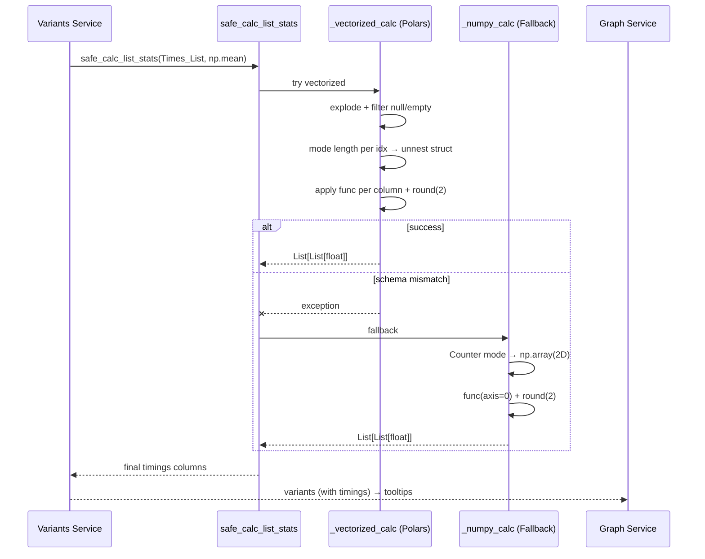

# مستندات فنی ماژول: Utils Service

| مشخصه | مقدار |
|---|---|
| مسیر منبع | `BackEnd/app/services/utils.py` |
| دسته | ابزار کمکی |
| مستندات مرتبط | [۰۴-Graph API Router](04-graph-api-router.md) · [۰۹-Variants](09-variants.md) · [۱۰-Graph](10-graph.md) |

## ۱. هدف (Purpose)

سرویس **Utils** توابع کمکی و «معماری هیبریدی» پردازش لیست‌های زمانی را ارائه می‌دهد. این سرویس دو مسئولیت اصلی دارد:

- **محاسبه امن آمار list-wise** (`safe_calc_list_stats`): اعمال تابعی مانند میانگین/میانه/انحراف بر لیست‌های طول متغیر در هر ردیف — ابتدا با موتور **Polars (Rust)** و در صورت خطای Type، **Fallback به NumPy** تا برنامه هرگز Crash نکند
- **فرمت‌سازی زمان** (`format_seconds_to_days_expr`): تبدیل ثانیه به رشته خوانا («X روز ») به صورت Vectorized

این سرویس زیرساخت مشترک **Variants Service** و **Graph Service** است.

## ۲. مسئولیت‌ها (Responsibilities)

| مسئولیت | توضیح |
|---|---|
| محاسبه آمار هیبریدی | اجرای تابع (mean/sum/min/max/median/std) روی لیست‌های هر ردیف |
| لایه سریع (Polars) | پردازش موازی و Vectorized با `explode`/`unnest` |
| لایه تضمینی (NumPy) | Fallback پایدار با `Counter` و آرایه ۲-بعدی در هر خطا |
| هم‌ترازی طول‌ها | انتخاب طول مد (mode) لیست‌ها برای آرایه مربعی معتبر |
| Rounding | همه نتایج به ۲ رقم اعشار |
| مقاوم‌سازی | هر ردیف خراب → `[]` به‌جای شکست کل عملیات |
| فرمت‌سازی زمان | ثانیه → «X روز » با مدیریت 0 و Null |

## ۳. فایل‌های مرتبط (Related Files)

| نقش | مسیر |
|---|---|
| **Main**: این فایل | `BackEnd/app/services/utils.py` |
| مصرف‌کننده ۱ | `BackEnd/app/services/variants.py` — `safe_calc_list_stats` برای Timings |
| مصرف‌کننده ۲ | `BackEnd/app/services/graph.py` — `format_seconds_to_days_expr` برای Tooltip |
| زنجیره بالا | `BackEnd/app/api/routes/GraphData.py` (GraphData از هر دو استفاده می‌کند) |

## ۴. داده ورودی (Input Data)

### `safe_calc_list_stats`

| آرگومان | نوع | توضیح |
|---|---|---|
| `times_series` | `pl.Series` | ستونی از لیست‌های لیست (List(List)) — مثلاً `Times_List` یا `Edge_Durations_List` |
| `func` | Callable | `np.mean`, `np.sum`, `np.min`, `np.max`, `np.median`, `np.std` |

### `format_seconds_to_days_expr`

| آرگومان | نوع | توضیح |
|---|---|---|
| `col_name` | str | نام ستون ثانیه‌ای (مثل `Total_Duration_Seconds`) |

## ۵. منبع داده (Data Source)

- **منبع**: داده از سرویس‌های بالادست (Variants Service) عبور می‌کند
- **مسیر**: خروجی‌های ETL → Variants (ستون‌های لیستی) → `safe_calc_list_stats`
- **نکته**: بدون I/O خارجی؛ فقط محاسبات درون‌حافظه‌ای

## ۶. مراحل پردازش داده (Data Processing Steps)

### `safe_calc_list_stats` — الگوی هیبریدی

| مرحله | شرح |
|---|---|
| **۱. تلاش سریع** | فراخوانی `_vectorized_calc` |
| **۲. موفق** | بازگشت مستقیم نتایج |
| **۳. خطا** | Logging هشدار + فراخوانی `_numpy_calc` (Fallback تضمینی) |

### `_vectorized_calc` — لایه سریع Polars

| مرحله | شرح |
|---|---|
| **۱. آماده‌سازی** | `with_row_index` → LazyFrame |
| **۲. Explode شرطی** | اگر `List(List)` باشد → `explode("Times_List")` |
| **۳. پاکسازی** | حذف Null و لیست‌های خالی |
| **۴. طول مد** | `length.mode().list.first()` به ازای هر `idx` — انتخاب طول رایج |
| **۵. فیلتر** | join و نگه‌داشتن ردیف‌های هم‌طول با mode |
| **۶. Unnest** | `list.to_struct()` + `unnest` → ستون‌های موقعیتی (field_0..field_n) |
| **۷. تابع** | به ازای هر ستون موقعیتی: `mean/min/max/median/std` (پیش‌فرض `sum`) + `round(2)` |
| **۸. ترکیب** | `group_by idx` + `concat_list` با ترتیب ستون‌ها → `Result` |
| **۹. کامل‌سازی** | join بر `range(n_rows)` تا همه ردیف‌ها (از جمله بی‌نتیجه) پوشش داده شوند → `[]` برای ردیف‌های بدون داده |

### `_numpy_calc` — لایه Fallback

| مرحله | شرح |
|---|---|
| **۱. هر ردیف** | استخراج لیست‌های معتبر |
| **۲. طول رایج** | `Counter(lengths).most_common(1)` |
| **۳. ماتریس** | `np.array(matching_lists, float64)` — ۲-بعدی |
| **۴. تابع** | `func(arr, axis=0)` → round(2) |
| **۵. استثنا** | هر `Exception` → `[]` |

### `format_seconds_to_days_expr`

| حالت | خروجی |
|---|---|
| `col == 0` | `"0s"` |
| `col` Null | `""` |
| سایر | `"{days} روز "` با `round(2)` (days = sec / 86400) |

## ۷. داده خروجی (Output Data)

| تابع | خروجی |
|---|---|
| `safe_calc_list_stats` | `List[List[float]]` — به ازای هر ردیف، آمار تابع (ممکن است `[]`) |
| `format_seconds_to_days_expr` | `pl.Expr` — رشته «X روز » |

## ۸. مصرف‌کنندگان خروجی (Where Outputs Are Consumed)

| مصرف‌کننده | نحوه مصرف |
|---|---|
| **Variants Service** | `Avg_Timings`, `Total_Timings`, `Min/Max/Median/Std_Timings` روی `Times_List`/`Edge_Durations_List` |
| **Graph Service** | `Tooltip_Total_Time` و `Tooltip_Mean_Time` (ستون‌های نمایشی یال) |
| **GraphData Router** | ستون‌های آماده‌شده → Arrow IPC |

## ۹. وابستگی‌ها (Dependencies)

| وابستگی | نوع |
|---|---|
| Polars | `explode`, `mode`, `list.to_struct`, `unnest`, `concat_list`, `with_row_index` |
| NumPy | `np.array`, توابع آماری axis=0 |
| `collections.Counter` | تشخیص طول مد در Fallback |

## ۱۰. خطاهای احتمالی (Error Scenarios)

| سناریو | رفتار فعلی |
|---|---|
| **ناسازگاری Type در Polars** (مثلاً UInt32) | پیام هشدار + Fallback کامل به NumPy |
| **لیست با طول‌های نامساوی** | انتخاب طول mode؛ ردیف‌های خارج از mode حذف/خالی |
| **لیست خالی / Null** | `[]` برای آن ردیف |
| **`with_row_index` در نسخه قدیمی‌تر** | `with_row_count` جایگزین |
| **ورودی کاملاً خالی** | `[]` |
| **خطای پیش‌بینی‌نشده در Fallback** | `except` → `[]` (هرگز Crash) |

## ۱۱. نمودار جریان داده (Data Flow Diagram)

## خلاصه

سرویس **Utils** دو قابلیت حیاتی را با الگوی **Fallback امن** فراهم می‌کند: محاسبه آمار list-wise با حداکثر سرعت (Polars Vectorized) و تضمین پایداری در برابر خطاهای Type (NumPy). به‌علاوه `format_seconds_to_days_expr` زمان‌ها را برای Tooltipهای یال به رشته تبدیل می‌کند. این سرویس لایه پایه است که Variants و Graph را در برابر داده‌های چالش‌برانگیز مقاوم می‌کند.
