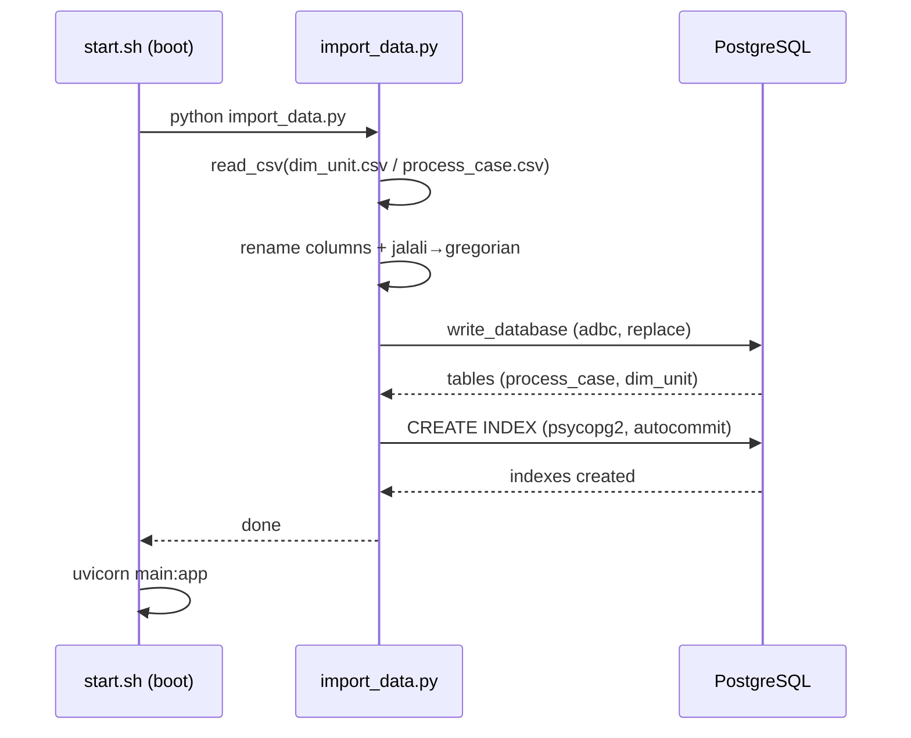

# مستندات فنی ماژول: Import Data (Ingestion)

| مشخصه | مقدار |
|---|---|
| مسیر منبع | `BackEnd/import_data.py` |
| دسته | اسکریپت |
| مستندات مرتبط | [۰۱-Application Entrypoint](01-application-entrypoint.md) · [۰۲-Config](02-config.md) · [۰۴-Graph API Router](04-graph-api-router.md) · [۰۸-ETL](08-etl.md) |

## ۱. هدف (Purpose)

ماژول **Import Data** اسکریپت بارگذاری (Ingestion) داده‌ی خام به PostgreSQL است. این اسکریپت دو فایل CSV (`dim_unit.csv` و `process_case.csv`) را می‌خواند، نام ستون‌ها را استاندارد می‌کند، تاریخ‌های **جلالی را به میلادی تبدیل** می‌کند (بخش حیاتی این ماژول) و جداول را با موتور ADBC به‌صورت Bulk در دیتابیس می‌نویسد و در پایان ایندکس‌ها را می‌سازد.

این ماژول توسط `start.sh` در **هر بوت کانتینر** اجرا می‌شود (قبل از شروع Uvicorn).

## ۲. مسئولیت‌ها (Responsibilities)

| مسئولیت | توضیح |
|---|---|
| خواندن CSV | `pl.read_csv(file_path, separator=delimiter)` |
| تغییر نام ستون‌ها | نگاشت دلخواه (برای `process_case`: `CASENO→case_id`, `UNITID→unit_id`, `DATETIME→timestamp`, `COURTTYPETITLE→activity`) |
| تبدیل جلالی→میلادی | `jalali_to_gregorian` + `parse_jalali_timestamp` — تنها محل این تبدیل در کل Backend |
| نوشتن Bulk | `df.write_database(..., engine="adbc")` با `if_table_exists="replace"` (بازنویسی کامل جدول) |
| ساخت ایندکس | ایندکس‌های اختصاصی برای `process_case` و `dim_unit` (با `psycopg2` و `autocommit=True`) |
| مقیاس‌پذیری | فرمت `%Y/%m/%d-%H:%M` با دقت دقیقه — تبدیل در زمان ایمپورت، نه در زمان Query |

## ۳. فایل‌های مرتبط (Related Files)

| نقش | مسیر |
|---|---|
| **Main**: این فایل | `BackEnd/import_data.py` |
| اجراکننده | `BackEnd/start.sh` (قبل از `uvicorn main:app`) |
| داده ورودی | `BackEnd/process_case.csv` (~۵۹MB) و `BackEnd/dim_unit.csv` |
| مقصد | دیتابیس PostgreSQL (اتصال هاردکد — رجوع به `BackEnd/app/config.py`) |
| مصرف‌کننده جداول | `app/services/ETL.py` (process_case)، `app/api/routes/GraphData.py` (dim_unit) |

## ۴. داده ورودی (Input Data)

| آرگومان | مقدار در فراخوانی | توضیح |
|---|---|---|
| `file_path` | `dim_unit.csv` / `process_case.csv` | مسیر CSV (در کارپوشه Backend) |
| `column_names` | `None` یا نگاشت (مثال بالا) | تغییر نام ستون‌ها |
| `table_name` | `dim_unit` / `process_case` | نام جدول مقصد |
| `delimiter` | `,` | جداکننده CSV |

ستون‌های نهایی `process_case`: `case_id`, `unit_id`, `timestamp`, `activity` — دقیقاً همان نام‌هایی که `ETL.get_lazyframe` می‌خواند.

## ۵. منبع داده (Data Source)

- **منبع**: فایل‌های CSV محلی در ریشه‌ی `BackEnd/` (خروجی سیستم قضایی، شامل ستون‌های `CASENO/UNITID/DATETIME/COURTTYPETITLE`)
- **نکته**: `DATABASE_URL` این ماژول به‌صورت **هاردکد** تعریف شده (`import_data.py:6`) و از `app.config` import نمی‌شود (تکرار مقدار — رجوع به مستندات Config)

## ۶. مراحل پردازش داده (Data Processing Steps)

| مرحله | شرح |
|---|---|
| **۱. خواندن CSV** | `pl.read_csv` — بارگذاری کامل در حافظه |
| **۲. تغییر نام** | در صورت وجود `column_names`، `df.rename(...)` |
| **۳. تبدیل تاریخ** | فقط برای `process_case`: هر رشته‌ی `%Y/%m/%d-%H:%M` → `jalali_to_gregorian` → `datetime` میلادی (با دقت microsecond، `pl.Datetime("us")`) |
| **۴. نوشتن** | `write_database(engine="adbc")` با `if_table_exists="replace"` — جدول قبلی حذف و از نو ساخته می‌شود |
| **۵. ایندکس‌ها** | اتصال `psycopg2` با `autocommit=True`؛ `process_case`: ایندکس روی `case_id`, `timestamp`, `unit_id` + کامپوزیت `(unit_id, timestamp)`؛ `dim_unit`: روی `"ID"`, `"LEV2_NAME"`, `"LEV3_NAME"`؛ جداول دیگر: پیش‌فرض `case_id`/`timestamp` |

## ۷. داده خروجی (Output Data)

| خروجی | توضیح |
|---|---|
| جداول `process_case` و `dim_unit` | بازنویسی‌شده (replace) با ستون‌های استاندارد و تاریخ میلادی |
| ایندکس‌ها | تسریع کوئری‌های ETL و GraphData (schema/filters/court-kinds) |
| خروجی استاندارد | `print` مرحله‌به‌مرحله برای لاگ |

## ۸. مصرف‌کنندگان خروجی (Where Outputs Are Consumed)

| مصرف‌کننده | نحوه مصرف |
|---|---|
| **ETL Service** | `SELECT case_id, activity, timestamp, unit_id FROM process_case` — وابسته به نام/نوع ستون‌های نوشته‌شده |
| **GraphData Router** | کوئری‌های `dim_unit` (سطح‌بندی `LEV*_NAME`، `COURTKINDSNAME`، `ID`) |
| **start.sh** | اجرای اسکریپت قبل از بالا آمدن Uvicorn (وابستگی بوت) |
| **HealthCheck** | اتصال `psycopg2` در `/health` به همان دیتابیس |

## ۹. وابستگی‌ها (Dependencies)

| وابستگی | نوع |
|---|---|
| Polars | `read_csv`, `write_database` |
| **adbc-driver-postgresql** | موتور `engine="adbc"` در `write_database` — **تنها مصرف‌کننده‌ی این پکیج در کل Backend** |
| psycopg2-binary | ساخت ایندکس‌ها |
| `datetime` | ساخت زمان میلادی |

> نکته: `requirements.txt` شامل `pydantic-settings` است که در هیچ ماژولی import نشده (وابستگی مرده — کاندید حذف).

## ۱۰. خطاهای احتمالی (Error Scenarios)

| سناریو | رفتار فعلی |
|---|---|
| **نبود فایل CSV** | `FileNotFoundError` → چاپ خطا و `return` (بدون crash ولی بدون نوشتن) |
| **خطا در ساخت ایندکس** | `except` → چاپ خطا؛ ادامه بدون ایندکس (کوئری‌ها کند می‌شوند) |
| **جلالی نامعتبر** | `parse_jalali_timestamp` → `ValueError` (رشته‌های غیررشته‌ای → `None`) |
| **بازنویسی داده‌های دستی** | `if_table_exists="replace"` هر اجرا جدول را **پاک می‌کند** — تغییرات دیتابیسی خارج از CSV در بوت بعدی از بین می‌رود |
| **نام جدول دیگر** | ایندکس‌های پیش‌فرض عمومی ساخته می‌شوند |

## ۱۱. نمودار جریان داده (Data Flow Diagram)

## خلاصه

ماژول **Import Data** پایپلاین ورود داده است: CSV خام (با تاریخ جلالی) را می‌خواند، ستون‌ها را با نام‌های مورد انتظار ETL استاندارد می‌کند، تاریخ‌ها را به میلادی تبدیل و با ADBC به‌صورت Bulk (وضعیت `replace`) می‌نویسد و ایندکس‌ها را می‌سازد. نکات کلیدی: تنها محل تبدیل تقویم، وابستگی انحصاری به `adbc-driver-postgresql`، و اینکه در هر بوت کانتینر جداول از CSV بازنویسی می‌شوند.
