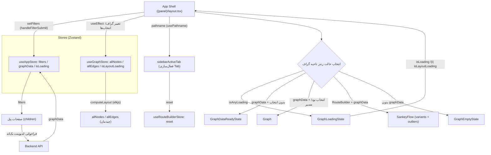

# مستندات فنی: Layout و Providers (App Shell)

| مشخصه | مقدار |
|---|---|
| مسیر منبع | `src/app/layout.tsx`، `src/app/Providers.tsx`، `src/app/(panel)/layout.tsx` |
| دسته | کامپوننت Frontend (App Shell) |
| مستندات مرتبط | [۰۴-Zustand Stores](04-zustand-stores.md) · [۰۵-Fetcher](05-fetcher.md) · [۰۶-Graph Renderer](06-graph-renderer.md) · [۰۷-Graph UI Primitives](07-graph-ui-primitives.md) |

## ۱. هدف (Purpose)

ماژول **App Shell** اسکلت کلی رابط کاربری سامانه «فکر» را می‌سازد و از سه فایل تشکیل شده است:

| فایل | نقش |
|---|---|
| `src/app/layout.tsx` | **Root Layout** — سند HTML، فونت فارسی، متادیتا و محصورکردن برنامه در Providers |
| `src/app/Providers.tsx` | **Providers** — راه‌اندازی HeroUI (با `navigate` برای Next.js) و Toast |
| `src/app/(panel)/layout.tsx` | **App Shell اصلی** — چیدمان سه‌ستونه (Sidebar ← کارت فیلتر ← ناحیه گراف) + Navbar + مدیریت وضعیت Tab و سایز کارت |

این ماژول محتوای صفحات پنل را در قالب یک Shell یکپارچه (ستون‌بندی، نوار کناری، هدر کارت، Resizer و ناحیه نمایش گراف) قرار می‌دهد و حالت‌های مختلف نمایش گراف (بارگذاری/خالی/آماده) را مدیریت می‌کند.

## ۲. Props

### `RootLayout` (layout.tsx)

| Prop | نوع | توضیح |
|---|---|---|
| `children` | `React.ReactNode` | محتوای کل برنامه |

### `Providers` (Providers.tsx)

| Prop | نوع | توضیح |
|---|---|---|
| `children` | `React.ReactNode` | محتوای برنامه (صفحات) |

### `LayoutContent` / Panel Layout ((panel)/layout.tsx)

| Prop | نوع | توضیح |
|---|---|---|
| `children` | `React.ReactNode` | محتوای صفحه فعلی (صفحات پنل: فرآیندنگار، جریان‌یاب و …) |

## ۳. منبع Props (Props Source)

| منبع | Props/State حاصل |
|---|---|
| **Next.js** | `children` — پر شده توسط صفحات نرمال (App Router nesting) |
| **HeroUI** | `HeroUIProvider.navigate={router.push}` — انتقال مسیر با `useRouter` |
| **Store (useAppStore)** | `filters`, `setFilters`, `isLoading`, `graphData`, `selectedNodeIds`, `selectedPathNodes`, `sidebarActiveTab`, `setSidebarActiveTab`, `startEndNodes`, `selectedColorPalette`, `variants`, `outliers` |
| **Store (useGraphStore)** | `isLayoutLoading`, `allNodes`, `allEdges`, `computeLayout` |
| **Store (useRouteBuilderStore)** | `reset` |
| **Constant (tabThemes)** | `TAB_THEMES` — مسیر، عنوان، آیکون و کلاس‌های تم هر Tab |
| **Font (محلی)** | `../assets/Fonts/Vazir-FD-WOL.woff2` — فونت وزیر |

## ۴. استیت داخلی (Internal State)

### استفاده مستقیم از `useState`

| State | پیش‌فرض | توضیح |
|---|---|---|
| `isSidebarCollapsed` | `false` | جمع/باز شدن نوار آیکونی |
| `isSideCardVisible` | `true` | نمایش/پنهان شدن کارت کناری (فیلترها) |
| `cardWidth` | `450` | عرض پیکسلی کارت (Re-Evaluate با Resizer) |
| `isResizing` | `false` | در جریان کشیدن دستگیره Resize |

### مشتق‌شده (Derived)

| مقدار | فرمول |
|---|---|
| `allVariants` | `[...(variants ?? []), ...(outliers ?? [])]` |
| `isAnyLoading` | `isLoading \|\| isLayoutLoading` |
| `actualCardWidth` | `isSideCardVisible ? `${cardWidth}px` : "0px"` |
| `sidebarWidth` | `"max-content"` (ثابت) |

## ۵. هوک‌های استفاده‌شده (Hooks Used)

| هوک | کاربرد |
|---|---|
| `usePathname()` | تشخیص Tab فعال از مسیر جاری |
| `useRouter()` | ناوبری در `onTabChange` و `HeroUIProvider.navigate` |
| `useState` | چهار استیت داخلی بالا |
| `useEffect` (×۲) | ۱) همگام‌سازی `sidebarActiveTab` با `pathname` و `reset` جریان‌ساز؛ ۲) فراخوانی `computeLayout` با تغییر گراف/انتخاب‌ها |
| `useCallback` | `handleFilterSubmit` — ارسال فیلتر به Store |
| `useMemo` | ساخت `allVariants` (ترکیب variants + outliers) |
| `useAppStore` / `useGraphStore` / `useRouteBuilderStore` | Zustand stores (اشتراک حالت) |
| افزودن Event Listener دستی | `mousemove`/`mouseup` برای Resize دستگیره |

## ۶. فراخوانی‌های API (API Calls)

| فراخوانی | محل/علت |
|---|---|
| **مستقیم: ندارد** | این ماژول هیچ درخواست HTTP مستقیم انجام نمی‌دهد |
| **غیرمستقیم** | `computeLayout` (محاسبه Layout با elkjs) و ذخیره فیلترها در Store باعث می‌شود صفحات (مثل page اصلی) اندپوینت‌های بک‌اند را فراخوانی کنند |
| **راست‌کننده‌ها** | `setFilters` → محرک بارگذاری مجدد گراف در صفحه اصلی |

## ۷. تبدیل داده (Data Transformation)

| تبدیل | شرح |
|---|---|
| `TAB_THEMES` → تم Tab | نگاشت `SidebarTab` به عنوان/آیکون/کلاس‌های رنگ (`TAB_TITLES`, `TAB_ICONS`, `TAB_ICON_COLORS`, `TAB_TITLE_COLORS`) |
| variants+outliers → `allVariants` | ادغام هر دو لیست برای `SankeyFlow` |
| `cardWidth` پیکسلی → CSS | `gridTemplateColumns: "max-content <width> 1fr"` (ترتیب RTL) |
| DeltaX معکوس | در RTL افزایش عرض با `startX - moveEvent.clientX`؛ محدودیت ۲۸۰–۶۰۰px |
| مسیر → Tab فعال | `Object.entries(TAB_THEMES)` و تطبیق `value.path === pathname` |

## ۸. خروجی رندر (Render Output)

ساختار رندر Root:

```
<html lang="fa" dir="rtl">
  <body class=فونت وزیر>
    <Providers>
      <HeroUIProvider navigate={router.push}>
        <ToastProvider />
        {children}
      </HeroUIProvider>
    </Providers>
  </body>
</html>
```

ساختار رندر App Shell (grid سه‌ستونه):

```
<div grid h-screen — columns: [sidebarWidth] [actualCardWidth] 1fr>
  ├─ <SideBar>              ← نوار آیکونی (rounded-3xl)
  ├─ <Card> (کارت کناری)
  │   ├─ CardHeader          ← آیکون + عنوان Tab فعال (رنگ از تم)
  │   ├─ CardBody            ← {children} (محتویات صفحه، اسکرول‌دار)
  │   └─ Resizer Handle      ← دستگیره درگ (فقط وقتی isSideCardVisible)
  └─ <main> (ناحیه اصلی)
      ├─ <Navbar onFilterUpdate currentFilters isLoading>
      └─ ناحیه گراف (بر اساس شرط‌ها):
          ├─ isAnyLoading          → <GraphLoadingState>
          ├─ graphData بدون انتخاب → <GraphDataReadyState>
          ├─ graphData + انتخاب    → <Graph>
          ├─ RouteBuilder + داده   → <SankeyFlow allVariants allNodes>
          └─ بدون graphData        → <GraphEmptyState>
</div>
```

منطق نمایش گراف (شرط‌های ترکیبی در `<main>`):

| شرط | خروجی |
|---|---|
| `isAnyLoading` | GraphLoadingState |
| `graphData` و `selectedNodeIds.size===0` و `selectedPathNodes.size===0` و tab **∉** {SearchCaseIds, Outliers, Routing, RouteBuilder} | GraphDataReadyState (بلاک اول) |
| `graphData` و `selectedPathNodes.size===0` و tab **∈** {Routing, Outliers, SearchCaseIds} | GraphDataReadyState (بلاک دوم — مستقل از `selectedNodeIds`) |
| `graphData` و tab ≠ RouteBuilder و (`selectedNodeIds.size>0` یا `selectedPathNodes.size>0`) | Graph |
| `sidebarActiveTab === "RouteBuilder"` و `graphData` | SankeyFlow |
| `!isAnyLoading` و نبود `graphData` | GraphEmptyState |

> نکته: بلاک دومِ `GraphDataReadyState` فقط شرط `selectedPathNodes.size === 0` را بررسی می‌کند؛ یعنی در تب‌های Routing/Outliers/SearchCaseIds حتی اگر نودی انتخاب شده باشد (فقط مسیرها از پیش تعیین‌کننده‌اند) ناحیه گراف «آماده» می‌ماند. «tabs ویژه» در بلاک اول یعنی چهار تب SearchCaseIds، Outliers، Routing و RouteBuilder.

## ۹. کامپوننت‌های استفاده‌کننده (Components Using It)

| کامپوننت | نحوه استفاده |
|---|---|
| **صفحات پنل** (children) | `page.tsx`, `routing`, `outliers`, `search-case-ids`, `route-builder`, `settings`, `guide` — در `CardBody` رندر می‌شوند |
| `SideBar` | دریافت `onToggle`, `isCollapsed`, `setIsCollapsed` |
| `Navbar` | دریافت `onFilterUpdate`, `currentFilters`, `isLoading` |
| `Graph` | وقتی نود/مسیر انتخاب شده (یا جریان) |
| `SankeyFlow` | در Tab جریان‌ساز (با `allVariants`, `allNodes`) |
| `GraphDataReadyState` / `GraphEmptyState` / `GraphLoadingState` | وضعیت‌های ناحیه گراف |
| `ToastProvider` | نمایش اعلان‌های سراسری |
| صفحه لاگین | خارج از پنل (مسیر `(auth)`) با Root Layout ولی بدون App Shell |

## ۱۰. نمودار جریان داده (Data Flow Diagram)



> این نمودار فقط جریان‌های مرتبط با App Shell را نشان می‌دهد؛ جزئیات fetch و چیدمان در مستندات [۰۵-Fetcher](05-fetcher.md) و [۰۶-Graph Renderer](06-graph-renderer.md) آمده است.

## خلاصه

**App Shell** شامل سه لایه است: Root Layout (HTML/فونت)، Providers (HeroUI/Toast) و Panel Layout (چیدمان سه‌ستونه با Sidebar، کارت فیلتر قابل Resize و ناحیه گراف). هیچ API مستقیمی ندارد؛ فقط وضعیت را از Stores می‌خواند، Tab فعال را از `pathname` تشخیص می‌دهد، `computeLayout` را راه می‌اندازد و بر اساس وضعیت (لودینگ/خالی/آماده/انتخاب) کامپوننت مناسب گراف را رندر می‌کند.
