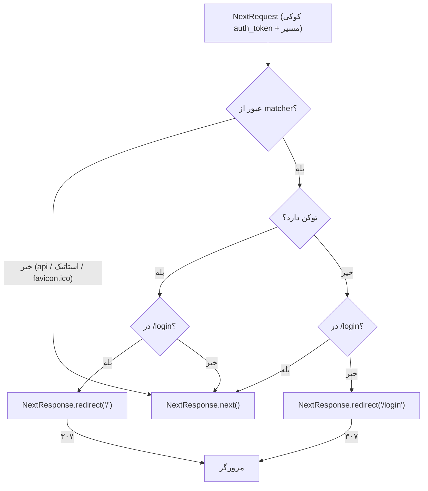

# مستندات فنی: Middleware احراز هویت (Auth Proxy Middleware)

| مشخصه | مقدار |
|---|---|
| مسیر منبع | `src/proxy.ts` |
| دسته | ابزار کمکی (Middleware) |
| مستندات مرتبط | [۰۱-Layout & Providers (App Shell)](01-layout-providers-app-shell.md) · [۰۳-Login Module](03-login-page.md) |

## ۱. هدف (Purpose)

ماژول **Auth Proxy Middleware** یک میان‌افزار احراز هویت در لبه (Edge) فرانت‌اند است که با خواندن کوکی `auth_token` تصمیم می‌گیرد کاربر به صفحه درخواستی دسترسی داشته باشد یا به صفحه لاگین هدایت شود. وظایف اصلی:

- **Guard مسیرها**: کاربر بدون توکن → Redirect به `/login`
- **Block صفحه لاگین برای واردشده‌ها**: کاربر دارای توکن → Redirect از `/login` به `/`
- **عبور عادی**: بقیه درخواست‌ها → `NextResponse.next()`

## ۲. Props

این ماژول کامپوننت React نیست؛ تابعی به نام `proxy` است:

| پارامتر | نوع | توضیح |
|---|---|---|
| `request` | `NextRequest` | درخواست ورودی Next.js (دسترسی به کوکی‌ها، مسیر، URL) |

## ۳. منبع Props (Props Source)

| منبع | نحوه دریافت |
|---|---|
| **Next.js Runtime** | `NextRequest` خودکار در هر درخواست به Middleware تزریق می‌شود |
| **کوکی‌های کاربر** | `request.cookies.get('auth_token')` — توکن جلسه (Mock) |
| **پیکربندی (config)** | `matcher` — تعیین مسیرهای تحت پوشش |
| **ثابت در کد** | مسیر `/login` و `/` — هاردکد |

## ۴. استیت داخلی (Internal State)

| State | وضعیت |
|---|---|
| **ندارد** | کاملاً Stateless؛ بدون متغیر پایدار بین درخواست‌ها (هر درخواست مستقلاً تصمیم می‌گیرد) |

متغیرهای محلی در هر فراخوانی:

| متغیر | مقدار |
|---|---|
| `token` | مقدار کوکی `auth_token` (یا `undefined`) |
| `isLoginPage` | `pathname.startsWith('/login')` |

## ۵. هوک‌های استفاده‌شده (Hooks Used)

| هوک | وضعیت |
|---|---|
| **ندارد** | نه React Hook نه Next Hook؛ به‌صورت تابع خالص در runtime لبه اجرا می‌شود |

## ۶. فراخوانی‌های API (API Calls)

| فراخوانی | توضیح |
|---|---|
| **مستقیم: ندارد** | هیچ درخواست HTTP بیرونی یا بک‌اند زده نمی‌شود (تصمیم‌گیری صرفاً بر پایه کوکی) |
| **Redirect (سمت سرور)** | `NextResponse.redirect` — بازگشت پاسخ هدایت به مرورگر |

## ۷. تبدیل داده (Data Transformation)

| تبدیل | شرح |
|---|---|
| کوکی → بولی | `request.cookies.get('auth_token')?.value` → وجود/نبود توکن |
| مسیر → بولی | `pathname.startsWith('/login')` → `isLoginPage` |
| تصمیم‌گیری ۲×۲ | جدول منطق زیر |

| توکن | در `/login` | اقدام |
|---|---|---|
| ندارد | خیر | `redirect('/login')` |
| ندارد | بله | `next()` (اجازه ورود) |
| دارد | بله | `redirect('/')` |
| دارد | خیر | `next()` (اجازه ورود) |

## ۸. خروجی رندر (Render Output)

این ماژول UI رندر نمی‌کند؛ خروجی آن یک پاسخ HTTP از میان‌افزار است:

| خروجی | توضیح |
|---|---|
| `NextResponse.redirect(loginUrl)` | ۳۰۷ به `/login` برای کاربران بدون توکن |
| `NextResponse.redirect('/')` | ۳۰۷ به داشبورد برای کاربران واردشده در صفحه لاگین |
| `NextResponse.next()` | ادامه پردازش درخواست |

**دامنه پوشش (matcher)**: همه مسیرها به‌جز:

```
/((?!api|_next/static|_next/image|favicon.ico).*)
```

یعنی: مسیرهای `api`، فایل‌های استاتیک Next و `favicon.ico` بدون بررسی رد می‌شوند.

## ۹. کامپوننت‌های استفاده‌کننده (Components Using It)

| مصرف‌کننده | نحوه تأثیر |
|---|---|
| **صفحات پنل** (پای `(panel)` و بقیه صفحات) | محافظت‌شده — بدون توکن به `/login` می‌روند |
| **صفحه لاگین** (`(auth)/login`) | فقط برای کاربران بدون توکن قابل مشاهده |
| **صفحه اصلی `/`** | مقصد Redirect بعد از ورود موفق |
| **زیرساخت Next** | از طریق مکانیزم Middleware (فایل `proxy.ts` در `src/`) |

> ⚠️ **نکته مهم**: در پروژه فعلی فایل به نام `src/proxy.ts` است در حالی که Next.js به صورت خودکار فقط فایل `middleware.ts` (در ریشه یا `src/`) را به عنوان Middleware می‌شناسد. جستجو نشان داد هیچ فایل `middleware.ts` و هیچ importی از `proxy` وجود ندارد؛ بنابراین **این میان‌افزار در حال حاضر عملاً فعال نیست** و حفاظت مسیرها به صورت موثر اجرا نمی‌شود. برای فعال‌سازی باید فایل به `middleware.ts` تغییر نام داده شود.

## ۱۰. نمودار جریان داده (Data Flow Diagram)



## خلاصه

**Auth Proxy Middleware** تصمیم‌گیری دسترسی مبتنی بر کوکی `auth_token` را در لبه انجام می‌دهد (جدول منطق ۲×۲: Redirect/Next). کاملاً Stateless است، API مستقیمی نمی‌زند و با matcher استاتیک‌ها و مسیرهای api را نادیده می‌گیرد. اما به دلیل نام‌گذاری غیراستاندارد فایل (`proxy.ts` به جای `middleware.ts`)، در وضعیت فعلی **غیرفعال** است و باید رفع شود.
