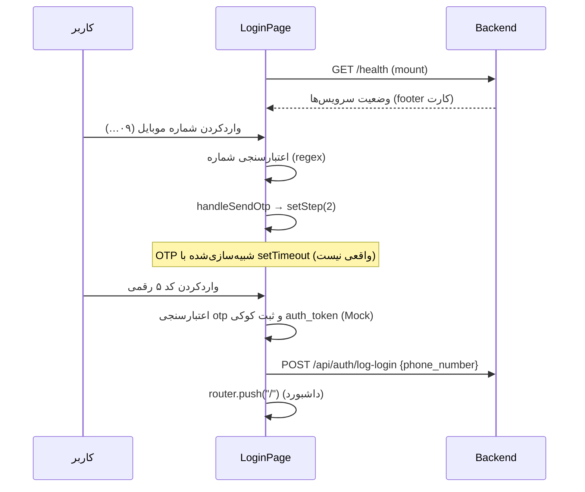

# مستندات فنی: Login Module

| مشخصه | مقدار |
|---|---|
| مسیر منبع | `src/app/(auth)/login/page.tsx` |
| دسته | صفحه Frontend |
| مستندات مرتبط | [۰۲-Auth Proxy Middleware](02-auth-proxy-middleware.md) |

## ۱. هدف (Purpose)

ماژول **Login** صفحه ورود/ثبت‌نام سامانه «فکر» را پیاده‌سازی می‌کند — یک فرم دو مرحله‌ای با انیمیشن:

- **مرحله ۱**: دریافت و اعتبارسنجی شماره موبایل (فرمت ۱۱ رقمی ایران)
- **مرحله ۲**: دریافت کد تایید ۵ رقمی (InputOtp) و ورود

به‌علاوه یک **نشانگر وضعیت سلامت سیستم** (فرانت‌اند/بک‌اند/دیتابیس) در پایین کارت نمایش می‌دهد که با فراخوانی اندپوینت `/health` بک‌اند به‌روز می‌شود.

> ⚠️ جریان احراز هویت کاملاً **Mock** است: OTP واقعی ارسال نمی‌شود (شبیه‌سازی `setTimeout`) و توکن نیز به صورت ثابت `your_mock_token` در کوکی ثبت می‌شود. TODOها در کد برای اتصال بعدی به API واقعی پیامک مشخص شده‌اند.

## ۲. Props

این ماژول یک Page کامپوننت Next.js است و **هیچ Prop از والد دریافت نمی‌کند** (فارغ از Props):

| Prop | وضعیت |
|---|---|
| — | بدون Props (استاتیک، `export default function LoginPage()`) |

## ۳. منبع Props (Props Source)

| منبع | توضیح |
|---|---|
| **ندارد** | بدون Props ورودی؛ همه داده از State محلی و Hook ها | 
| Env Var | `process.env.NEXT_PUBLIC_API_URL` (پیش‌فرض `http://localhost:3001`) — برای healthcheck |
| HeroUI | `Input`, `InputOtp`, `Button`, `Card` — کامپوننت‌های UI |
| Assets | `../../../assets/images/sign.svg` و `type.svg` — لوگو |
| lucide-react | آیکون‌های `Phone`, `ArrowRight`, `Monitor`, `Server`, `Database` |

## ۴. استیت داخلی (Internal State)

| State | پیش‌فرض | توضیح |
|---|---|---|
| `step` | `1` (تایپ `1|2`) | مرحله فرم (شماره تماس یا کد تایید) |
| `phone` | `''` | شماره موبایل ورودی |
| `phoneError` | `''` | پیام خطای اعتبارسنجی شماره |
| `otp` | `''` | کد تایید ۵ رقمی |
| `isLoading` | `false` | وضعیت در حال ارسال (دکمه spinner) |
| `health` | `{frontend:'healthy', backend:'loading', database:'loading'}` | وضعیت سلامت سرویس‌ها (loading/healthy/unhealthy) |

## ۵. هوک‌های استفاده‌شده (Hooks Used)

| هوک | کاربرد |
|---|---|
| `useState` | شش استیت بالا |
| `useEffect` | اجرای `checkHealth` در mount (با `AbortController` و timeout ۴ ثانیه) |
| `useRouter` | انتقال به `/` پس از ورود موفق |

## ۶. فراخوانی‌های API (API Calls)

| فراخوانی | اندپوینت | توضیح |
|---|---|---|
| `fetch(`${apiUrl}/health`)` | GET `/health` | بررسی سلامت بک‌اند و دیتابیس؛ با AbortController (4s) |
| `fetch(apiUrl + '/api/auth/log-login')` | POST `/api/auth/log-login` | ثبت لاگ ورود (بدنه: `{ phone_number }`) — پس از ورود موفق |
| OTP واقعی | — | TODO (فقط `setTimeout` شبیه‌سازی) |
| Verify API | — | TODO (توکن واقعی ندارد) |

> ⚠️ `NEXT_PUBLIC_API_URL` می‌تواند `undefined` باشد؛ در healthcheck از fallback `http://localhost:3001` استفاده می‌شود ولی در `log-login` مستقیماً الحاق می‌شود (احتمال خطا در نبود متغیر).

## ۷. تبدیل داده (Data Transformation)

| تبدیل | شرح |
|---|---|
| اعتبارسنجی شماره | `iranianPhoneRegex = /^09\d{9}$/` — دقیقاً ۱۱ رقم، شروع با 09 |
| اعتبارسنجی OTP | `otp.length >= 5` — ورود فقط با کامل بودن کد |
| healthcheck → status | `data.backend === 'healthy'` → `health.backend`؛ در هر خطا/failure → `unhealthy` |
| گام جابه‌جایی | `handleSendOtp` → `setStep(2)`؛ دکمه «اصلاح شماره» → `setStep(1)` + `setOtp('')` |
| لاگ ورود | بسته‌بندی `JSON.stringify({ phone_number: phone })` |

## ۸. خروجی رندر (Render Output)

ساختار رندر صفحه:

```
<div min-h-screen bg-slate-50>          ← بک‌گراند با بلور رنگی (بلاب)
  <Card max-w-md>
    <CardHeader>
      LogoSign + LogoType (لوگو)
      <h1>ورود به سامانه</h1>
      + توضیح بر اساس step
    </CardHeader>
    <CardBody>
      <AnimatePresence mode="wait">
        ├─ step 1: <Input tel (09123456789) + Button "ارسال کد تایید">
        └─ step 2: <InputOtp length=5 dir=ltr + Button "تایید و ورود">
                    + Button "اصلاح شماره" (بازگشت)
      </AnimatePresence>
    </CardBody>
    <Footer: وضعیت سیستم>
      فرانت (پایدار سبز) | بک‌اند (dot بر اساس health) | دیتابیس (dot بر اساس health)
    </Footer>
  </Card>
</div>
```

حالت‌های دکمه: `isLoading` → `isLoading={true}` (spinner) روی دکمه‌های submit.

## ۹. کامپوننت‌های استفاده‌کننده (Components Using It)

| کامپوننت/مصرف‌کننده | نحوه استفاده |
|---|---|
| **App Shell/Providers** | در route group `(auth)` — فقط Root Layout (بدون App Shell پنل) |
| **Auth Proxy Middleware** | مقصد Redirect برای کاربران بدون توکن؛ در حال حاضر غیرفعال (فایل `proxy.ts`) |
| **`api/auth/log-login` (بک‌اند)** | دریافت لاگ ورود پس از ورود موفق |
| **سیستم حفاظت مسیر** | پس از ورود → `router.push('/')` (داشبورد) |
| `setCookie` | `document.cookie = "auth_token=..."` — مبنای تصمیم‌گیری Auth |

## ۱۰. نمودار جریان داده (Data Flow Diagram)



## خلاصه

**Login Module** صفحه ورود دومرحله‌ای است: اعتبارسنجی شماره موبایل (۰۹…) → مرحله OTP (با HeroUI InputOtp) → ثبت کوکی Mock + لاگ در بک‌اند → هدایت به `/`. وضعیت سلامت سیستم را از `/health` می‌خواند و با کامپوننت‌های HeroUI و framer-motion رندر می‌شود. جریان OTP و توکن در حال حاضر **Mock** است و TODOها برای API واقعی در کد مشخص شده‌اند.