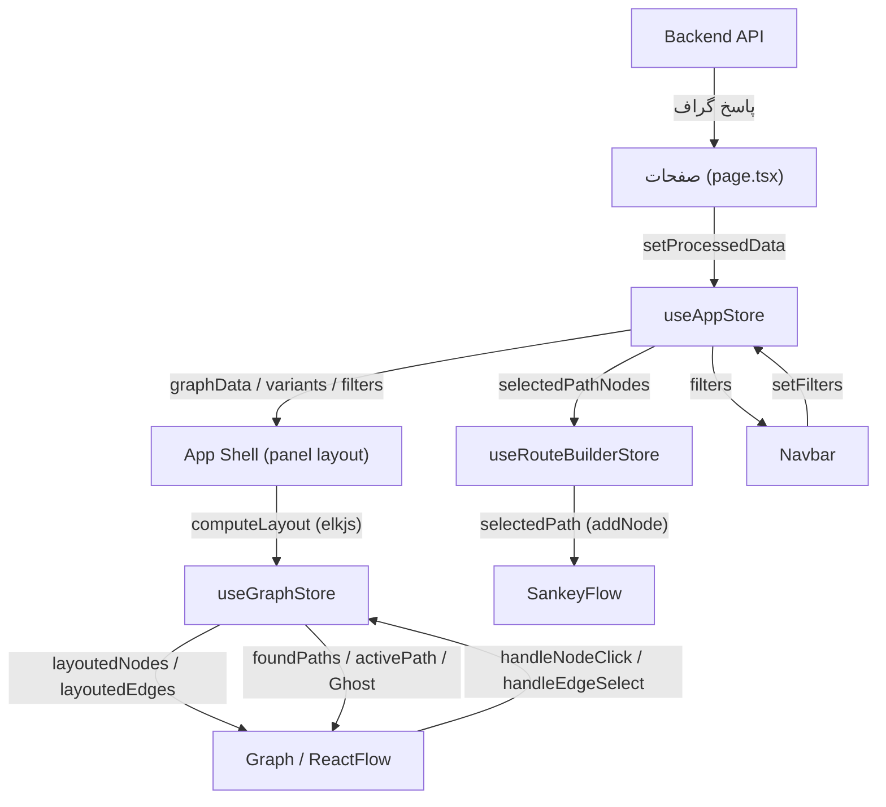

# مستندات فنی: State (Zustand Stores)

| مشخصه | مقدار |
|---|---|
| مسیر منبع | `src/hooks/useAppStore.ts`، `src/store/useGraphStore.ts`، `src/store/useRouteBuilderStore.ts` |
| دسته | Store |
| مستندات مرتبط | [۰۱-Layout & Providers (App Shell)](01-layout-providers-app-shell.md) · [۰۶-Graph Renderer](06-graph-renderer.md) · [۰۸-Navbar](08-navbar.md) |

## ۱. هدف (Purpose)

ماژول **State** مدیریت وضعیت سراسری برنامه را با **Zustand** انجام می‌دهد و شامل سه Store مستقل است:

| Store | فایل | مسئولیت |
|---|---|---|
| `useAppStore` | `src/hooks/useAppStore.ts` | داده‌ی فرایند (گراف/Variantها)، فیلترها، وضعیت UI و انتخاب‌ها |
| `useGraphStore` | `src/store/useGraphStore.ts` | وضعیت گراف: Layout، تعاملات (کلیک/Tooltip)، Pathfinding، هایلایت و Ghost elements |
| `useRouteBuilderStore` | `src/store/useRouteBuilderStore.ts` | مسیر در حال ساخت در جریان‌ساز |

این Stores مرکز هماهنگی بین صفحات، نوار کناری و کامپوننت گراف هستند (لایه فراخوان بدون API مستقیم؛ داده را پس از دریافت از بک‌اند دریافت می‌کنند).

## ۲. Props

Stores Props ندارند (Hook نیستند با آرگومان‌ها)؛ اما **توابع اکشن** به عنوان «رابط عمومی» به کامپوننت‌ها داده می‌شوند:

### `useAppStore` — اکشن‌های اصلی

| اکشن | توضیح |
|---|---|
| `setProcessedData({graphData, variants, outliers, startActivities, endActivities})` | ثبت داده پردازش‌شده + `filteredGraphData = graphData` + ریست انتخاب‌ها + `filtersApplied: true` + `isLoading: false` |
| `setFilters(filters)` / `setFiltersApplied(b)` | ذخیره فیلترها و وضعیت اعمال |
| `setFilteredGraphData(data)` | گراف فیلترشده کلاینت‌ساید |
| `setDataFilePath(path)` | ثبت مسیر فایل + `step: 2` |
| `setIsLoading` / `setSidebarActiveTab` / `toggleSideCard` / `toggleSidebarCollapsed` | وضعیت‌های UI |
| `setSelectedNodeIds/PathNodes/PathEdges/PathIndex` | مدیریت انتخاب — `setSelectedNodeIds` وقتی مجموعه جدید **غیرخالی** و `filtersApplied` باشد، `filtersApplied` را خودکار `false` می‌کند |
| `setSelectedColorPalette` | پالت رنگی گراف |
| `resetPathSelection` / `handleSidebarTabClick` | ریست و تعامل Tab — `handleSidebarTabClick` اگر Tab فعلی دوباره کلیک شود کارت کناری را می‌بندد، وگرنه Tab را عوض کرده و کارت را باز می‌کند |

### `useGraphStore` — اکشن‌های اصلی

| اکشن | توضیح |
|---|---|
| `processInitialData(graphData, startActivities, endActivities)` | تبدیل داده‌ی خام یال‌ها به نود/یال + نودهای START/END |
| `computeLayout(config: LayoutConfig)` | فیلتر، ELK Layout، رنگ‌بندی وزنی، Ghost و override مسیر |
| `handleNodeClick` / `handleEdgeSelect` | تعاملات با Tooltip/انتخاب/Pathfinding |
| `handleSelectPath` / `handleSelectOutlier` | انتخاب مسیرهای یافت‌شده |
| `highlightPath` / `clearPathHighlight` | حالت هایلایت مسیر (قفل تعامل) |
| `injectGhostElements` / `clearGhostElements` | نود/یال‌های خط‌چین برای مسیر جستجو/Outlier |
| `removePath` / `resetPathfinding` / `calculatePathDuration` | مدیریت Pathfinding |

### `useRouteBuilderStore`

| اکشن | توضیح |
|---|---|
| `addNode(nodeId)` / `removeLastNode()` / `reset()` | ساخت مسیر در جریان‌ساز |

## ۳. منبع Props (Props Source)

| منبع | نحوه تأمین |
|---|---|
| **صفحات (page.tsx و …)** | پس از پارس پاسخ API، `setProcessedData` صدا زده می‌شود |
| **کامپوننت‌های مصرف‌کننده** | Selectorها: `useGraphData`, `useDataFilePath`, `useFilters`, `useIsLoading`, `useSidebarState`, `useGraphLayoutState`, `useGraphInteractionState` |
| **App Shell (panel layout)** | `filters`, `isLoading`, `graphData`, `selectedNodeIds`, `selectedPathNodes`, `sidebarActiveTab`, `selectedColorPalette` → `computeLayout` |
| **Constants** | `colorPalettes` (رنگ‌بندی), `formatDuration` (برچسب) |
| **انواع** | `FilterTypes`, `GraphData`, `Variant`, `SidebarTab`, `Path`, `ExtendedPath` از `types/types.ts` |

## ۴. استیت داخلی (Internal State)

### `useAppStore` — فیلدهای اصلی

| بخش | فیلدها |
|---|---|
| داده | `dataFilePath`, `graphData`, `filteredGraphData`, `variants`, `outliers`, `startEndNodes`, `filters` |
| UI | `step`, `isLoading`, `sidebarActiveTab`, `isSideCardVisible`, `isSidebarCollapsed`, `filtersApplied` |
| انتخاب | `selectedNodeIds`, `selectedPathNodes`, `selectedPathEdges`, `selectedPathIndex`, `selectedColorPalette` |

مقدار پیش‌فرض `filters` (شیء اولیه در Store):

```
{
  dateRange: { start: "", end: "" },
  dimensionFilters: {}, courtKinds: [],
  minCaseCount: null, maxCaseCount: null,
  meanTimeRange: { min: null, max: null },
  weightFilter: "mean_time", timeUnitFilter: "d",
  outlierPrecentage: 5, unitId: null
}
```

سایر پیش‌فرض‌ها: `step: 1`, `sidebarActiveTab: "Filter"`, `selectedColorPalette: "default"`, `filtersApplied: false` و همه‌ی Setهای انتخاب خالی.

### `useGraphStore` — فیلدها (گروه‌بندی)

| بخش | فیلدها |
|---|---|
| Layout | `allNodes`, `allEdges`, `layoutedNodes`, `layoutedEdges`, `isLayoutLoading`, `loadingMessage` |
| Interaction | `activeTooltipEdgeId`, `selectedEdgeId`, `isNodeCardVisible`, `isEdgeCardVisible`, `nodeTooltipTitle/Data`, `edgeTooltipTitle/Data` |
| Pathfinding | `isPathFinding`, `pathStartNodeId`, `pathEndNodeId`, `foundPaths`, `activePath` |
| Highlight | `isHighlightModeActive`, `highlightedActivePath` |
| Refs داخلی | `_workerRef`, `_elkInstance`, `_edgeLookupMap` |

### `useRouteBuilderStore`

| فیلد | مقدار اولیه |
|---|---|
| `selectedPath` | `string[]` (پیش‌فرض `[]`) |

## ۵. هوک‌های استفاده‌شده (Hooks Used)

| هوک/مکانیزم | کاربرد |
|---|---|
| `create` از Zustand | ساخت هر سه Store (با `set`/`get`) |
| Selector ها | بهینه‌سازی اشتراک‌گذاری بخشی (مثل `useGraphData` → `filteredGraphData ?? graphData`) |
| **درون Store** | بدون React Hooks؛ همه‌چیز خالص JS (ELK فقط در `computeLayout` استفاده می‌شود) |

## ۶. فراخوانی‌های API (API Calls)

| فراخوانی | توضیح |
|---|---|
| **مستقیم: ندارد** | هیچ Store مستقیم fetch نمی‌زند؛ داده از طریق `setProcessedData` (صفحه اصلی پس از API) وارد می‌شود |
| **محاسبات سنگین** | `computeLayout` با کتابخانه `ELK` (layout) در `elkjs` — سمت کلاینت |

## ۷. تبدیل داده (Data Transformation)

| تبدیل | شرح |
|---|---|
| **یال‌ها → گراف** | `processInitialData`: اسکن ردیف‌های `graphData` → ساخت `nodesMap`/`edgesMap` (شناسه `A->B`) + نودهای `START_NODE`/`END_NODE` + یال‌های خط‌چین شروع/پایان با حجم |
| **Layout** | `computeLayout`: فیلتر نود/یال (شامل START/END)، افزودن Ghost، ساخت گراف ELK (layered RIGHT)، نگاشت مختصات، رنگ‌بندی بر اساس محدوده `Weight_Value` با `colorPalettes[key]`، override مسیر |
| **Pathfinding** | `handleNodeClick`: اسکن Variantها با `indexOf/lastIndexOf` شروع/پایان → `ExtendedPath` با `_variantDuration`, `_frequency`, `_pathType`, `_variantTimings` |
| **Tooltip Override** | `calculateEdgeOverride`: آمار مخصوص مسیر (`_specificEdgeDurations` و …) → label و tooltip |
| **Ghost Injection** | `injectGhostElements`: نود/یال‌های غایب مسیر (SearchCaseIds/Outliers) → خط‌چین نارنجی؛ یا بدون گراف پایه (Pure Search) |
| **بازنشانی** | `resetPathfinding`, `clearPathHighlight`, `clearGhostElements` — پاک‌سازی state بعد از عملیات |

## ۸. خروجی رندر (Render Output)

Stores UI رندر نمی‌کنند؛ اما **خروجی آن‌ها رندر کامپوننت‌ها را کنترل می‌کند**:

| استیت | مصرف در رندر |
|---|---|
| `layoutedNodes`/`layoutedEdges` | نودها/یال‌های اصلی `ReactFlow` در `Graph` |
| `foundPaths`/`activePath` | لیست مسیرهای جریان‌یاب و هایلایت |
| `isLayoutLoading`/`loadingMessage` | وضعیت `GraphLoadingState` (در App Shell) |
| `isNodeCardVisible`/`isEdgeCardVisible` | کارت‌های Tooltip نود/یال |
| `selectedPath` (RouteBuilder) | نمایش مسیر در `SankeyFlow` و sidebar |
| `filtersApplied` | به‌روزرسانی دیتای گراف در page |

## ۹. کامپوننت‌های استفاده‌کننده (Components Using It)

| کامپوننت | Store/اکشن |
|---|---|
| **App Shell (panel layout)** | `useAppStore` + `useGraphStore` (`computeLayout`) + `useRouteBuilderStore.reset` |
| **Graph.tsx** | `useGraphStore` — رندر `layoutedNodes/Edges`, تعاملات `handleNodeClick/EdgeSelect` |
| **SankeyFlow** | `useGraphStore` (allNodes) + `useRouteBuilderStore` (selectedPath) |
| **Navbar** | `useAppStore` (filters, isLoading) |
| **SideBar** | `useAppStore` (sidebarActiveTab, toggle) |
| **ActivityTreeFilter** | `useAppStore` (filters, setFilters) |
| **صفحات** (routing/outliers/search) | `useGraphStore` (pathfinding/highlight/ghost) + `useAppStore` |
| **Selector Hooks** | `useGraphData`, `useFilters`, `useGraphLayoutState`, `useGraphInteractionState` — مصرف بهینه در کامپوننت‌ها |

## ۱۰. نمودار جریان داده (Data Flow Diagram)



## خلاصه

ماژول **State** با سه Store حالت سراسری را مدیریت می‌کند: `useAppStore` (داده و UI)، `useGraphStore` (گراف و تعاملات با ELK) و `useRouteBuilderStore` (جریان‌ساز). هیچ API مستقیمی در Stores نیست؛ داده از `setProcessedData` وارد و تبدیل‌های کلیدی (ساخت نود/یال، Layout وزنی، Pathfinding روی Variantها، Ghost injection) درون Store انجام می‌شود. اکشن‌ها با استفاده از `set`/`get` Zustand و با انتخاب‌های جداگانه به کامپوننت‌ها تزریق می‌شوند.
