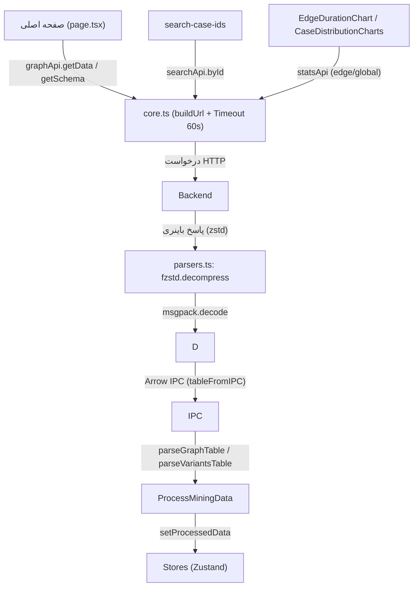

# مستندات فنی: ارتباط با Backend (Fetcher)

| مشخصه | مقدار |
|---|---|
| مسیر منبع | `src/utils/fetcher/core.ts`، `src/utils/fetcher/parsers.ts`، `src/utils/fetcher/api/*.ts`، `src/utils/fetcher/index.ts` |
| دسته | لایه ارتباط با Backend |
| مستندات مرتبط | [۰۴-Zustand Stores](04-zustand-stores.md) · [۰۷-Graph UI Primitives](07-graph-ui-primitives.md) |

## ۱. هدف (Purpose)

ماژول **Fetcher** لایه رسمی ارتباط فرانت‌اند با بک‌اند است و تمام درخواست‌های HTTP را متمرکز می‌کند. ساختار آن:

| فایل | نقش |
|---|---|
| `src/utils/fetcher/core.ts` | پیکربندی، توابع پایه (`fetcher`)، ساخت URL، Timeout، مدیریت خطا |
| `src/utils/fetcher/parsers.ts` | دی‌کد پاسخ باینری: zstd → msgpack → Arrow IPC → آبجکت‌های دامنه |
| `src/utils/fetcher/api/*.ts` | APIهای دامنه: `health`, `graph`, `search`, `stats` |
| `src/utils/fetcher/index.ts` | Barrel: خروجی `api` + ری‌اکسپورت توابع |

این ماژول هم آدرس‌دهی محیط‌ها (Docker/SSR و مرورگر) را مدیریت می‌کند و هم فرمت باینری اختصاصی گراف (`application/x-arrow-msgpack-zstd`) را به داده قابل مصرف تبدیل می‌کند.

## ۲. Props

توابع اصلی و آرگومان‌های آن‌ها:

| تابع | آرگومان‌ها |
|---|---|
| `fetcher<T>(endpoint, options?)` | `endpoint: string` + `FetchOptions` (روش، body، params، headers، timeout، responseType، signal) |
| `graphApi.getData(filters)` | `Partial<FilterTypes>` — فیلترهای کاربر |
| `graphApi.getSchema()` / `getDimensions(filters?)` / `getCourtKinds()` | بدون/فیلترهای ابعادی/بدون |
| `searchApi.byId(caseId, options?)` | `caseId` + `{startDate, endDate, includeGlobalStats}` |
| `statsApi.getEdgeStats(source, target, options?)` / `getGlobalStats(options?)` | نام فعالیت‌ها/بازه زمانی |
| `healthApi` | بررسی سلامت |

## ۳. منبع Props (Props Source)

| منبع | توضیح |
|---|---|
| **Environments** | `API_BASE_URL` — سمت سرور: `INTERNAL_API_URL ?? "http://backend:8000"` (Docker)؛ سمت مرورگر: `NEXT_PUBLIC_API_URL ?? "http://localhost:3001"` |
| **Stores (filters)** | `FilterTypes` از `useAppStore` → `buildQueryParams` → query string |
| **کامپوننت‌ها** | پارامترهای جستجو/آمار از صفحات (routing, search-case-ids, EdgeDurationChart و …) |
| **پیکربندی** | `DEFAULT_TIMEOUT = 60_000ms`، `ResponseType` پیش‌فرض `json` |

## ۴. استیت داخلی (Internal State)

| State | وضعیت |
|---|---|
| **ندارد** | بدون استیت پایدار؛ فقط توابع و ثابت‌ها |
| متغیرهای محلی | `AbortController` (timeout)، `Url` ساخته‌شده، cache (ندارد) |

## ۵. هوک‌های استفاده‌شده (Hooks Used)

| هوک | وضعیت |
|---|---|
| **ندارد** | توابع خالص؛ صرفاً یک بررسی `typeof window === "undefined"` برای تشخیص SSR |

## ۶. فراخوانی‌های API (API Calls)

| اندپوینت | متد | ماژول | نکته |
|---|---|---|---|
| `/health` | GET | `healthApi` | بررسی سلامت |
| `/api/graph/data` | POST | `graphApi.getData` | پارامترها در URL؛ پاسخ باینری (`arrayBuffer`) |
| `/api/graph/schema` | GET | `graphApi.getSchema` | Fallback به ۸ سطح پیش‌فرض در خطا |
| `/api/graph/filters` | GET | `graphApi.getDimensions` | مقادیر ابعاد |
| `/api/graph/court-kinds` | GET | `graphApi.getCourtKinds` | Fallback `[]` |
| `/api/search` | GET | `searchApi.byId` | 404 → `{found: false}` |
| `/api/stats/edge` | GET | `statsApi.getEdgeStats` | Toast فقط برای خطا (Toast موفقیت کامنت‌شده است) |
| `/api/stats/global` | GET | `statsApi.getGlobalStats` | Toast فقط برای خطا (Toast موفقیت کامنت‌شده است) |

## ۷. تبدیل داده (Data Transformation)

| تبدیل | شرح |
|---|---|
| **filters → Query** | `buildQueryParams`: `outlierPrecentage` → `target_coverage = 1 - pct/100`؛ نگاشت dateRange/weight/timeUnit/min-max؛ فیلترهای ابعادی (lev*)؛ `court_kinds` |
| **URL** | `buildUrl`: params تکی/آرایه‌ای → `searchParams` (حذف null/undefined) |
| **Timeout** | `createTimeoutController`: abort بعد از 60s + اتصال به signal خارجی |
| **Response parse** | `parseResponse`: json/msgpack (`@msgpack/msgpack`)/blob/text/arraybuffer |
| **خطا** | `!response.ok` → `ApiError(status, statusText, data)`؛ Abort → `ApiError(0, Aborted)`؛ شبکه → `ApiError(0, NetworkError)` |
| **باینری گراف** | `parseGraphResponse`: `fzstd.decompress` → `msgpack.decode` → `tableFromIPC` (دو جدول) → `parseGraphTable` (یال‌ها) و `parseVariantsTable` (تفکیک `variants`/`outliers` با `cum_coverage <= targetCoverage`) |
| **List Arrow** | `toArray`: مقادیر List ایپک به آرایه ساده |

## ۸. خروجی رندر (Render Output)

UI رندر نمی‌کند؛ خروجی‌های آن:

| خروجی | نوع | توضیح |
|---|---|---|
| `fetcher` → `{data, status, headers}` | `ApiResponse<T>` | پاسخ تایپ‌شده |
| `graphApi.getData` → `ProcessMiningData` | `{graphData, variants, outliers, startActivities, endActivities}` | داده آماده برای Store |
| `searchApi.byId` → `{found: bool, data?}` | `SearchCaseIdsData` | عدم تبدیل 404 به خطا |
| Toast ها | — | پیام‌های خطا (داده، جستجو، آمار) — موفقیت‌ها کامنت‌شده |

> **شکاف تایپ (نکته):** `statsApi.getEdgeStats` از نظر تایپ `HistogramData` برمی‌گرداند، اما مصرف‌کننده‌ی آن (`EdgeDurationChart`) پاسخ را `as unknown as { source, target, histogram }` کست می‌کند و فقط `.histogram` را می‌خواند — یعنی ساختار واقعی پاسخ یک شیء توکار `{source, target, histogram}` است، نه مستقیم `HistogramData`.

## ۹. کامپوننت‌های استفاده‌کننده (Components Using It)

| مصرف‌کننده | نحوه استفاده |
|---|---|
| **صفحه اصلی (page.tsx)** | `graphApi.getData/getSchema/getDimensions/getCourtKinds` → `setProcessedData` |
| **Navbar/ActivityTreeFilter** | schema و dimensionها برای درخت فیلتر |
| **صفحه search-case-ids** | `searchApi.byId` → نمایش مسیر پرونده |
| **EdgeDurationChart** | `statsApi.getEdgeStats` (یال انتخابی) |
| **CaseDistributionCharts** | `statsApi.getGlobalStats` |
| **Login page** | healthcheck مستقیم (fetch ساده، خارج از fetcher) |
| **همه صفحات** | `import api from "@/utils/fetcher"` — namespace یکپارچه |

## ۱۰. نمودار جریان داده (Data Flow Diagram)

## خلاصه

ماژول **Fetcher** مرز رسمی بین فرانت و بک‌اند است: ساخت URL با تفکیک محیط (Docker/مرورگر)، Timeout و خطای تایپ‌شده (`ApiError`)، parse پنج فرمت پاسخ و مهم‌تر از همه **پایپلاین باینری zstd→msgpack→Arrow** که داده گراف را به `ProcessMiningData` تبدیل می‌کند. کپسوله‌سازی در `api` namespace باعث می‌شود صفحات فقط با توابع دامنه (getData/byId/…) کار کنند و جزئیات انتقال پنهان بماند.
