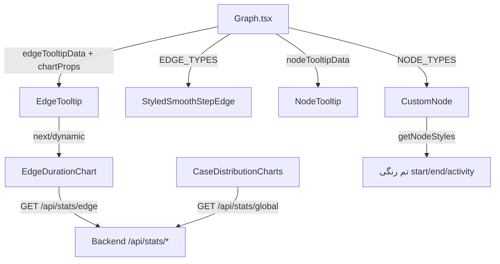

# مستندات فنی: کامپوننت‌های UI گراف (Graph UI Primitives)

| مشخصه | مقدار |
|---|---|
| مسیر منبع | `src/components/graph/ui/CustomNode.tsx`، `src/components/graph/ui/StyledSmoothStepEdge.tsx`، `src/components/graph/ui/NodeTooltip.tsx`، `src/components/graph/ui/EdgeTooltip.tsx`، `src/components/graph/ui/EdgeDurationChart.tsx`، `src/components/graph/ui/CaseDistributionCharts.tsx` |
| دسته | کامپوننت Frontend |
| مستندات مرتبط | [۰۴-Zustand Stores](04-zustand-stores.md) · [۰۵-Fetcher](05-fetcher.md) · [۰۶-Graph Renderer](06-graph-renderer.md) |

## ۱. هدف (Purpose)

ماژول **Graph UI Primitives** شامل کامپوننت‌های نمایشی پایه در مسیر `src/components/graph/ui/` است که بلوک‌های سازنده گراف را می‌سازند:

| کامپوننت | فایل | نقش |
|---|---|---|
| `CustomNode` | `CustomNode.tsx` | رندر نود سفارشی (شروع/پایان/فعالیت) با هندل‌های اتصال |
| `StyledSmoothStepEdge` | `StyledSmoothStepEdge.tsx` | یال SmoothStep با Self-Loop، منطقه کلیک، لیبل و انیمیشن هایلایت |
| `NodeTooltip` | `NodeTooltip.tsx` | کارت اطلاعات نود: لیست یال‌های ورودی/خروجی و انتخاب |
| `EdgeTooltip` | `EdgeTooltip.tsx` | کارت جزئیات یال: آمار رنگی + نمودار histogram یال |
| `EdgeDurationChart` | `EdgeDurationChart.tsx` | هیستوگرام توزیع مدت یک یال (ApexCharts) |
| `CaseDistributionCharts` | `CaseDistributionCharts.tsx` | هیستوگرام‌های سراسری (مدت کل و تعداد گام) |

این کامپوننت‌ها در `NODE_TYPES`/`EDGE_TYPES` گراف ثبت می‌شوند و Tooltipها/نمودارها را در کارت‌های شناور گراف نمایش می‌دهند.

## ۲. Props

### `CustomNode`

| Prop | منبع | توضیح |
|---|---|---|
| `data.type` | Store (`start`/`end`/`activity`) | نوع نود → تم رنگ |
| `data.label` | Store | نام فعالیت |
| `data.subLabel` | Store (اختیاری) | اطلاعات اضافی (مثلاً زمان) |
| `selected` | ReactFlow | استایل ring هنگام انتخاب |

### `StyledSmoothStepEdge`

| Prop | توضیح |
|---|---|
| `id`, `source`, `target`, `sourceX/Y`, `targetX/Y` | هندسه یال از ReactFlow |
| `data.onEdgeSelect`, `data.isGhost`, `data._highlighted` | انتخاب، یال موقت، هایلایت |
| `label`, `style`, `markerEnd`, `animated` | نمایش و انیمیشن |

### `NodeTooltip`

| Prop | توضیح |
|---|---|
| `nodeTooltipTitle`, `nodeTooltipData: NodeTooltipType[]` | عنوان و ردیف‌های یال |
| `selectedEdgeId` | ردیف فعال |
| `onClose`, `onEdgeSelect` | بستن/انتخاب |

### `EdgeTooltip`

| Prop | توضیح |
|---|---|
| `edgeTooltipTitle`, `edgeTooltipData: {label, value}[]` | عنوان و آمار |
| `onClose` | بستن |
| `chartProps: {source, target, duration}?` | پارامتر نمودار یال |

### `EdgeDurationChart`

| Prop | توضیح |
|---|---|
| `source`, `target` | نام فعالیت‌ها |
| `duration` | مدت میانگین (رسم خط مرجع) |

### `CaseDistributionCharts`

| Prop | توضیح |
|---|---|
| `searchResult: SearchCaseIdsData` | نتیجه جستجوی پرونده — بازه زمانی را خودش از `useAppStore` (فیلد `filters.dateRange`) می‌خواند و برای موقعیت‌یابی پرونده در توزیع (annotation «پرونده شما») از `total_duration` و تعداد نودهای آن استفاده می‌کند |

## ۳. منبع Props (Props Source)

| منبع | توضیح |
|---|---|
| **useGraphStore** | داده نود/یال (label، isGhost، _highlighted، selectedEdgeId، node/edgeTooltip) |
| **Graph.tsx** | `EdgeTooltip.chartProps` (از `edgeChartProps`)، نصب NODE/EDGE_TYPES |
| **types/types.ts** | `NodeTooltipType` — `{edgeId, label, weight, direction, caseCount}` |
| **statsApi (fetcher)** | `EdgeDurationChart`/`CaseDistributionCharts` — داده نمودار از `api.stats` |
| **HeroUI** | Card، Button، Chip، Accordion، ScrollShadow، Tooltip |

## ۴. استیت داخلی (Internal State)

| کامپوننت | State ها |
|---|---|
| `EdgeDurationChart` | `histogramData`, `isLoading`, `isExpanded` |
| `CaseDistributionCharts` | `globalStatisticsData`, `isLoading`, `activeChart` (`time`/`steps`), `isExpanded`, `mounted` |
| `CustomNode`/`StyledSmoothStepEdge`/Tooltipها | Stateless (رندر خالص) |

نکته حالت تمام‌صفحه: هر دو نمودار در حالت `isExpanded` کارت را با `createPortal(…, document.body)` + Backdrop به حالت Modal تمام‌صفحه می‌برند (بستن با کلیک Backdrop یا کلید Escape؛ انیمیشن با framer-motion و `layoutId` مشترک). `CaseDistributionCharts` هنگام لود یک Skeleton بارگذاری دارد و اگر `filters.dateRange` نباشد، داده را واکشی نمی‌کند.

نکته SSR: `EdgeDurationChart` با `next/dynamic ssr:false` لود می‌شود (ApexCharts به `window` نیاز دارد).

## ۵. هوک‌های استفاده‌شده (Hooks Used)

| هوک | کامپوننت | کاربرد |
|---|---|---|
| `useState`/`useEffect` | نمودارها | واکشی و نگهداری داده histogram |
| `useMemo` | نمودارها | تبدیل bins/counts به سری‌های ApexCharts |
| `memo` | CustomNode | جلوگیری از رندر اضافه |
| `next/dynamic` | EdgeTooltip | لود غیر SSR نمودار |

## ۶. فراخوانی‌های API (API Calls)

| کامپوننت | اندپوینت | توضیح |
|---|---|---|
| `EdgeDurationChart` | `GET /api/stats/edge` | هیستوگرام مدت یال (`source/target` + بازه) |
| `CaseDistributionCharts` | `GET /api/stats/global` | هیستوگرام `total_time` و `steps` |
| بقیه کامپوننت‌ها | — | بدون API (نمایش داده Store) |

## ۷. تبدیل داده (Data Transformation)

| تبدیل | شرح |
|---|---|
| **تم نود** | `getNodeStyles()`: switch بر `data.type` → wrapper/icon/badge رنگی (سبز شروع، قرمز پایان، آبی فعالیت) |
| **Self-Loop** | ساخت مسیر SVG حلقه با Q-curves (`loopHeight=60`) وقتی `source === target` |
| **Ghost/Hightlight** | `isGhost` → خط‌چین `5,5` و رنگ `#949494`؛ `_highlighted` → `strokeDasharray 8 4` + انیمیشن `pathEdgeFlow` |
| **Hit Area** | BaseEdge شفاف با `strokeWidth: 20` برای کلیک راحت‌تر |
| **لیبل یال** | `EdgeLabelRenderer` + ترنسفورم `translate(x, y)` |
| **انتخاب ردیف** | `NodeTooltip` — رنگ/آیکون/حاشیه بر اساس `selectedEdgeId` و جهت ورودی/خروجی |
| **تم آمار** | `EdgeTooltip.getStatTheme(label)`: دسته‌بندی «کل/زمان/تعداد/حداقل-حداکثر/انحراف» → آیکون و رنگ |
| **پارچ عنوان** | رجکس `از یال\s+(.+?)\s+به\s+(.+)` → استخراج source/target |
| **Histogram → Chart** | `bins`/`counts` → سری ApexCharts (با خط مرجع `duration`) |
| **موقعیت پرونده در توزیع** | `CaseDistributionCharts` — یافتن bin مربوط به `total_duration` (زمان) و تعداد نودها (گام) با `findIndex` و افزودن annotation قرمز «پرونده شما» + فرمت محلی `formatDuration` (ثانیه→دقیقه/ساعت/روز) |

## ۸. خروجی رندر (Render Output)

| کامپوننت | ساختار |
|---|---|
| `CustomNode` | `div گرادیان` + Handle target (چپ) + هدر (آیکون + لیبل + تگ نوع) + subLabel اختیاری + Handle source (راست) |
| `StyledSmoothStepEdge` | Hit-Area شفاف + BaseEdge اصلی (markerEnd) + لیبل شناور |
| `NodeTooltip` | CardHeader (عنوان + X) + ScrollShadow با `EdgeRow`ها (جهت + Chip وزن + دکمه انتخاب) |
| `EdgeTooltip` | CardHeader گرادیانی (عنوان + بستن) + ردیف‌های آمار تم‌دار + `EdgeDurationChart` (dynamic) |
| `EdgeDurationChart` | کارت آمار + نمودار ApexCharts (histogram) |
| `CaseDistributionCharts` | تب‌ها (زمان/گام) + هیستوگرام مربوطه |

## ۹. کامپوننت‌های استفاده‌کننده (Components Using It)

| مصرف‌کننده | نحوه استفاده |
|---|---|
| **Graph.tsx** | ثبت `NODE_TYPES`/`EDGE_TYPES`؛ رندر کارت‌های NodeTooltip/EdgeTooltip روی گراف |
| **EdgeTooltip** | `EdgeDurationChart` را dynamic ایمپورت می‌کند |
| **صفحه search-case-ids** | `CaseDistributionCharts` (با `searchResult`) برای آمار کلی — تنها مصرف‌کننده |
| **SearchCaseIds/Outliers** | `EdgeTooltip.chartProps` → `EdgeDurationChart` برای مدت یال مسیر |

## ۱۰. نمودار جریان داده (Data Flow Diagram)

## خلاصه

ماژول **Graph UI Primitives** ظاهر و تعامل گراف را می‌سازد: نودهای رنگی (CustomNode)، یال‌های SmoothStep با Self-Loop و انیمیشن هایلایت (StyledSmoothStepEdge)، کارت‌های Tooltip نود/یال با سیستم تم رنگی آمار، و دو نمودار ApexCharts که از `statsApi` (اندپوینت‌های `/api/stats/*`) داده histogram می‌گیرند. این ماژول تنها جایی در لایه نمایش است که به‌صورت مستقیم API صدا می‌زند.
