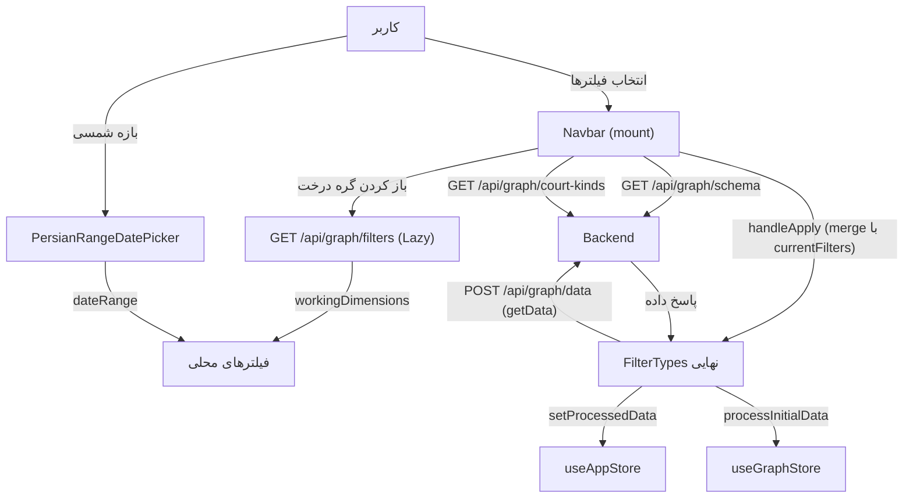

# مستندات فنی: نوار بالای سامانه (Navbar)

| مشخصه | مقدار |
|---|---|
| مسیر منبع | `src/components/Navbar.tsx` |
| دسته | کامپوننت Frontend |
| مستندات مرتبط | [۰۱-Layout & Providers (App Shell)](01-layout-providers-app-shell.md) · [۰۴-Zustand Stores](04-zustand-stores.md) · [۰۵-Fetcher](05-fetcher.md) |

## ۱. هدف (Purpose)

ماژول **Navbar** نوار بالای پنل سامانه «فکر» است و **مرکز فیلتر و بارگذاری گراف** محسوب می‌شود. سه فیلتر اصلی را ارائه می‌دهد:

- **فیلتر زمان**: بازه زمانی با تقویم شمسی (`PersianRangeDatePicker` + moment-jalaali)
- **فیلتر ابعاد**: درخت پویا و Lazy از سطوح ابعاد (LEV1..LEV8) با انتخاب آبشاری (Cascade)
- **فیلتر صلاحیت شعبه**: لیست `COURTKINDSNAME` با جستجوی کلاینتی

پس از اعمال فیلترها، با دکمه «اعمال فیلترها» داده گراف جدید از بک‌اند دریافت (`getData`) و در Stores ثبت می‌شود.

## ۲. Props

| Prop | نوع | توضیح |
|---|---|---|
| `onFilterUpdate` | `(filters: FilterTypes) => void` | تحویل فیلترهای نهایی به App Shell (که `setFilters` را صدا می‌زند) |
| `isLoading` | `boolean` (پیش‌فرض `false`) | حالت لودینگ دکمه اعمال |
| `currentFilters` | `FilterTypes \| null` | فیلترهای فعلی برای بازیابی وضعیت |

## ۳. منبع Props (Props Source)

| منبع | توضیح |
|---|---|
| **App Shell (panel layout)** | `onFilterUpdate={handleFilterSubmit}` (→ `setFilters` Store)، `currentFilters`, `isAnyLoading` |
| **useAppStore** | `setIsLoading`, `setProcessedData` — ثبت داده گراف |
| **useGraphStore** | `processInitialData` — تبدیل یال‌ها به نود/یادها |
| **fetcher (api.graph)** | `getSchema`, `getCourtKinds`, `getDimensions`, `getData` |
| **Constants/Utils** | `moment-jalaali` (تاریخ شمسی)، `parseDate` از `@internationalized/date`، `PersianRangeDatePicker` |

## ۴. استیت داخلی (Internal State)

### فیلتر زمان

| State | توضیح |
|---|---|
| `dateRange` | `{start: DateValue, end: DateValue}` — بازه انتخابی |
| `isTimeFilterOpen` | باز/بسته بودن پاپ‌اور |

### فیلتر ابعاد (درخت)

| State | توضیح |
|---|---|
| `schema` / `schemaLoading` | اسکیما سطوح (getSchema) |
| `scopedDimensionOptions` | `{pathKey: string[]}` — گزینه‌های هر گره درخت (کلید `root` برای سطح اول) |
| `workingDimensions` | انتخاب موقت (قبل از Apply) |
| `selectedDimensions` | انتخاب کامیت‌شده |
| `expandedNodes` | گره‌های باز شده درخت |
| `isDimensionFilterOpen` | باز/بسته بودن پاپ‌اور |

### فیلتر صلاحیت شعبه

| State | توضیح |
|---|---|
| `courtKindsOptions` | لیست کامل صلاحیت‌ها |
| `workingCourtKinds` / `selectedCourtKinds` | انتخاب موقت/نهایی |
| `courtKindsSearch` | متن جستجوی کلاینتی |
| `isCourtKindsFilterOpen` | باز/بسته بودن پاپ‌اور |

## ۵. هوک‌های استفاده‌شده (Hooks Used)

| هوک | کاربرد |
|---|---|
| `useState` | همه استیت‌های بالا |
| `useEffect` ×۵ | ۱) لود schema + courtKinds (با `active` guard)؛ ۲) لود ریشه درخت بعد از schema؛ ۳) بازیابی وضعیت از `currentFilters` (پارچ تاریخ، ابعاد، صلاحیت‌ها)؛ ۴) بازیابی workingDimensions هنگام باز شدن پاپ‌اور ابعاد؛ ۵) بازیابی workingCourtKinds هنگام باز شدن پاپ‌اور |
| `useCallback` | `loadGraph` — دریافت و ثبت داده گراف |

## ۶. فراخوانی‌های API (API Calls)

| اندپوینت | زمان | توضیح |
|---|---|---|
| `GET /api/graph/schema` | mount | سطوح ابعاد + ساخت ساختار خالی |
| `GET /api/graph/court-kinds` | mount | لیست صلاحیت‌ها |
| `GET /api/graph/filters` | بعد از schema + باز کردن هر گره | مقادیر ریشه و Lazy فرزندان (با `lev*` والد در پارامتر) |
| `POST /api/graph/data` | `loadGraph` (اعمال فیلترها) | داده گراف جدید → `setProcessedData` + `processInitialData` |

## ۷. تبدیل داده (Data Transformation)

| تبدیل | شرح |
|---|---|
| **اسکیما → ساختارها** | `schema.levels` → `emptyDimensions` برای working/selected |
| **DateValue → ISO** | `dateRange.start.toString()` در `handleApply` (فیلتر سمت بک‌اند) |
| **ISO → نمایش شمسی** | `moment(...).format("jYYYY/jMM/jDD")` برای Chip و لیبل |
| **مقادیر → رشته امن** | `String(opt)` + فیلتر `trim() !== ""` |
| **انتخاب آبشاری** | `toggleSelectedNode`: تیک → افزودن گره + همه فرزندان (cascade به پایین)؛ برداشتن → حذف گره + فرزندان + والدهای بالایی (cascade به بالا) |
| **Lazy loading درخت** | `toggleNodeExpand`: کلید `path.join("|")`؛ در نبود کش → `getDimensions({lev*: [path]})` → `scopedDimensionOptions[pathKey]` + افزودن فرزندان به انتخاب اگر والد تیک بود |
| **Indeterminate** | `isAnyChildSelected && !isChecked` → `isIndeterminate` چک‌باکس |
| **Badge ها** | تعداد انتخاب‌ها؛ «همه موارد» اگر کل گزینه‌ها انتخاب شده باشند |
| **جستجوی صلاحیت** | `toLowerCase().includes(search)` — فیلتر کلاینتی |
| **ساخت فیلتر نهایی** | `handleApply`: merge با `currentFilters` → `{dateRange, dimensionFilters, courtKinds}` → `onFilterUpdate` + `loadGraph` |

## ۸. خروجی رندر (Render Output)

```
<div h-16 glassmorphism>
  ├─ آیکون لوگو (گرادیان آبی-نیلی)
  ├─ Popover ۱: فیلتر زمان
  │   ├─ دکمه (چپ/راست) + Chip تاریخ شمسی
  │   └─ PersianRangeDatePicker + دکمه انصراف
  ├─ Popover ۲: فیلتر ابعاد
  │   ├─ دکمه + Chip (تعداد/همه موارد)
  │   └─ درخت بازگشتی renderDimensionTree:
  │       Checkbox (isIndeterminate) + دکمه +/− (Lazy)
  │       + دکمه «پاک کردن»
  ├─ Popover ۳: صلاحیت شعبه
  │   ├─ دکمه + Chip
  │   └─ search input + انتخاب همه/پاک کردن + لیست Checkbox (اسکرول)
  └─ Button «اعمال فیلترها»
      (isDisabled بدون بازه یا هنگام schemaLoading؛ isLoading spinner)
```

## ۹. کامپوننت‌های استفاده‌کننده (Components Using It)

| مصرف‌کننده | نحوه استفاده |
|---|---|
| **App Shell (panel layout)** | رندر Navbar با `onFilterUpdate`/`currentFilters`/`isLoading` در ناحیه اصلی |
| **useAppStore / useGraphStore** | پس از `loadGraph` — داده جدید گراف به کل سیستم (Layout و صفحات) |
| **PersianRangeDatePicker** | انتخاب بازه شمسی |
| **Backend GraphData Router** | دریافت `getData` با فیلترهای ارسالی |
| **SideBar/ActivityTreeFilter** | اسکیما/فیلترهای همگام (داده مشترک از Store) |

## ۱۰. نمودار جریان داده (Data Flow Diagram)



## خلاصه

**Navbar** نقطه ورود داده به گراف است: سه فیلتر (زمان شمسی، درخت ابعاد Lazy با Cascade، صلاحیت شعبه با جستجو) → ساخت `FilterTypes` → `POST /api/graph/data` → `setProcessedData` و `processInitialData` → بازسازی کامل گراف. بازیابی وضعیت از `currentFilters` (پارچ تاریخ و انتخاب‌ها) و آبشاری‌سازی انتخاب‌ها از نکات کلیدی آن است.
