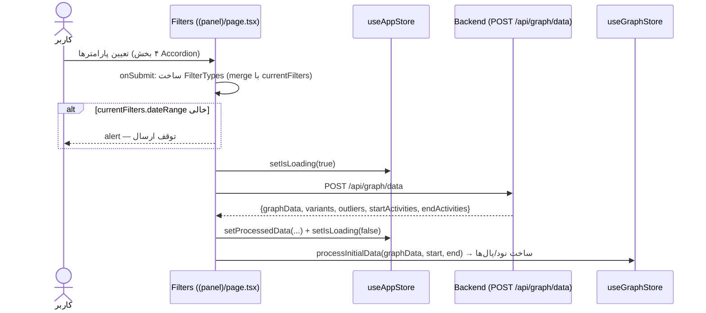

# مستندات فنی: پنل فیلتر و پردازش (Dashboard Filter Form)

| مشخصه | مقدار |
|---|---|
| مسیر منبع | `src/app/(panel)/page.tsx` |
| دسته | صفحه Frontend |
| مستندات مرتبط | [۰۴-Zustand Stores](04-zustand-stores.md) · [۰۵-Fetcher](05-fetcher.md) · [۱۰-Activity Tree Filter](10-activity-tree-filter.md) |

## ۱. هدف (Purpose)

ماژول **Filters** (صفحه اصلی پنل، `src/app/(panel)/page.tsx`) فرم مرکزی **فیلتر و پردازش** سامانه «فکر» است. کاربر در این فرم پارامترهای پردازش گراف را تعیین می‌کند:

| بخش فرم | توضیح |
|---|---|
| **تعداد پرونده‌ها** | بازه حداقل/حداکثر حجم پرونده (min/max case count) |
| **زمان رسیدگی** | بازه میانگین زمان فرآیند (حداقل/حداکثر) + **معیار وزن** (تعداد پرونده/میانگین زمان) + **واحد نمایش** (ثانیه تا هفته) |
| **حساسیت داده‌های پرت** | درصد آستانه ناهنجاری (Slider ۰ تا ۱۰٪) |
| **ساختار درختی فرآیندها** | فیلتر درختی کلاینت‌ساید نودها (`ActivityTreeFilter`) |

با دکمه «پردازش و نمایش گراف»، فیلترها به بک‌اند ارسال (`POST /api/graph/data`) و داده دریافتی در Stores ثبت می‌شود.

## ۲. Props

| Prop | نوع | توضیح |
|---|---|---|
| — | — | این کامپوننت **props ندارد**؛ صفحه (Page) مسیر `(panel)/` است و از Stores و fetcher مستقیماً استفاده می‌کند |

(کامپوننت با `memo(Filters)` صادر می‌شود.)

## ۳. منبع Props (Props Source)

| منبع | توضیح |
|---|---|
| **useAppStore** | `filters` (همگام‌سازی فرم)، `setFilters`، `setProcessedData`، `setIsLoading`، `isLoading` |
| **useGraphStore** | `processInitialData` — تبدیل یال‌ها به نود/یال گراف |
| **fetcher (api.graph)** | `getData` — دریافت گراف پردازش‌شده |
| **کامپوننت‌ها** | `TimeFilterSection` (ورودی حداقل/حداکثر زمان)، `ActivityTreeFilter` (درخت فعالیت‌ها) |
| **HeroUI** | Form, Accordion, NumberInput, Select, Slider, Divider, Button |

## ۴. استیت داخلی (Internal State)

| State | نوع | پیش‌فرض | توضیح |
|---|---|---|---|
| `caseIdRange` | `{min?: number; max?: number}` | `{}` | بازه تعداد پرونده‌ها |
| `meanTimeRange` | `{min: number\|null; max: number\|null}` | `{min: null, max: null}` | بازه میانگین زمان |
| `weightFilter` | `WeightFilter` (`"cases"\|"mean_time"`) | `"mean_time"` | معیار وزن گراف |
| `timeUnitFilter` | `TimeUnit` (`"s"\|"m"\|"h"\|"d"\|"w"`) | `"d"` | واحد نمایش زمان |
| `outlierPercentage` | `number \| number[]` | `5` | درصد داده‌های پرت |

## ۵. هوک‌های استفاده‌شده (Hooks Used)

| هوک | کاربرد |
|---|---|
| `useState` ×۵ | استیت‌های جدول بالا |
| `useCallback` ×۳ | `setMinTime` / `setMaxTime` (به‌روزرسانی بازه‌ای بدون رفرش جدید رفرنس — جلوگیری از لوپ useEffect در TimeFilterSection) و `onSubmit` (هندلر ارسال فرم) |
| `useEffect` | همگام‌سازی فرم از `currentFilters` هر بار که فیلترها در Store تغییر می‌کنند (بازیابی مقادیر min/max/weight/unit/outlier) |

## ۶. فراخوانی‌های API (API Calls)

| اندپوینت | زمان | توضیح |
|---|---|---|
| `POST /api/graph/data` | `onSubmit` (کلیک «پردازش و نمایش گراف») | ارسال `FilterTypes` → دریافت `{graphData, variants, outliers, startActivities, endActivities}` |

**پیش‌شرط**: اگر `currentFilters.dateRange` خالی باشد، `alert` نمایش داده شده و ارسال متوقف می‌شود.

## ۷. تبدیل داده (Data Transformation)

| تبدیل | شرح |
|---|---|
| **همگام‌سازی ورودی** | `currentFilters` → state فرم (عدد `null` → `undefined` برای NumberInput) |
| **ساخت FilterTypes** | در `onSubmit`: merge با فیلترهای سراسری — `dateRange`، `dimensionFilters` و `courtKinds` از `currentFilters`؛ `unitId` از آن کپی می‌شود |
| **نرمال‌سازی outlier** | آرایه `number[]` (خروجی Slider) → تک‌عدد `outlierPercentage[0]`؛ مقادیر خالی → `null` |
| **ثبت خروجی** | `setProcessedData({graphData, variants, outliers, startActivities, endActivities})` + `processInitialData(graphData, start, end)` → ساخت نود/یال‌ها |
| **مدیریت خطا/لودینگ** | `setIsLoading(true)` قبل از fetch؛ `console.error` در catch؛ `setIsLoading(false)` در finally |

## ۸. خروجی رندر (Render Output)

```
<Form h-full flex-col justify-between dir=rtl>
  ├─ Accordion (splitted, caseCountFilter باز)
  │   ├─ ۱. تعداد پروندهها (آیکون Hash، کهربایی)
  │   │   └─ ۲× NumberInput (حداقل ۰ / حداکثر ∞)
  │   ├─ ۲. زمان رسیدگی (آیکون Clock، بنفش)
  │   │   ├─ TimeFilterSection «حداقل زمان» + TimeFilterSection «حداکثر زمان»
  │   │   ├─ Divider
  │   │   ├─ Select «معیار وزن» (تعداد پروندهها / میانگین زمان طی شده)
  │   │   └─ [فقط در mean_time] Select «واحد نمایش» (ثانیه…هفته)
  │   ├─ ۳. حساسیت دادههای پرت (آیکون Activity، رز)
  │   │   └─ Slider ۰–۱۰٪ + نمایش درصد + راهنمای متن
  │   └─ ۴. ساختار درختی فرآیندها (آیکون Network، زمردی)
  │       └─ ActivityTreeFilter (فیلتر کلاینتساید نودها)
  └─ Button «پردازش و نمایش گراف» (fullWidth, isLoading spinner)
```

استایل: کارت‌های `bg-white/40 backdrop-blur-md` با گرادیان‌های رنگی هر بخش.

## ۹. کامپوننت‌های استفاده‌کننده (Components Using It)

| مصرف‌کننده | نحوه استفاده |
|---|---|
| **App Shell (panel layout)** | رندر صفحه در ناحیه سایدبار |
| **useAppStore / useGraphStore** | پس از submit — داده جدید گراف به کل سیستم (Layout، Navbar، صفحات) |
| **TimeFilterSection** | ورودی زمان حداقل/حداکثر (با `setTime` پایدار) |
| **ActivityTreeFilter** | فیلتر درختی کلاینت‌ساید نودهای گراف |
| **Backend GraphData Router** | دریافت `getData` با فیلترهای کامل |

## ۱۰. نمودار جریان داده (Data Flow Diagram)



## خلاصه

**Filters** فرم پردازش گراف است: چهار بخش Accordion (حجم پرونده، زمان/وزن/واحد، آستانه ناهنجاری، درخت فعالیت) → ساخت `FilterTypes` با merge از فیلترهای سراسری → `POST /api/graph/data` → `setProcessedData` + `processInitialData`. نکات کلیدی: همگام‌سازی دوطرفه با `currentFilters`، نرمال‌سازی خروجی Slider، و تابع‌های `useCallback` پایدار برای جلوگیری از لوپ `useEffect` در `TimeFilterSection`.
