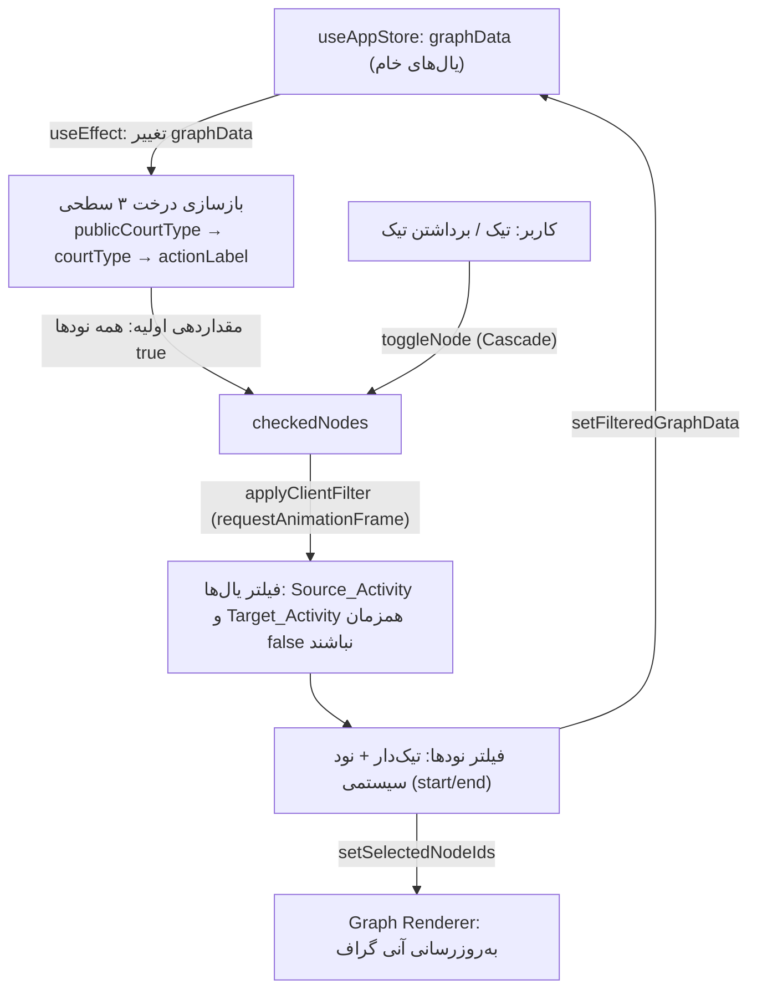

# مستندات فنی: فیلتر درختی فعالیت‌ها (Activity Tree Filter)

| مشخصه | مقدار |
|---|---|
| مسیر منبع | `src/components/ActivityTreeFilter.tsx` |
| دسته | کامپوننت Frontend |
| مستندات مرتبط | [۰۴-Zustand Stores](04-zustand-stores.md) · [۰۶-Graph Renderer](06-graph-renderer.md) · [۰۹-Dashboard Filter Form](09-dashboard-filter-form.md) |

## ۱. هدف (Purpose)

ماژول **ActivityTreeFilter** فیلتر درختی **کلاینت‌ساید و بلادرنگ** نودهای گراف است (در پنل فیلتر و پردازش). یک درخت سلسله‌مراتبی ۳ سطحی را به‌صورت داینامیک مستقیماً از داده گراف می‌سازد:

| سطح | محتوا |
|---|---|
| **سطح ۱** | نوع عمومی شعبه (`PublicCourtType`) |
| **سطح ۲** | نوع شعبه تخصصی (`CourtType`) |
| **سطح ۳ (برگ)** | فعالیت فرآیند (`Source_Activity`) |

با هر تیک/برداشتن تیک، هم یال‌ها و هم نودهای فعال فیلتر می‌شوند و نتیجه آنی (با `requestAnimationFrame`) در Store سراسری ثبت می‌شود.

## ۲. Props

| Prop | نوع | توضیح |
|---|---|---|
| — | — | این کامپوننت **props ندارد**؛ داده را با `graphData` و `setFilteredGraphData` از `useAppStore` دریافت/ثبت می‌کند |

(کامپوننت با `memo(ActivityTreeFilter)` صادر می‌شود.)

## ۳. منبع Props (Props Source)

| منبع | توضیح |
|---|---|
| **useAppStore** | `graphData` (یال‌های خام)، `setFilteredGraphData` (یال‌های فیلترشده)، `setSelectedNodeIds` (نودهای فعال) |
| **HeroUI** | Checkbox, Button |
| **lucide-react** | آیکون‌های Plus, Minus, Filter |

## ۴. استیت داخلی (Internal State)

| State | نوع | توضیح |
|---|---|---|
| `treeData` | `TreeNode[]` | ریشه‌های درخت ساخته‌شده از گراف |
| `checkedNodes` | `Record<string, boolean>` | وضعیت تیک هر نود (کلید = id نود) |
| `expandedNodes` | `Record<string, boolean>` | نودهای باز/بسته درخت |

ساختار `TreeNode`: `{ id, label, children? }` — درخت سه سطحی با `children` بازگشتی.

## ۵. هوک‌های استفاده‌شده (Hooks Used)

| هوک | کاربرد |
|---|---|
| `useState` ×۳ | استیت‌های جدول بالا |
| `useEffect` | بازسازی درخت + مقداردهی اولیه تیک‌ها هنگام تغییر `graphData` |
| `useCallback` ×۲ | `applyClientFilter` (اعمال فیلتر آنی) و `toggleNode` (Cascade) |

**نکته کلیدی**: `toggleNode` داخل `setCheckedNodes` مقدار جدید را می‌سازد و سپس `applyClientFilter(nextChecked)` را در همان لحظه صدا می‌زند تا رندر گراف بلادرنگ باشد.

## ۶. فراخوانی‌های API (API Calls)

| اندپوینت | زمان | توضیح |
|---|---|---|
| — | — | **هیچ فراخوانی API مستقیمی ندارد**؛ کاملاً کلاینت‌ساید است و از `graphData` موجود در Store استفاده می‌کند |

## ۷. تبدیل داده (Data Transformation)

| تبدیل | شرح |
|---|---|
| **ساخت درخت ۳ سطحی** | برای هر یال: `publicCourtType` (سطح ۱) → `courtType` (سطح ۲) → `actionLabel` (قبل از « در ») |
| **استخراج Fail-safe نوع شعبه** | سلسله‌مراتب: `Source_PublicCourtType` → `source_publiccourttype` → `PUBLICCOURTTYPENAME` → `publiccourttypename` (به‌همین ترتیب برای `CourtType`) |
| **Fallback هوشمند** | اگر متادیتا خالی یا «سایر مراجع عمومی/سایر شعب تخصصی» بود و نام فعالیت شامل « در » بود: نوع شعبه = بخش دوم نام، و نوع عمومی با کلمات کلیدی (اجرای احکام / تجدیدنظر / دادگاه‌های عمومی و تخصصی) |
| **کلیدهای درخت** | سطح ۲: `publicCourtType\|courtType`؛ سطح ۳: خود `srcActivity` (برچسب برگ = قبل از « در ») |
| **مقداردهی اولیه** | همه نودها `true` → `applyClientFilter(initialChecked)` برای اعمال وضعیت اول |
| **فیلتر یال‌ها** | نگه‌داشتن یال وقتی `Source_Activity` و `Target_Activity` هر دو `false` نباشند |
| **فیلتر نودها** | نود فعال = تیک‌دار + نود سیستمی (نام شامل `start`/`end` — به حروف کوچک و بدون وابستگی به case) |
| **Cascade** | `cascadeDown`: تیک/برداشتن یک نود → اعمال به کل زیردرخت به‌صورت بازگشتی |
| **اعمال بلادرنگ** | `requestAnimationFrame` → `setFilteredGraphData(filteredEdges)` + `useAppStore.getState().setSelectedNodeIds(activeNodeIds)` |

## ۸. خروجی رندر (Render Output)

```
<div bg-slate-50/50 backdrop-blur-md rounded-2xl>
  ├─ سرفصل «فیلتر درختی فرآیندها (مبتنی بر داده)» با آیکون Filter
  └─ <div max-h-64 overflow-y-auto>
      └─ renderTree(treeData) — بازگشتی برای هر نود:
         ├─ کارت: Checkbox (isSelected, color primary) + label (truncate max-w-200px)
         ├─ [دارای فرزند] Button آیکونی +/− برای باز/بسته کردن
         └─ اگر باز: فرزندان با indentation (pr-3 + border-r)
      └─ placeholder: «در حال ساخت ساختار سلسله‌مراتبی...» (اگر درخت خالی)
</div>
```

کارت‌ها با استایل `bg-white/40 backdrop-blur-md border-white/60`، و ناحیه درخت با اسکرول عمودی (`max-h-64`) رندر می‌شوند.

## ۹. کامپوننت‌های استفاده‌کننده (Components Using It)

| مصرف‌کننده | نحوه استفاده |
|---|---|
| **Filters (پنل فیلتر و پردازش، ۹)** | داخل AccordionItem «ساختار درختی فرآیندها» رندر می‌شود |
| **useAppStore** | خروجی فیلتر در `filteredGraphData` و `selectedNodeIds` ثبت می‌شود |
| **Graph Renderer (GraphDAG/Graph)** | گراف بر اساس نودهای منتخب و یال‌های فیلترشده به‌روز می‌شود |

## ۱۰. نمودار جریان داده (Data Flow Diagram)



## خلاصه

**ActivityTreeFilter** فیلتر بلادرنگ و کاملاً کلاینت‌ساید نودهای گراف است؛ درخت سه سطحی داینامیک از خود `graphData` ساخته می‌شود و با هر تیک، فیلتر آنی روی یال‌ها و نودها (با حفاظت نودهای START/END) در `useAppStore` ثبت و گراف به‌روز می‌شود. نکات کلیدی: Cascade انتخاب، Fail-safe در استخراج نوع شعبه، و فیلتر بلادرنگ با `requestAnimationFrame`.
