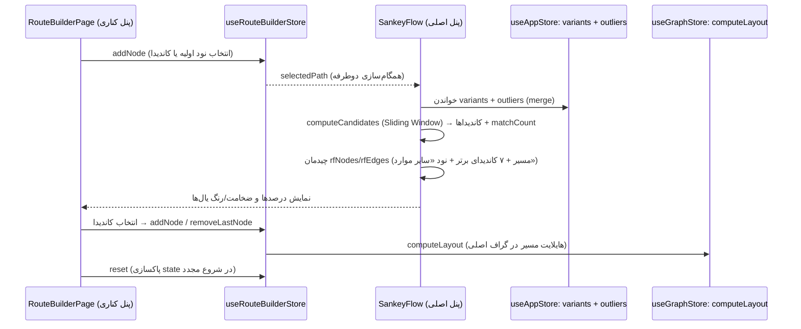

# مستندات فنی: جریان‌ساز هوشمند (Route Builder / Sankey)

| مشخصه | مقدار |
|---|---|
| مسیر منبع | `src/components/SankeyFlow.tsx`، `src/app/(panel)/route-builder/page.tsx` |
| دسته | صفحه Frontend |
| مستندات مرتبط | [۰۴-Zustand Stores](04-zustand-stores.md) · [۰۶-Graph Renderer](06-graph-renderer.md) · [۱۲-Pathfinder](12-pathfinder.md) |

## ۱. هدف (Purpose)

ماژول **Route Builder** (جریان‌ساز هوشمند) ساخت گام‌به‌گام مسیر (Path) در فرآیندها را فراهم می‌کند. از دو بخش هماهنگ تشکیل شده است:

- **SankeyFlow** (`src/components/SankeyFlow.tsx`): پنل اصلی — نمایش DAG تعاملی با چیدمان درختی قطعی (جایگزین d3-sankey قدیمی). مسیر انتخاب‌شده به‌صورت ردیفی افقی و **کاندیداهای بعدی** به‌صورت ستونی عمودی با درصد و ضخامت یال نمایش داده می‌شوند.
- **RouteBuilderPage** (`src/app/(panel)/route-builder/page.tsx`): پنل کناری — Stepper مسیر در حال ساخت، لیست قابل جستجوی کاندیداها، و تب «مسیرهای یافت‌شده» (PathList) با قابلیت مرتب‌سازی.

هر دو از **`useRouteBuilderStore`** استفاده می‌کنند (همگام‌سازی کامل بین پنل و گراف).

## ۲. Props

### SankeyFlow

| Prop | نوع | توضیح |
|---|---|---|
| `allVariants` | `Variant[]` | همه واریانت‌های فرآیند (اساس محاسبه کاندیداها) |
| `allNodes` | `GraphNode[]` | همه نودهای گراف (تبدیل id به label) |

### RouteBuilderPage

| Prop | نوع | توضیح |
|---|---|---|
| — | — | **props ندارد**؛ صفحه مسیر `(panel)/route-builder` |

## ۳. منبع Props (Props Source)

| منبع | توضیح |
|---|---|
| **useRouteBuilderStore** | `selectedPath`, `addNode`, `removeLastNode`, `reset` — قلب همگام‌سازی |
| **useAppStore** | `variants`, `outliers`, `isLoading`, `selectedNodeIds`, `startEndNodes`, `selectedColorPalette`, `setSelectedPathNodes/Edges`, `setSelectedPathIndex` |
| **useGraphStore** | `allNodes`, `setFoundPaths`, `setActivePath`, `computeLayout` |
| **useGraphData hook** | `graphData` (فیلترشده با احترام به ActivityTreeFilter) |
| **PathList** | رندر مسیرهای یافت‌شده در تب Results |
| **@xyflow/react** | ReactFlow, ReactFlowProvider, getSmoothStepPath, EdgeLabelRenderer, Handle, Position |

## ۴. استیت داخلی (Internal State)

### SankeyFlow

| State | توضیح |
|---|---|
| `rfNodes` / `rfEdges` | نودها/یال‌های ساخته‌شده برای ReactFlow (از `selectedPath` + `candidates`) |
| `candidates` / `matchCount` | خروجی `computeCandidates` (مشتق با `useMemo`) |

### RouteBuilderPage

| State | نوع | توضیح |
|---|---|---|
| `activeTab` | `"Build" \| "Results"` | تب فعال (ساخت مسیر / نتایج) |
| `searchValue` | `string` | متن جستجو در لیست نودها/کاندیداها |
| `searchedNodes` | `Node[]` | نودهای فیلترشده اولیه |
| `selectedPathIndex` | `number \| null` | مسیر انتخاب‌شده در نتایج |
| `isSorted` / `isSorting` | `boolean` | وضعیت مرتب‌سازی زمانی |
| `processedPaths` / `sortedPaths` | `ExtendedPath[]` | مسیرهای ساخته‌شده / مرتب‌شده |

## ۵. هوک‌های استفاده‌شده (Hooks Used)

| هوک | کاربرد |
|---|---|
| `useMemo` | `computeCandidates`، `rfNodes/rfEdges` (Layout)، `matchingVariants/candidates`، `baseNodes`، `allVariants` (merge واریانت‌ها + outlierها)، `enrichedCandidates` |
| `useCallback` | `getLabel`، هندلرهای select/remove/reset/sort/selectPath/removePath |
| `useEffect` | فوکوس دوربین روی آخرین نود؛ بازسازی `processedPaths` هنگام تغییر مسیر؛ جستجوی `searchedNodes`؛ پاکسازی در unmount |
| `useReactFlow` | `fitView`, `setCenter` (زوم هوشمند با `zoom: 0.9`) |

## ۶. فراخوانی‌های API (API Calls)

| اندپوینت | زمان | توضیح |
|---|---|---|
| — | — | **هیچ فراخوانی API مستقیمی ندارد**؛ کاملاً بر اساس `variants`/`outliers`/`allNodes` موجود در Stores کار می‌کند |

## ۷. تبدیل داده (Data Transformation)

| تبدیل | شرح |
|---|---|
| **merge واریانت‌ها** | `[...(variants ?? []), ...(outliers ?? [])]` — outlierها به‌عنوان مسیر هم در نظر گرفته می‌شوند |
| **computeCandidates (Sliding Window)** | برای هر واریانت، توالی `selectedPath` در همه ایندکس‌ها جستجو می‌شود؛ نود بعدی (منحصربه‌فرد در هر واریانت با Set) شمارش می‌شود؛ خروجی: کاندیداها (مرتب نزولی) + تعداد واریانت‌های منطبق (`matchCount`) |
| **چیدمان مسیر (Layout)** | نود i ام مسیر در `x = i * 500`، ردیف `y = 0`؛ نوع نودها: اول `start`، آخر `current`، میانی `selected`؛ یال‌ها SmoothStep با `isCandidate: false` |
| **چیدمان کاندیداها** | ۷ کاندیدای برتر (`MAX_VISIBLE`) در `x = len * 500` با `y` متقارن (`startY = -((n-1) * 150) / 2`)؛ کاندیدای برتر معیار `maxCount` برای استایل‌دهی |
| **نود «سایر موارد»** | اگر >۷ کاندیدا: نود `cand-more-hidden` با جمع `hiddenSum` و برچسب `+ N نود دیگر` (خاکستری، `isMore: true`) |
| **درصدها** | لیبل: `count / matchCount * 100`؛ استایل یال: `relative% = count / maxCount * 100` → ضخامت ۲–۱۴px، شفافیت ۰.۳۵–۱، رنگ (نارنجی ≥۷۵٪ / کهربایی ≥۳۵٪ / زرد) |
| **buildExtendedPaths** | برای هر واریانت منطبق: یافتن ایندکس مسیر، `isAbsolute` (شروع=۰ و پایان=آخر)، جمع `selectedPortionDur` از `Avg_Timings`، تیمینگ‌های تک‌یال (`eid = a->b`) در `_specificEdgeDurations`، مرتب‌سازی فرکانسی |
| **برجسته‌سازی گراف** | `computeLayout({filteredNodeIds, filteredEdgeIds, activePathInfo: {nodes, edges, edgeDurations, edgeTotalDurations, frequency}, ...})` — هایلایت مسیر در گراف اصلی |
| **نرمال‌سازی جستجو** | جایگزینی «ی» با «ي» (حروف همشکل) قبل از فیلتر |

## ۸. خروجی رندر (Render Output)

### SankeyFlow (پنل اصلی)

```
<div bg-slate-50 dir=ltr>
  ├─ ReactFlow (fitView, zoom 0.1–1.5, nodesDraggable=false)
  │   ├─ نودها: مسیر (start=کهربایی تیک / current=نارنجی pulse+شماره گام / selected)
  │   │          کاندیداها (چهارچوب خط‌چین کهربایی + ٪ و تعداد مسیر)
  │   │          «+ N نود دیگر» (خاکستری خط‌چین، آیکون MoreHorizontal)
  │   ├─ یال‌ها: stepEdge — حلقه + خط اصلی (ضخامت/رنگ/شفافیت نسبی)
  │   │          لیبل ٪ در EdgeLabelRenderer (همه کاندیداها)
  │   └─ Background Dots + Controls
  ├─ Top bar (RTL): «مسیرساز هوشمند» + N نود + M مسیر باقیمانده
  │   + دکمههای «بازگشت یک مرحله» / «شروع مجدد»
  ├─ Empty state: «نقطه شروع مسیر را انتخاب کنید» + گرید نودهای اولیه (کلیک → addNode)
  └─ Terminal hint: «پایان مسیر» (bounce سبز) وقتی candidates خالی است
```

### RouteBuilderPage (پنل کناری)

```
<div dir=rtl>
  ├─ Path Stepper (گرادیان کهربایی): شماره گامها + لیبل، «…» + N گزینه بعدی / پایان مسیر
  │   + آمار «N نود» و «X مسیر منطبق از Y»
  ├─ Tabs: «ساخت مسیر» / «مسیرهای یافتشده (count)»
  ├─ Build tab: Input جستجو + ScrollShadow
  │   ├─ [مسیر خالی] لیست نودهای اولیه (searchedNodes)
  │   └─ [مسیر فعال] لیست enrichedCandidates (Chip: N مسیر) / «پایان مسیر»
  ├─ Results tab: PathList (sortedPaths/processedPaths) + دکمه «مرتبسازی زمانی»
  └─ Footer: Button «شروع مجدد» (danger)
```

## ۹. کامپوننت‌های استفاده‌کننده (Components Using It)

| مصرف‌کننده | نحوه استفاده |
|---|---|
| **PathList (۲۷)** | رندر مسیرهای ExtendedPath در تب Results (گروه‌بندی غیرفعال، بدون دکمه گراف) |
| **useRouteBuilderStore** | اشتراک وضعیت مسیر بین پنل و گراف |
| **useAppStore / useGraphStore** | `computeLayout` برای هایلایت مسیر انتخابی در گراف اصلی؛ پاکسازی state در reset/unmount |
| **Backend GraphData Router** | غیرمستقیم — واریانت‌ها از داده گراف دریافتی پس از فیلتر |

## ۱۰. نمودار جریان داده (Data Flow Diagram)



## خلاصه

**Route Builder** ابزار گام‌به‌گام ساخت مسیر است: الگوریتم **Sliding Window** (`computeCandidates`) نودهای بعدی ممکن را از همه واریانت‌ها (با احتساب outlierها) شمارش می‌کند؛ پنل اصلی DAG با ۷ کاندیدای برتر + نود تجمیعی «سایر» و استایل‌دهی نسبی یال‌ها (ضخامت/رنگ/درصد) رندر می‌کند؛ پنل کناری Stepper، جستجو و نتایج `ExtendedPath` (با `selectedPortionDur` و تیمینگ‌های تک‌یال) را ارائه می‌دهد و `computeLayout` مسیر را در گراف اصلی هایلایت می‌کند. نکات کلیدی: همگام‌سازی دوطرفه با Store، زوم هوشمند دوربین، و پاکسازی کامل state در شروع مجدد.
