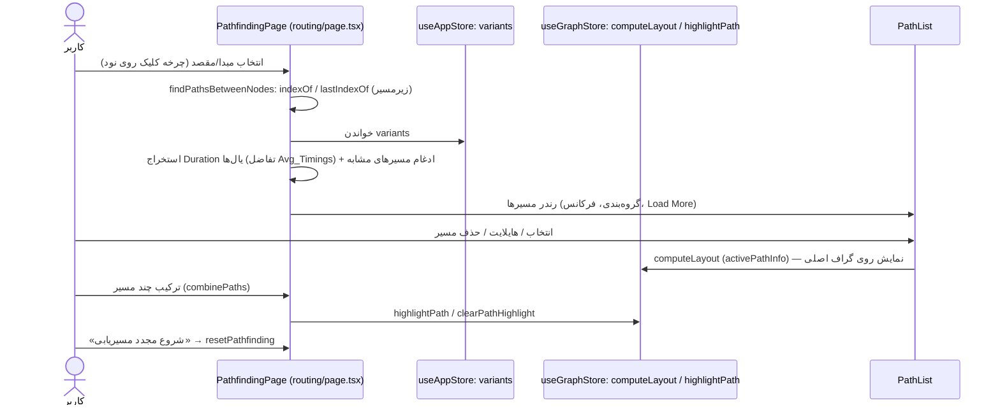

# مستندات فنی: مسیریابی (Pathfinder)

| مشخصه | مقدار |
|---|---|
| مسیر منبع | `src/app/(panel)/routing/page.tsx`، `src/components/sideBarCards/PathList.tsx` |
| دسته | صفحه Frontend |
| مستندات مرتبط | [۰۴-Zustand Stores](04-zustand-stores.md) · [۰۶-Graph Renderer](06-graph-renderer.md) · [۱۱-Route Builder](11-route-builder-sankey.md) |

## ۱. هدف (Purpose)

ماژول **Pathfinder** یافتن مسیر بین دو نود (مبدا/مقصد) را از بین واریانت‌ها فراهم می‌کند. از دو بخش تشکیل شده است:

- **PathfindingPage** (`src/app/(panel)/routing/page.tsx`): صفحه مسیریابی — انتخاب مبدا/مقصد (از لیست نودها یا کلیک روی گراف)، استخراج و ادغام مسیرها از `variants`، محاسبه Duration و هایلایت/ترکیب مسیرهای انتخاب‌شده روی گراف اصلی.
- **PathList** (`src/components/sideBarCards/PathList.tsx`): کامپوننت مشترک لیست مسیرها — تایم‌لاین گام‌به‌گام نودها، گروه‌بندی (کامل/نسبی/سایر)، فرکانس، دکمه‌های مشاهده روی گراف/هایلایت/حذف و Load More.

## ۲. Props

### PathfindingPage

| Prop | نوع | توضیح |
|---|---|---|
| — | — | **props ندارد**؛ صفحه مسیر `(panel)/routing` — همه state از Zustand Stores |

### PathList

| Prop | نوع | پیش‌فرض | توضیح |
|---|---|---|---|
| `paths` | `Path[]` | — | لیست مسیرها |
| `allNodes` | `Node[]` | — | تبدیل id به label |
| `selectedIndex` | `number \| null` | `null` | مسیر انتخاب‌شده (حالت تکی) |
| `selectedIndices` | `number[]` | — | مسیرهای انتخاب‌شده (حالت چندتایی) |
| `onSelectPath` | `(path, index) => void` | — | مشاهده روی گراف |
| `onRemovePath` | `(index) => void` | — | حذف مسیر |
| `onHighlightPath` | `(index) => void` | — | هایلایت (فقط با چند انتخاب) |
| `highlightedPathIndex` | `number \| null` | `null` | مسیر هایلایت‌شده |
| `groupByType` | `boolean` | `false` | گروه‌بندی کامل/نسبی/سایر |
| `showGraphButton` | `boolean` | `true` | نمایش دکمه «مشاهده روی گراف» |
| `emptyMessage` | `string` | «هیچ مسیری یافت نشد.» | پیام خالی |

## ۳. منبع Props (Props Source)

| منبع | توضیح |
|---|---|
| **useAppStore** | `variants`, `isLoading`, `selectedNodeIds`, `startEndNodes`, `selectedColorPalette`, `setSelectedPathNodes/Edges`, `setSelectedPathIndex` |
| **useGraphStore** | `allNodes`, `pathStartNodeId`, `pathEndNodeId`, `foundPaths`, `setPathStartNodeId/EndNodeId`, `setFoundPaths`, `setActivePath`, `computeLayout`, `highlightPath`, `clearPathHighlight` |
| **useGraphData hook** | `graphData` (فیلترشده) — برای بازسازی Layout |
| **HeroUI** | Button, Input, Chip, ScrollShadow, Accordion, Tooltip |
| **lucide-react** | Search, Network, MapPin, Timer, PlayCircle, StopCircle, Eye, X, ... |

## ۴. استیت داخلی (Internal State)

### PathfindingPage

| State | نوع | توضیح |
|---|---|---|
| `processedPaths` / `sortedPaths` | `Path[]` | مسیرهای پردازش‌شده / مرتب‌شده زمانی |
| `isSorted` / `isSorting` | `boolean` | وضعیت مرتب‌سازی |
| `isSearching` | `boolean` | لودینگ جستجوی مسیر |
| `searchedNodes` | `Node[]` | نتیجه جستجوی نودها |
| `activeTab` | `"Nodes" \| "Paths"` | تب فعال |
| `searchValue` | `string` | متن جستجو |
| `selectedPathIndices` | `number[]` | مسیرهای انتخاب‌شده (چندتایی) |
| `highlightedPathIndex` | `number \| null` | مسیر هایلایت‌شده |

### PathList

| State | نوع | توضیح |
|---|---|---|
| `itemsToShow` | `Record<string, number>` | تعداد نمایشی هر گروه (`absolute/relative/others/all` — شروع از ۲۰، Load More +۵۰) |

## ۵. هوک‌های استفاده‌شده (Hooks Used)

| هوک | کاربرد |
|---|---|
| `useCallback` | `findPathsBetweenNodes` (موتور جستجو)، `handleNodeClick` (چرخه انتخاب مبدا/مقصد)، `handleSortPaths`، `handleSearchChange`، `combinePaths`، `handleSelectPath`، `resetPathfinding`، `handleHighlightPath`، `removePath` |
| `useEffect` ×۴ | ۱) جستجوی خودکار مسیرها (با `setTimeout` 10ms برای عدم بلاک UI) + سوییچ خودکار به تب Paths؛ ۲) ریست هایلایت با تغییر انتخاب؛ ۳) پاکسازی unmount (ریست گراف + بازسازی Layout با فیلترها)؛ ۴) مقداردهی `searchedNodes` |
| `useMemo` | `baseNodes`، `paths` (foundPaths) |
| `useState` | استیت‌های بالا |

## ۶. فراخوانی‌های API (API Calls)

| اندپوینت | زمان | توضیح |
|---|---|---|
| — | — | **هیچ فراخوانی API مستقیمی ندارد**؛ مسیرها از `variants` داخل Store استخراج می‌شوند (داده پس از فیلتر گراف لود شده) |

## ۷. تبدیل داده (Data Transformation)

| تبدیل | شرح |
|---|---|
| **استخراج زیرمسیر** | `variantPath.indexOf(startId)` (اولین رخداد؛ `START_NODE` → ۰) و `lastIndexOf(endId)` (آخرین رخداد برای مدیریت لیبل‌های تکراری؛ `END_NODE` → انتها)؛ شرط `endIndex > startIndex` |
| **انواع مسیر** | `absolute`: شروع=ایندکس ۰ و پایان=آخرین ایندکس واریانت؛ در غیر این صورت `relative` |
| **Duration یال‌ها** | `Avg_Timings` تجمعی → تفاضل `[i+1] - [i]` (با `Math.max(0, …)`)؛ نگهداری `Min/Max/Median/Std_Timings` به تفکیک یال (`a->b`) |
| **ادغام مسیرهای مشابه** | کلید = `nodes.join("->")`؛ تجمیع فرکانس، `weightedTotalDuration += total * freq`، و یال‌های وزنی؛ نهایی: `avg = weighted / totalFrequency`، مرتب‌سازی فرکانسی نزولی |
| **combinePaths** | ادغام چند مسیر انتخابی: `Set` نودها/یال‌ها، `edgeCounts` (از `_specificEdgeCounts`)، `edgeTotalDurations` (یا `dur * count`)، `min/max` به‌ترتیب با `Math.min/Math.max`، `median/std` میانگین وزنی؛ `totalDuration = Σ میانگین یال‌ها` |
| **بازسازی گراف** | `computeLayout({filteredNodeIds, filteredEdgeIds, activePathInfo: {nodes, edges, edgeDurations, edgeTotalDurations, edgeCounts, edgeMin/Max/Median/StdDurations, frequency}})`;
| **هایلایت** | `highlightPath(nodes, edges, path)` / `clearPathHighlight()` — هایلایت تک‌مسیره هنگام چند انتخاب |
| **نرمال‌سازی جستجو** | `toLowerCase().replace('ی', 'ي')` — یکسان‌سازی ی/ي |
| **چرخه انتخاب نود** | بدون مبدا → مبدا؛ مبدا بدون مقصد (و نا مساوی) → مقصد؛ کلیک روی مبدا → ریست کامل؛ کلیک روی مقصد → فقط مقصد؛ نود جدید → مبدا جدید |
| **بازگشت به حالت اولیه** | `resetPathfinding` / cleanup: پاک‌سازی همه state ها + `computeLayout` با فیلترهای اصلی (`filteredEdgeIds: null`) |

## ۸. خروجی رندر (Render Output)

### PathfindingPage

```
<div h-full dir=rtl>
  ├─ Visualizer مبدا → مقصد (فلش عمودی + کارتهای emerald/rose)
  ├─ Tabs: «انتخاب نودها» / «لیست مسیرها (count)» (غیرفعال بدون مبدا/مقصد)
  ├─ Tab Nodes: Input جستجو + ScrollShadow لیست نودها
  │   (Chip شروع/پایان؛ hover «انتخاب»)
  ├─ Tab Paths: نوار مرتبسازی («مرتب شده فرکانسی/زمانی» + دکمه «مرتبسازی زمانی»)
  │   + PathList (groupByType، چند انتخابی، هایلایت) + overlays لودینگ
  │   + empty state «مسیر مستقیمی یافت نشد»
  └─ Footer: Button «شروع مجدد مسیریابی» (danger)
```

### PathList

```
<div w-full>
  ├─ [groupByType] Accordion گروهها:
  │   ├─ مسیرهای کامل (emerald) | مسیرهای نسبی (amber) | سایر مسیرها (slate)
  └─ [هر گروه] AccordionItem مسیر N
      ├─ title: dot وضعیت + «مسیر N» + Chip «X از Y پرونده» (fa-IR)
      ├─ subtitle: مدت کل (formatDuration: ثانیه/دقیقه/ساعت/روز)
      ├─ startContent: دکمههای هایلایت (Eye، فقط چندانتخابی) /
      │   مشاهده روی گراف (Monitor/Activity) / حذف (X)
      └─ content: PathNodesList (memo)
          ├─ Timeline عمودی (دایرههای شمارهگذاری: شروع emerald / پایان rose /
          │   درون مسیر blue / خارج مسیر slate + grayscale)
          └─ Chip زمان هر گام (تقدم `_specificEdgeDurations` ← `_variantTimings` تفاضلی)
  └─ Button «نمایش N مورد بیشتر» (Load More +50)
```

## ۹. کامپوننت‌های استفاده‌کننده (Components Using It)

| مصرف‌کننده | نحوه استفاده |
|---|---|
| **PathList** | داخل تب Paths صفحه مسیریابی (گروه‌بندی فعال، چندانتخابی) و تب Results جریان‌ساز (گروه‌بندی غیرفعال) |
| **useAppStore / useGraphStore** | `computeLayout` برای نمایش/ترکیب مسیرها روی گراف اصلی؛ `highlightPath/clearPathHighlight` |
| **Graph Renderer (GraphDAG/Graph)** | دریافت `filteredNodeIds/filteredEdgeIds/activePathInfo` از Layout برای رندر هایلایت |
| **Backend GraphData Router** | غیرمستقیم — واریانت‌ها از داده گراف دریافتی |

## ۱۰. نمودار جریان داده (Data Flow Diagram)



## خلاصه

**Pathfinder** مسیرهای بین مبدا/مقصد را از واریانت‌ها استخراج می‌کند: `indexOf/lastIndexOf` برای زیرمسیر، تفاضل `Avg_Timings` برای Duration یال‌ها (با Min/Max/Median/Std)، **ادغام مسیرهای مشابه** با میانگین وزنی فرکانس، و **combinePaths** برای ترکیب چند مسیر انتخابی — سپس با `computeLayout` روی گراف اصلی نمایش می‌دهد و `highlightPath` هایلایت تک‌مسیره را ممکن می‌کند. نکات کلیدی: مدیریت لیبل‌های تکراری با `lastIndexOf`، تمیزکاری کامل در reset/unmount، و جستجوی `ی/ي` نرمال‌شده.
