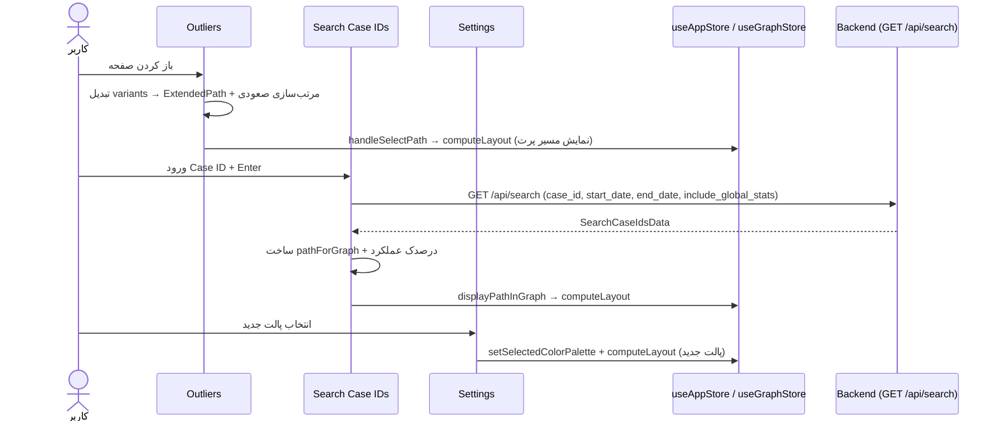

# مستندات فنی: صفحات کمکی (Outliers / Search / Settings / Guide)

| مشخصه | مقدار |
|---|---|
| مسیر منبع | `src/app/(panel)/outliers/page.tsx`، `src/app/(panel)/search-case-ids/page.tsx`، `src/app/(panel)/settings/page.tsx`، `src/app/(panel)/guide/page.tsx` |
| دسته | صفحه Frontend |
| مستندات مرتبط | [۰۴-Zustand Stores](04-zustand-stores.md) · [۰۵-Fetcher](05-fetcher.md) · [۱۲-Pathfinder](12-pathfinder.md) · [۱۴-Domain Types & Constants](14-domain-types-constants.md) |

## ۱. هدف (Purpose)

ماژول **صفحات کمکی** شامل چهار صفحه فرعی پنل است که تحلیل/پیکربندی مکمل را ارائه می‌دهند:

| صفحه | نقش |
|---|---|
| **Outliers** (`outliers/page.tsx`) | نمایش واریانت‌های کم‌تکرار (مسیرهای پرت) مرتب‌شده از کم‌فرکانس به پرتکرار، با قابلیت مشاهده هر مسیر روی گراف |
| **Search Case IDs** (`search-case-ids/page.tsx`) | جستجوی یک پرونده با شناسه (Case ID) از بک‌اند — نمایش تایم‌لاین، آمار عملکرد (درصدک) و نمودارهای توزیع |
| **Settings** (`settings/page.tsx`) | تغییر پالت رنگی نمودار و بازچینی (Recompute) Layout با پالت جدید |
| **Guide** (`guide/page.tsx`) | صفحه راهنمای سیستم — کارت‌های معرفی عناوین آموزشی (در حال تدوین) |

## ۲. Props

| صفحه | Prop | توضیح |
|---|---|---|
| Outliers / Search / Settings / Guide | — | **هیچ‌کدام props ندارند** — صفحات مسیر `(panel)/` هستند و از Stores/fetcher استفاده می‌کنند |

(صفحات همراه `loading.tsx` رندر می‌شوند.)

## ۳. منبع Props (Props Source)

| منبع | توضیح |
|---|---|
| **useAppStore** | `outliers`, `filters`, `graphData`, `startEndNodes`, `selectedNodeIds`, `selectedColorPalette`, `selectedPathNodes/Edges/Index`, `setSelectedColorPalette`, `setSelectedPath*` |
| **useGraphStore** | `layoutedNodes` (Outliers)، `setActivePath`, `computeLayout` |
| **useGraphData hook** | `graphData` فیلترشده (Outliers) |
| **fetcher** | `api.search.byId(caseId, {startDate, endDate, includeGlobalStats})` → `GET /api/search` (فقط Search) |
| **کامپوننت‌ها** | `PathList`, `ColorPaletteCard`, `CaseDistributionCharts` |
| **Constants** | `paletteOptions` از `colorPalettes.ts` |
| **HeroUI / lucide** | Card, Chip, Button, Input, NumberInput, ScrollShadow, Divider / آیکون‌های صفحات |

## ۴. استیت داخلی (Internal State)

| صفحه | State | نوع | توضیح |
|---|---|---|---|
| **Outliers** | `sortedPaths` | `ExtendedPath[]` (useMemo) | outlierها تبدیل‌شده و مرتب‌شده صعودی |
| **Search** | `caseIdInput` | `number \| undefined` | شناسه ورودی |
| | `isLoading` | `boolean` | لودینگ جستجو |
| | `searchResult` | `SearchCaseIdsData \| null` | نتیجه API |
| | `error` | `string \| null` | پیام خطا (ورودی خالی/بدون بازه/404/خطای سرویس) |
| | `activeTab` | `"Timeline" \| "Charts"` | تب فعال |
| **Settings** | — | — | (بدون state — مستقیم از Store) |
| **Guide** | — | — | (استاتیک با `sections[]`) |

## ۵. هوک‌های استفاده‌شده (Hooks Used)

| صفحه | هوک | کاربرد |
|---|---|---|
| **Outliers** | `useMemo` | تبدیل `outliers` → `ExtendedPath[]` + مرتب‌سازی صعودی فرکانس |
| | `useCallback` | `handleSelectPath` (نمایش مسیر پرت روی گراف) |
| | `useEffect` | پاکسازی در unmount → `resetGraphState` (ریست انتخاب + `computeLayout` با فیلترهای اصلی) |
| **Search** | `useState` | استیت‌های بالا |
| | `useCallback` | `displayPathInGraph` (نمایش مسیر پرونده در گراف) |
| | `useEffect` ×۲ | پاکسازی/ریست اولیه در mount و unmount |
| | `handleKeyDown` | ارسال با Enter |
| **Settings** | `useCallback` | `handlePaletteChange` (ذخیره پالت + `computeLayout` با پالت جدید) |

## ۶. فراخوانی‌های API (API Calls)

| اندپوینت | صفحه | زمان | توضیح |
|---|---|---|---|
| `GET /api/search` | Search | submit | `api.search.byId(caseIdNum, {startDate: filters.dateRange.start, endDate: filters.dateRange.end, includeGlobalStats: true})` → `SearchCaseIdsData` — پارامترها به‌صورت query string (`case_id`, `start_date`, `end_date`, `include_global_stats`) |
| — | Outliers/Settings/Guide | — | **هیچ فراخوانی مستقیمی** — داده از Stores/Constants |

**پیش‌شرط Search**: شناسه معتبر + بازه زمانی تعیین‌شده در `filters.dateRange` (در غیر این صورت خطا).

## ۷. تبدیل داده (Data Transformation)

| تبدیل | شرح |
|---|---|
| **Outliers: تبدیل واریانت → ExtendedPath** | `nodes = Variant_Path`؛ `edgeStats` تجمعی (`sum/count` از تفاضل `Avg_Timings[i+1] - [i]`)؛ `_specificEdgeDurations = sum/count`؛ `_specificTotalDurations = sum`؛ `_specificEdgeCounts = count`؛ `_pathType = "absolute"`؛ `totalDuration` از تفاضل آخرین-اولین تایم‌استمپ |
| **Outliers: مرتب‌سازی** | صعودی بر اساس `_frequency` (کم‌تکرارها در بالا — هدف تحلیل ناهنجاری) |
| **Search: ساخت pathForGraph** | از `response.data.nodes` و `edge_durations` → `edgeStats` → specific durations/counts؛ `averageDuration = total_duration`؛ `_pathType = "absolute"` |
| **Search: درصدک عملکرد** | `position_stats.duration_percentile`: >80 → «بحرانی» (rose)، 50–80 → «کندتر از میانگین» (amber)، <50 → «سریع» (emerald) + نوار گرادیانی با عرض percentile |
| **Search: نمایش در گراف** | `displayPathInGraph` → `computeLayout({filteredNodeIds, filteredEdgeIds, activePathInfo: {nodes, edges, edgeDurations, edgeTotalDurations, edgeCounts, frequency}}) |
| **Settings: پالت جدید** | `setSelectedColorPalette` + `computeLayout({colorPaletteKey: newPalette, ...})` — بازچینی فوری گراف با فیلترهای موجود |
| **ریست گراف** | در reset/unmount هر صفحه: پاک‌سازی `selectedPath*` + `computeLayout` با `filteredNodeIds: selectedNodeIds`, `filteredEdgeIds: null` |
| **فرمت زمان** | `formatDuration` (ثانیه → ثانیه/دقیقه/ساعت/روز) در تایم‌لاین و کارت‌های آمار |

## ۸. خروجی رندر (Render Output)

### Outliers

```
<div h-full>
  ├─ [Header آماری — غیرفعال/کامنت‌شده]
  └─ Content: PathList (sortedPaths, groupByType=false, selectedIndex)
      └─ empty state: «واریانتی یافت نشد» + راهنمای اعمال فیلتر
```

### Search Case IDs

```
<div h-full>
  ├─ Top: NumberInput شناسه (Enter برای جستجو) + دکمه Search (isLoading spinner)
  │   + کارت وضعیت: «فعالیتها (تعداد)» + «مدت زمان (formatDuration)» | خطا rose | «منتظر ورود شناسه»
  ├─ Tabs: «مسیر زمانی» / «تحلیل و نمودار» (غیرفعال بدون نتیجه)
  └─ Content:
      ├─ Timeline: تایملاین عمودی (نقطه شروع emerald ring / پایان rose ring)
      │   + Card هر نود با Chip شروع/پایان + Chip مدت یال (ArrowDown)
      └─ Charts: renderPerformanceStats (کارت درصدک + نوار) + CaseDistributionCharts
```

### Settings

```
<div h-full>
  ├─ بخش «طیف رنگی نمودار» (آیکون PaintBucket بنفش)
  │   └─ ColorPaletteCard (options=paletteOptions, value=selectedColorPalette)
  ├─ Divider
  └─ [محل تنظیمات آینده]
```

### Guide

```
<div dir=rtl p-4>
  ├─ هدر: «راهنما و مستندات سیستم» (آیکون BookOpen فیروزهای)
  ├─ Card «در دست توسعه و طراحی» (Chip + Sparkles متحرک، گرادیان teal/emerald)
  └─ «عناوین در حال تدوین:» — کارتهای motion هر section
      (آشنایی با فرآیندکاوی / تحلیل DFG / تنظیمات پیشرفته و پالتها)
```

## ۹. کامپوننت‌های استفاده‌کننده (Components Using It)

| مصرف‌کننده | نحوه استفاده |
|---|---|
| **PathList (۲۷)** | رندر مسیرهای پرت در Outliers |
| **ColorPaletteCard** | انتخاب پالت در Settings |
| **CaseDistributionCharts** | نمودارهای توزیع در Search (تب Charts) |
| **useAppStore / useGraphStore** | `computeLayout`/`setActivePath` برای نمایش مسیرها روی گراف اصلی |
| **Backend Search Router** | `GET /api/search` — جستجوی پرونده با شناسه (تنها صفحه کمکی با API مستقیم) |

## ۱۰. نمودار جریان داده (Data Flow Diagram)



## خلاصه

**صفحات کمکی** چهار ابزار مکمل پنل هستند: **Outliers** واریانت‌های کم‌فرکانس را به `ExtendedPath` تبدیل و صعودی مرتب می‌کند؛ **Search** با `GET /api/search` مسیر و آمار درصدکی یک پرونده را می‌گیرد (با تبدیل `edge_durations` به ساختار PathList و هایلایت روی گراف)؛ **Settings** فقط پالت رنگی را عوض کرده و Layout را بازچینی می‌کند؛ و **Guide** صفحه راهنمای استاتیک است. نکات کلیدی: پاکسازی کامل گراف در reset/unmount همه صفحات، و اینکه تنها Search فراخوانی API مستقیم دارد.
