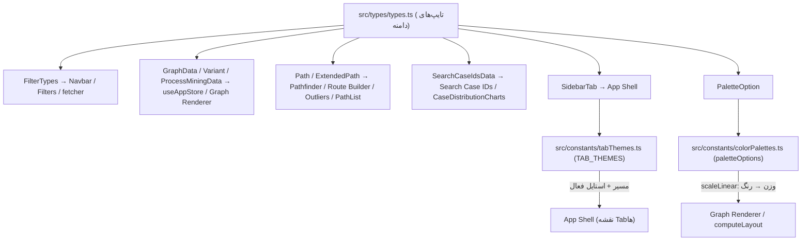

# مستندات فنی: تایپ‌ها و ثابت‌های دامنه (Domain Types & Constants)

| مشخصه | مقدار |
|---|---|
| مسیر منبع | `src/types/types.ts`، `src/constants/colorPalettes.ts`، `src/constants/tabThemes.ts` |
| دسته | ابزار کمکی |
| مستندات مرتبط | [۰۱-App Shell](01-layout-providers-app-shell.md) · [۰۵-Fetcher](05-fetcher.md) · [۱۳-Auxiliary Pages](13-auxiliary-pages.md) |

## ۱. هدف (Purpose)

ماژول **تایپ‌ها و ثابت‌ها** ستون‌فقرات داده‌ای فرانت‌اند است؛ سه فایل مرجع که قراردادهای دامنه را در کل سیستم یکپارچه می‌کنند:

| فایل | نقش |
|---|---|
| **`src/types/types.ts`** | تعریف تمام Interfaceهای دامنه — ساختار فیلترها، گراف، واریانت‌ها، مسیرها، نتایج جستجو/آمار و ساختار Tooltip |
| **`src/constants/colorPalettes.ts`** | پالت‌های رنگی گراف — تابع نگاشت وزن → رنگ (با `d3-scale`) + گزینه‌های نمایشی منو |
| **`src/constants/tabThemes.ts`** | تم/استایل هر تب سایدبار — عنوان، آیکون، مسیر و کلاس‌های حالت فعال |

## ۲. Props

| فایل | Prop | توضیح |
|---|---|---|
| — | — | این ماژول **کامپوننت نیست**؛ فقط Type و Constant صادر می‌کند — فاقد props است |

## ۳. منبع Props (Props Source)

| منبع | توضیح |
|---|---|
| **d3-scale** | `scaleLinear` — مقیاس رنگ پیوسته برای پالت‌ها |
| **lucide-react** | آیکون‌های تب‌ها (Monitor, LineSquiggle, FolderSearch, RouteOff, GitFork, Settings, HelpCircle, SlidersHorizontal) |
| **types/types** | `SidebarTab` — کلید `Record` تم‌ها |

## ۴. استیت داخلی (Internal State)

| مورد | توضیح |
|---|---|
| — | **هیچ استیتی ندارد** — فایل‌های استاتیک (صادرات خالص) |

## ۵. هوک‌های استفاده‌شده (Hooks Used)

| هوک | کاربرد |
|---|---|
| — | **هیچ هوکی استفاده نمی‌شود** — فقط تعریف Type/Constant |

## ۶. فراخوانی‌های API (API Calls)

| اندپوینت | زمان | توضیح |
|---|---|---|
| — | — | **هیچ فراخوانی API ندارد** — قراردادهای دامنه فقط (ساختارها با پاسخ بک‌اند تطبیق داده شده‌اند) |

## ۷. تبدیل داده (Data Transformation)

### تایپ‌های دامنه (types.ts)

| تایپ | شرح |
|---|---|
| `DimensionLevel` / `DimensionSchema` | متادیتای سطوح ابعاد: ایندکس، کلید API (`lev1_names`…)، نام ستون DB (`LEV1_NAME`…) و برچسب فارسی |
| `FilterTypes` | قرارداد فیلتر کامل: `dateRange`، `dimensionFilters` (داینامیک)، `courtKinds`، `min/maxCaseCount`، `meanTimeRange`، `weightFilter`، `timeUnitFilter`، `outlierPrecentage`، `unitId` |
| `Path` / `ExtendedPath` | مسیر گراف (نودها/یال‌ها/فرکانس/مدت) + متادیتای مشتق (`_` پیشوند): `_frequency`, `_pathType`, `_variantTimings`, `_specificEdgeDurations/TotalDurations/Min/Max/Median/Std/Counts` |
| `PaletteOption` / `SidebarTab` | گزینه پالت (key/label/gradient) و نوع اتحادی تب‌های سایدبار |
| `GraphData` | یک یال: فعالیت‌های مبدا/مقصد، میانگین/حداقل/حداکثر/میانه/انحراف معیار زمان، وزن، Case_Count، Tooltipهای فرمت‌شده، انواع شعب (PublicCourtType/CourtType) و Branching_Probability |
| `Variant` | مسیر کامل: `Variant_Path`, `Frequency`, آرایه‌های تایمینگ (Avg/Total/Min/Max/Median/Std), `Percentage`, `UnitID` |
| `ProcessMiningData` | پاسخ کامل پردازش: `graphData` + `variants` + `outliers` + `startActivities`/`endActivities` |
| `SearchCaseIdsData` | پاسخ جستجوی پرونده: `found`, نودها, `edge_durations`, `total_duration`, `case_id`, `position_stats.duration_percentile/is_slower_than_average` |
| `HistogramData` / `EdgeStatisticsGlobalData` | داده‌های هیستوگرام سراسری (bins/counts) — توزیع زمان و گام‌ها |
| `NodeTooltipType` | داده Tooltip نود: `edgeId`, label, وزن, جهت (incoming/outgoing), `caseCount` |

### پالت‌های رنگی (colorPalettes.ts)

| پالت | key | نگاشت (range) | شرح |
|---|---|---|---|
| پیش‌فرض | `default` | `#c4dafc → #3b82f6` | آبی |
| طیف ۱ | `palette1` | `#d9f0a3 → #4d004b` | سبز به بنفش |
| طیف ۲ | `palette2` | `#4575b4 → #d73027` | آبی به قرمز (سرد/گرم) |
| طیف ۳ | `palette3` | `#f0f0f0 → #000000` | خاکستری |
| طیف ۴ | `palette4` | `#deebf7 → #08306b` | آبی‌ها (روشن به تیره) |

تبدیل: `ColorScaleFn(weight, minWeight, maxWeight)` → `scaleLinear().domain([min, max]).range([...])` → رنگ CSS.

### تم تب‌ها (tabThemes.ts)

| تب | عنوان | مسیر | رنگ |
|---|---|---|---|
| `Filter` | فرآیند نگار | `/` | Blue |
| `Routing` | جریان یاب | `/routing` | Emerald |
| `SearchCaseIds` | پرونده نگار | `/search-case-ids` | Violet |
| `Outliers` | مسیر های کم تکرار | `/outliers` | Rose |
| `RouteBuilder` | جریان ساز | `/route-builder` | Amber |
| `Settings` | تنظیمات | `/settings` | Slate |
| `Guide` | راهنما | `/guide` | Teal |

تبدیل: `TabThemeConfig` = `{title, icon, path, activeClass, indicatorClass, iconActiveClass}` — کلاس‌های Tailwind + سایه رنگی (`shadow-[0_4px_12px_-4px_rgba(...)]`).

## ۸. خروجی رندر (Render Output)

```
این ماژول خروجی رندر ندارد (Type/Constant محض).
مصرف: سراسری — همه صفحات و کامپوننتهای فرانتاند:
├─ FilterTypes → Navbar, Filters, fetcher (GraphData Router)
├─ GraphData/Variant/ProcessMiningData → useAppStore, Graph Renderer
├─ Path/ExtendedPath → Pathfinder, Route Builder, Outliers, PathList
├─ SearchCaseIdsData → Search Case IDs, CaseDistributionCharts
├─ SidebarTab → App Shell (نقشه مسیرها) + TAB_THEMES (استایل)
├─ colorPalettes → ColorPaletteCard, Settings, Layout (Compute)
└─ NodeTooltipType → NodeTooltip
```

## ۹. کامپوننت‌های استفاده‌کننده (Components Using It)

| مصرف‌کننده | نحوه استفاده |
|---|---|
| **همه ماژول‌های فرانت‌اند** | تایپ‌های دامنه در تمام صفحات/کامپوننت‌ها (Types import) |
| **App Shell** | `SidebarTab` + `TAB_THEMES` برای ساخت ناوبری و استایل حالت فعال |
| **Settings / ColorPaletteCard** | `paletteOptions` — لیست گزینه‌های انتخاب |
| **Graph Renderer / Layout (computeLayout)** | `colorPalettes` — نگاشت وزن یال → رنگ |
| **fetcher** | قراردادهای پاسخ (ProcessMiningData, SearchCaseIdsData) برای پارس داده |

## ۱۰. نمودار جریان داده (Data Flow Diagram)



## خلاصه

**تایپ‌ها و ثابت‌های دامنه** قرارداد مرکزی فرانت‌اند است: `types.ts` ساختار فیلترها/گراف/واریانت/مسیر/جستجو و Tooltip را تعریف می‌کند (فیلدهای مشتق با پیشوند `_`)، `colorPalettes.ts` پنج پالت را با `scaleLinear` وزن→رنگ مپ می‌کند، و `tabThemes.ts` تم هفت تب سایدبار را با عنوان/آیکون/مسیر و کلاس‌های فعال ارائه می‌دهد. فاقد state، props و API است و تنها «سند قرارداد» بین همه ماژول‌ها محسوب می‌شود.
