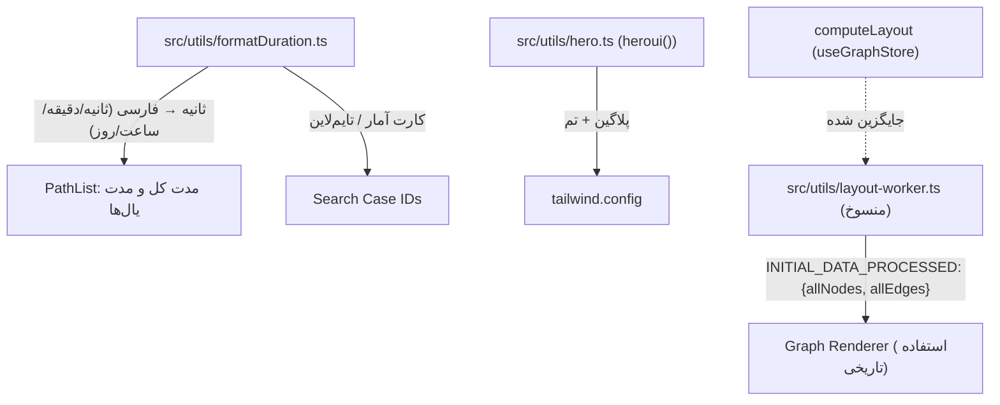

# مستندات فنی: توابع کمکی (Helper Utilities)

| مشخصه | مقدار |
|---|---|
| مسیر منبع | `src/utils/formatDuration.ts`، `src/utils/hero.ts`، `src/utils/layout-worker.ts` |
| دسته | ابزار کمکی |
| مستندات مرتبط | [۰۶-Graph Renderer](06-graph-renderer.md) · [۱۲-Pathfinder](12-pathfinder.md) · [۱۳-Auxiliary Pages](13-auxiliary-pages.md) |

## ۱. هدف (Purpose)

ماژول **توابع کمکی** شامل سه ابزار پراکنده و بدون وابستگی متقابل است که در سراسر فرانت‌اند استفاده می‌شوند:

| فایل | نقش |
|---|---|
| **`src/utils/formatDuration.ts`** | فرمت‌بندی مدت‌زمان (بر حسب ثانیه) به رشته فارسی خوانا (ثانیه/دقیقه/ساعت/روز) — پرکاربردترین تابع کمکی |
| **`src/utils/hero.ts`** | صادرات پیکربندی HeroUI (فقط `heroui()` — بدون تنظیمات سفارشی) |
| **`src/utils/layout-worker.ts`** | **Worker منسوخ** پردازش داده گراف (ساخت نود/یال اولیه) — با ظهور `computeLayout` در useGraphStore جایگزین شده است |

## ۲. Props

| فایل | Prop | توضیح |
|---|---|---|
| — | — | **کامپوننت نیست** — فقط تابع/تنظیم صادر می‌کند |

## ۳. منبع Props (Props Source)

| منبع | توضیح |
|---|---|
| **`@heroui/theme`** | `heroui()` — پیکربندی HeroUI (hero.ts) |
| **`@xyflow/react`** | `Node`, `Edge` — تایپ برای داده‌های Worker (layout-worker.ts) |

## ۴. استیت داخلی (Internal State)

| فایل | توضیح |
|---|---|
| — | **هیچ استیتی ندارد** (توابع خالص / تنظیم استاتیک) |

## ۵. هوک‌های استفاده‌شده (Hooks Used)

| هوک | کاربرد |
|---|---|
| — | **هیچ هوکی استفاده نمی‌شود** |

## ۶. فراخوانی‌های API (API Calls)

| اندپوینت | زمان | توضیح |
|---|---|---|
| — | — | **هیچ فراخوانی API ندارد** — Worker پیام‌ها را از طریق `self.onmessage`/`postMessage` (نه HTTP) دریافت/ارسال می‌کند |

## ۷. تبدیل داده (Data Transformation)

### formatDuration.ts

| بازه (ثانیه) | خروجی |
|---|---|
| `< 60` | `${seconds.toFixed(0)} ثانیه` |
| `< 3600` | `${(s/60).toFixed(1)} دقیقه` |
| `< 86400` | `${(s/3600).toFixed(1)} ساعت` |
| بقیه | `${(s/86400).toFixed(2)} روز` |

مثال‌ها: `45 → "45 ثانیه"`، `150 → "2.5 دقیقه"`، `7200 → "2.0 ساعت"`، `172800 → "2.00 روز"`.

### hero.ts

| تبدیل | شرح |
|---|---|
| پیش‌فرض | `heroui()` بدون `layout`/`colors` سفارشی — صادرات پیش‌فرض برای tailwind config |

### layout-worker.ts (منسوخ)

| تبدیل | شرح |
|---|---|
| **مقیاس‌بندی یال** | `scaleEdgeWidth`: نرمال‌سازی وزن → عرض ۱–۶px؛ `scaleEdgeColor`: نرمال‌سازی → `rgba(59,130,246, intensity≥0.3)` آبی |
| **ساخت نودها** | `allActivityNames` (اتحاد مبدا/مقصد) → نودها با `width: 250` + `START_NODE`/`END_NODE` (با برچسب «شروع»/«پایان»، width 150) |
| **ساخت یال‌ها** | یال اصلی: `a->b` با `label: Edge_Label`, `originalStroke/Width`؛ یال‌های شروع/پایان: خاکستری `#a0aec0` با `strokeDasharray "5 5"` و label = تعداد پرونده (`Case_Count`) |
| **خروجی پیام** | `postMessage({type: "INITIAL_DATA_PROCESSED", payload: {allNodes, allEdges}})` |

## ۸. خروجی رندر (Render Output)

```
این ماژول خروجی رندر ندارد (Utility محض).
مصرف سراسری:
├─ formatDuration → PathList (مدت کل یال)، Search Case IDs (کارت آمار/تایملاین)
├─ hero → tailwind.config (افزودن پلاگین HeroUI + تم)
└─ layout-worker → (استفاده تاریخی در Graph Renderer — اکنون منسوخ)
```

## ۹. کامپوننت‌های استفاده‌کننده (Components Using It)

| مصرف‌کننده | نحوه استفاده |
|---|---|
| **PathList (۲۷)** | `formatDuration` برای نمایش مدت کل و مدت هر یال در تایم‌لاین |
| **Search Case IDs (۱۳)** | `formatDuration` در کارت‌های آمار و تایم‌لاین |
| **tailwind.config / HeroUI setup** | `hero` — پیکربندی پلاگین HeroUI |
| **useGraphStore (قدیمی / Graph Renderer)** | `layout-worker` — جایگزین‌شده با `computeLayout` |

## ۱۰. نمودار جریان داده (Data Flow Diagram)



## خلاصه

**توابع کمکی** سه ابزار سبک و بدون وابستگی هستند: `formatDuration` مدت را به فارسی (ثانیه/دقیقه/ساعت/روز) فرمت می‌کند، `hero.ts` فقط پیکربندی HeroUI را صادر می‌کند، و `layout-worker.ts` یک Worker قدیمی است که نود/یال اولیه را با مقیاس‌های وزن می‌ساخت ولی با ظهور `computeLayout` منسوخ شده است. مهم‌ترین عضو فعال، `formatDuration` است.